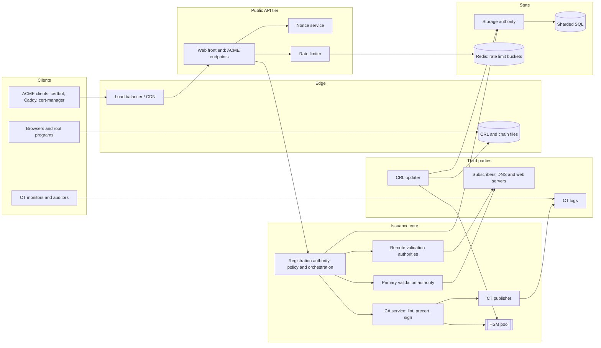
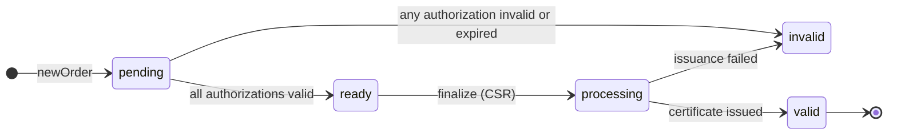
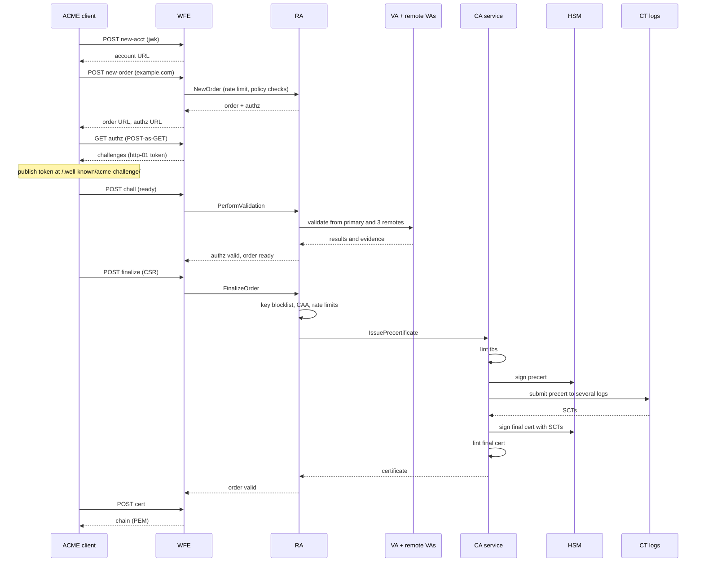

# Let's Encrypt

Design a free, automated, public certificate authority in the style of Let's Encrypt: any server
proves it controls a domain name over the ACME protocol and receives a browser-trusted TLS
certificate within seconds, with no human in the loop. The CA issues millions of certificates per
day, keeps its signing keys in hardware, logs every certificate publicly, and must be able to
revoke or replace a large share of them within days when it discovers a bug.

The protocol fits on a page, so the interesting questions sit around it:

- Trust. A certificate is a signature that every browser honors. Each issuance must pass domain
  validation that resists network attackers, a CAA policy check, and linting against the industry
  rules, because one misissued certificate can cost the CA its place in the root stores.
- Lifetime. Short certificate lifetimes replace revocation as the main defense against key
  compromise. Shorter lifetimes turn renewal into the dominant load and make the CA a piece of
  infrastructure that millions of servers call on a schedule.
- Auditability. Every certificate is submitted to public Certificate Transparency logs before it
  exists, so the CA's write path depends on third-party services and on logs it may have to run
  itself.

## Contents

1. [Requirements](#1-requirements)
2. [Capacity estimates](#2-capacity-estimates)
3. [Glossary](#3-glossary)
4. [High-level architecture](#4-high-level-architecture)
5. [Trust hierarchy](#5-trust-hierarchy)
6. [ACME requests and replay protection](#6-acme-requests-and-replay-protection)
7. [Orders and authorizations](#7-orders-and-authorizations)
8. [Domain validation methods](#8-domain-validation-methods)
9. [Validation infrastructure](#9-validation-infrastructure)
10. [Issuance pipeline](#10-issuance-pipeline)
11. [Signing and key custody](#11-signing-and-key-custody)
12. [Certificate Transparency](#12-certificate-transparency)
13. [Revocation](#13-revocation)
14. [Rate limits](#14-rate-limits)
15. [Renewal and load shaping](#15-renewal-and-load-shaping)
16. [Storage](#16-storage)
17. [Abuse and misissuance](#17-abuse-and-misissuance)
18. [Multi-site operation and availability](#18-multi-site-operation-and-availability)
19. [Data model](#19-data-model)
20. [API sketch](#20-api-sketch)
21. [End-to-end flows](#21-end-to-end-flows)
22. [Scaling and reliability](#22-scaling-and-reliability)
23. [Summary of choices](#23-summary-of-choices)
24. [References](#24-references)

---

## 1. Requirements

### Functional

- Create an account identified by a public key, without an email address or password.
- Order a certificate for one or more DNS names, including wildcard names, and later for IP addresses.
- Prove control of each name through an automated challenge.
- Submit a CSR and receive a certificate chain that browsers, operating systems, and JVMs trust.
- Renew by repeating the same flow; learn from the CA when to renew.
- Revoke a certificate as its account, as the holder of the certificate's key, or as a domain
  controller.
- Rotate account keys and deactivate accounts and authorizations.
- Publish revocation status and a public record of every issued certificate.
- Restrict issuance per domain through CAA records that domain owners publish in DNS.

### Non-functional

| Property | Target |
| --- | --- |
| Issuance latency | p99 under 10 s from finalize to certificate, excluding challenge propagation delay on the client |
| Availability | 99.9% for issuance; revocation data and certificate download stay available through issuance outages |
| Correctness | Zero certificates issued without valid, fresh domain control validation and a passing CAA check |
| Auditability | Every certificate logged to CT before delivery; every issuance decision reconstructable from stored evidence |
| Key safety | CA private keys never exist outside certified hardware; root keys stay offline |
| Revocation agility | Revoke up to millions of certificates within the Baseline Requirements deadline (5 days for most causes) |
| Cost | Free to subscribers; operated by a nonprofit on donations, so per-issuance compute and storage cost drive design |

### Out of scope

- Organization and Extended Validation certificates, which need human vetting.
- Code signing, S/MIME, and client certificates.
- Billing, since the service is free.
- Browser and operating system root program negotiations, except where they constrain design (section 5).

---

## 2. Capacity estimates

Assumptions sized to Let's Encrypt's public scale. Its statistics page reports several hundred
million active certificates and more than 10 million certificates issued on busy days.

| Parameter | Value |
| --- | --- |
| Certificates issued per day | 10 M average, 15 M on peak days |
| Active (unexpired) certificates | 500 M |
| Certificate lifetime | 90 days today; 45 days announced; 6 days for an opt-in short-lived profile |
| Names per certificate | 1.5 average, 100 maximum |
| Renewal share of issuance | Over 95% |

### Write throughput

- Issuances: 10 M / 86,400 s ≈ 116/s average. Renewal clients cluster on round clock times, so plan
  for 10× bursts: ~1.2 k/s for minutes at a time.
- Each issuance costs two signatures (precertificate and final certificate), plus 2 to 3 CT log
  submissions, plus validation of each name.
- Validations: ~1.5 names per order and authorization reuse cut the number of fresh validations to
  roughly 1 per order. Each validation fans out to a primary vantage point and several remote ones
  (section 9), so ~5 outbound network checks per validation, ~600/s average, ~6 k/s at peak.
- New orders and finalize calls: the ACME request rate is several times the issuance rate because of
  polling, failed attempts, and nonce fetches. Budget 10 to 20 API requests per issued certificate:
  ~2 k/s average.

### Read throughput

- Certificate downloads, order polls, and directory fetches make up most API reads.
- Revocation data: with CRLs (section 13), read load is a few hundred files that clients cache and
  CDNs absorb. With per-certificate OCSP, load was billions of requests per day, which is why the
  design shift matters.

### Storage

- Certificate: ~1.5 KB DER for ECDSA leaf plus SANs; precertificate similar. With order,
  authorization, challenge, and audit rows: ~5 KB per issuance in total.
- 3.65 B issuances/year × 5 KB ≈ 18 TB/year. Retention is at least the audit period of the
  Baseline Requirements (2 years after certificate expiry), and Let's Encrypt keeps certificates
  indefinitely through CT.
- CT log entries: each certificate appears in several logs as a precertificate entry. A log of
  this volume grows by ~3.65 B entries per year.

### Signing

- 2 signatures per issuance × 116/s ≈ 232/s average, ~2.5 k/s at peak. Network HSMs sign ECDSA
  P-384 at roughly a few thousand operations per second each, so signing needs a small pool of HSMs
  and several active intermediates (section 11). RSA-4096 intermediate signatures are slower by an
  order of magnitude.

---

## 3. Glossary

| Term | Meaning |
| --- | --- |
| ACME | Automatic Certificate Management Environment (RFC 8555): the protocol between a client and the CA. |
| Account | An ACME identity: a public key plus optional contact and terms-of-service state. |
| Order | A request for one certificate covering a set of identifiers. |
| Authorization | The CA's record that an account may obtain certificates for one identifier, satisfied by one challenge. |
| Challenge | A test of control: HTTP-01, DNS-01, or TLS-ALPN-01. |
| DCV | Domain control validation. |
| MPIC | Multi-perspective issuance corroboration: validating from several network vantage points. |
| CAA | DNS record type (RFC 8659) naming the CAs allowed to issue for a domain. |
| Precertificate | A poisoned certificate submitted to CT logs before the final certificate exists. |
| SCT | Signed Certificate Timestamp: a CT log's promise to include an entry. |
| Root | A self-signed CA certificate in trust stores. Kept offline. |
| Intermediate | A CA certificate signed by a root, used to sign leaf certificates. Kept online in an HSM. |
| HSM | Hardware security module that holds keys and signs without exporting them. |
| CRL | Certificate revocation list: a signed list of revoked serial numbers. |
| OCSP | Online Certificate Status Protocol: a signed per-certificate status answer. |
| Registered domain | The public suffix plus one label (`example.co.uk`), computed from the Public Suffix List. |
| FQDN set | The sorted set of names in a certificate, used to detect duplicates. |
| ARI | ACME Renewal Information: the CA tells clients when to renew. |
| Profile | A named issuance configuration (lifetime, key usages, extensions) that a client selects. |
| Misissuance | A certificate that violates the Baseline Requirements or the CA's own policy. |

---

## 4. High-level architecture



Principles:

- Each component has one privilege. The front end parses untrusted requests and holds no keys. The
  registration authority (RA) decides policy. The validation authorities (VAs) touch the hostile
  internet and hold no database write access. The CA service holds signing access and no network
  path to subscribers. A compromise of a component that touches untrusted input yields none of the
  higher privileges.
- Issuance is a pipeline of checkpoints, each of which can refuse: rate limit, key blocklist,
  policy, validation freshness, CAA, lint, CT, signature. A certificate exists only if all pass.
- Read-mostly data (chains, CRLs, directory) is static files behind a CDN, separate from the
  issuance path, so an issuance outage leaves relying parties unaffected.
- The CA treats every input as adversarial, including DNS answers, HTTP responses, and CSR contents.

### Reference implementations

| Service | Notes |
| --- | --- |
| Let's Encrypt (ISRG) | Boulder, written in Go, split into WFE, RA, VA, CA, SA, and publisher services over gRPC; MariaDB behind Vitess; Redis for rate limits; ended OCSP in 2025 |
| Google Trust Services | ACME endpoint on a commercial CA with its own roots; same protocol, different scale and policy |
| ZeroSSL | Alternative ACME CA with EAB-based accounts |
| step-ca (Smallstep), Pebble | Private CA and test-only ACME servers; skip the public trust obligations |
| Sectigo, DigiCert | Commercial CAs offering ACME alongside paid validation levels |

---

## 5. Trust hierarchy

### Roots and intermediates

A root key signs a few intermediates once and then goes offline into a safe. Intermediates sign leaf
certificates every second and live in online HSMs. Several structures fit:

| Structure | Description | Pros | Cons |
| --- | --- | --- | --- |
| Root signs leaves directly | One key does everything | Shortest chain | Root key online; compromise is fatal and root programs forbid it |
| One root, one intermediate | Minimal hierarchy | Simple | One key is a capacity limit and a single point of failure |
| One root, many active intermediates | A pool of intermediates in parallel, often split by key type (RSA, ECDSA) | Signing capacity scales; one revoked intermediate affects a fraction | More certificates to distribute in chains |
| Separate roots per key algorithm | RSA root and ECDSA root, each with intermediates | Clients that support only one algorithm choose the matching chain; algorithm agility | Doubles root program submissions |
| Rolling generations of roots | New root every few years, cross-signed by the previous | Lets young roots reach old clients | Cross-signature expiry causes client failures (below) |

Let's Encrypt runs an RSA root (ISRG Root X1) and an ECDSA root (ISRG Root X2), each with
several active intermediates that rotate. It has announced a new generation of roots for the
transition to shorter lifetimes.

### Cross-signing and old clients

A new root needs years to reach every device. Cross-signing lets an already trusted root vouch for
the new one. Let's Encrypt launched under a cross-signature from IdenTrust's DST Root CA X3. That
root expired on September 30, 2021, and old Android and embedded clients that lacked ISRG Root X1
started failing. The lesson for the design:

- Serve the chain that reaches the most clients by default and expose alternates. ACME lets the CA
  return alternate chains through `Link: rel="alternate"` headers, and clients choose by preferred
  root or issuer.
- Track the cross-signature's expiry as a first-class migration deadline, with a public timeline.

### Key ceremonies

- Root keys are generated and used only in a scripted, witnessed, audited ceremony inside a secured
  facility, with the HSM's key shares split across officers.
- Each ceremony produces intermediates, CRLs for the roots, and a signed transcript.
- Intermediates are generated in HSMs at a production site and never leave. Backup uses HSM-to-HSM
  wrapping with quorum controls.

### Key rotation

Rotate intermediates on a schedule (a few years) and on suspicion. Because several run in parallel,
issuance shifts to the new one by a configuration change, and the old one stays available only for
CRL signing until its last leaf expires. Short leaf lifetimes make this cheap: the population signed
by a retiring intermediate drains in weeks.

---

## 6. ACME requests and replay protection

### Authentication

Every ACME request after directory and nonce fetches is a JWS (JSON Web Signature) over the request
body, signed by the account key, and carries the URL it targets. Account identity is the key. Two
options exist for how a request names its account:

| Option | How it works | Trade-off |
| --- | --- | --- |
| Embedded public key (`jwk`) | The JWS header holds the key; used for `newAccount` and certificate revocation by certificate key | Requires a key lookup on each request |
| Account URL (`kid`) | The header names the account; the server loads the key | Cheaper on the wire, needs an account read on each request |

The signed URL prevents a captured request from being replayed to a different endpoint.

### Nonces

Each POST must carry a fresh nonce that the server issued, and the server accepts it once. This
stops replays. The nonce store is a distributed-systems problem, because the CA runs many front ends
behind load balancers and each nonce must be redeemable exactly once.

| Strategy | How it works | Pros | Cons |
| --- | --- | --- | --- |
| Shared database or cache | Insert on issue, delete on redeem | Simple, exact | Every request adds a write to a shared store; hot path |
| Stateless signed nonce with expiry | Nonce is an HMAC over a timestamp | No storage | Replays are possible within the window, which defeats the point |
| Local set per front end, sticky routing | A front end remembers nonces it issued | Fast | Client must reach the same front end; failover invalidates outstanding nonces |
| Prefixed nonces, routed to the issuing nonce service | Nonce carries a short prefix that identifies the nonce service that minted it; the front end forwards redemption there | Exact single use, no shared write path, scales by adding nonce services | Redeeming after that service restarts fails |
| Sliding window plus counter | Server tracks a bounded window of the newest nonces and rejects older ones | Bounded memory | Rejects valid slow clients |

Let's Encrypt uses prefixed nonces with dedicated nonce services. A rejected nonce returns a
`badNonce` error carrying a fresh nonce, and clients retry once. That makes nonce-service restarts
a routine retry, so deploys never break issuance.

### Idempotency and retries

- `newAccount` with an existing key returns the existing account (`onlyReturnExisting` reads
  without creating).
- `newOrder` with the same identifiers can return the existing pending order rather than a new
  one, which keeps retry storms from consuming the rate limits.
- `finalize` is a state transition on the order: only one CSR is accepted per order, and repeating
  it returns the current order state.

### External account binding

Providers that want to tie ACME accounts to customer accounts require an external account binding
(EAB): the client presents a MAC key issued out of band during `newAccount`. Let's Encrypt is open
and skips it, and commercial CAs use it for billing and validation-level entitlement.

---

## 7. Orders and authorizations

### Objects



An order lists identifiers and links to one authorization per identifier. An authorization holds a
set of challenges and moves `pending → valid | invalid | expired | deactivated | revoked`. A valid
authorization has an expiry. The CA reuses it across orders until then.

### Authorization reuse

| Policy | Effect |
| --- | --- |
| No reuse | Every order re-validates every name; slowest, most load on subscribers and the CA |
| Reuse within an account for N days | Renewals skip validation; load falls sharply |
| Reuse across accounts | Only correct if validation proves domain control regardless of who asked, which holds for the challenge types but weakens revocation of one account's rights |
| Pre-authorization | The client validates names before ordering (`newAuthz`); useful for batch flows |

Reuse windows shrink with the certificate lifetime rules: the Baseline Requirements allowed 398
days of validation reuse, then reduced the maximum in steps, and Let's Encrypt has announced going
down to hours by the time 45-day certificates arrive. A shorter reuse window raises validation load
by the ratio of the old window to the new, so the validation tier (section 9) is sized for a
future where nearly every renewal validates fresh.

### State ownership

- The order row is the source of truth for issuance progress. The RA reads and updates it inside a
  transaction that also inserts the `processing` marker, so a crash cannot leave two concurrent
  finalizations of one order.
- Pending orders and authorizations expire (a week for orders, shorter for authorizations); a
  reaper deletes them, since abandoned orders dominate row counts.

### Wildcards and identifiers

- A wildcard identifier `*.example.com` validates only through DNS-01 on `_acme-challenge.example.com`,
  because HTTP challenges cannot show control of every label.
- The authorization for a wildcard holds the base name plus a `wildcard: true` flag. It shares
  fate with the base-name authorization for CAA checks (`issuewild` property).
- IP address identifiers (RFC 8738) use HTTP-01 or TLS-ALPN-01 only, because DNS-01 has no
  meaning for an address. Certificates for IPs are short-lived by policy.

---

## 8. Domain validation methods

Validation is the CA's core security function. The methods differ in what they prove, where they
run, and what they cost the subscriber.

| Method | What the client does | Proves | Port or record | Wildcard | Failure modes |
| --- | --- | --- | --- | --- | --- |
| 8.1 HTTP-01 | Serve a token at `/.well-known/acme-challenge/<token>` | Control of the web server at that name | Port 80 | No | Redirects, CDNs, shared hosts, firewalls |
| 8.2 DNS-01 | Publish a TXT record at `_acme-challenge.<name>` | Control of DNS for the name | DNS | Yes | DNS provider API latency, propagation, credential sprawl |
| 8.3 TLS-ALPN-01 | Answer a TLS handshake with ALPN `acme-tls/1` and a self-signed cert containing the token digest | Control of the TLS endpoint | Port 443 | No | Needs TLS stack support; tricky behind terminating proxies |
| 8.4 Email to domain contacts | The CA mails a code to `admin@` or WHOIS contacts | Control of a mailbox | Mail | Yes | Not automatable, so not part of ACME |
| 8.5 Persistent DNS record (account-bound) | Publish a stable TXT or CNAME record tying the domain to an account key once | Control of DNS, once | DNS | Yes | Standardization ongoing; stale records outlive the intended authorization |
| 8.6 Delegated DNS-01 via CNAME | Point `_acme-challenge.<name>` by CNAME to a zone the ACME client controls | Same as DNS-01 | DNS | Yes | Delegation target compromise affects the name |

### 8.1 HTTP-01

The CA fetches `http://<name>/.well-known/acme-challenge/<token>` and expects
`<token>.<account-key-thumbprint>`.

- Only port 80 is used. The reason is that ports below 1024 typically need administrative rights on
  multi-user hosts, so a user without control of the host cannot bind them. Ports above 1023 do not
  carry this guarantee.
- The CA follows redirects (to a limit) to ports 80 and 443 only, and validates the redirect targets
  against the same rules: DNS lookups, CAA, and blocked address ranges.
- The response is read up to a small size cap with a short timeout.
- Pros: no DNS credentials; works with any web server.
- Cons: no wildcards; needs a public IP reachable on port 80 from the CA's vantage points.

### 8.2 DNS-01

The CA queries the TXT records at `_acme-challenge.<name>` and accepts a SHA-256 digest of the key
authorization.

- Only method for wildcards.
- Works for hosts unreachable from the internet, such as internal services with public names.
- Cost to subscriber: the ACME client needs DNS API credentials, which are powerful and often
  scoped to the whole zone. Mitigations: delegate `_acme-challenge` by CNAME to a small
  dedicated zone (8.6), or use a DNS provider with per-record tokens.
- CA cost: DNS answers depend on TTLs and authoritative server consistency. The VA queries all the
  authoritative servers or accepts any answer from a recursive resolver depending on policy (section 9).

### 8.3 TLS-ALPN-01 (RFC 8737)

The client presents a certificate carrying an `acmeIdentifier` extension with the key
authorization digest, negotiated with the ALPN protocol `acme-tls/1`.

- Runs entirely on port 443 and never touches port 80, which suits hosts that only expose 443 and
  lets TLS terminators complete validation without serving HTTP.
- Requires software support for per-handshake certificate selection by ALPN. Caddy and some
  load balancers support it.
- A January 2022 incident shows the edge cases: a bug in the CA's TLS-ALPN-01 validation
  method let a validation succeed in circumstances the specification excludes, and the CA revoked
  about 1.7 million certificates within the Baseline Requirements deadline. Every validation path
  deserves review as strict as the issuance code.

### 8.4 Email-based validation

Used by traditional CAs and named in the Baseline Requirements. Email requires a human action per
issuance, and delivered codes reach an inbox that may belong to a former administrator. Automation
at Let's Encrypt scale needs a protocol where the machine proves control, so email has no place
here.

### 8.5 Persistent, account-bound DNS records

A one-time TXT record that names the CA and the account (`accounturi`) could authorize all future
issuances by that account, removing per-renewal DNS writes. It solves the DNS credential problem of
8.2 and fits short lifetimes where validation reuse shrinks. Trade-offs:

- The record stays valid until removed, so a subscriber who leaves it in place after
  decommissioning a host permits later issuance.
- The CA must fold the record's freshness into the reuse window and the CAA check, so that a
  persisted authorization cannot outlive the maximum reuse period of the Baseline Requirements.
- The design is under standardization at the IETF ACME working group and in the CA/Browser Forum.

### 8.6 Delegated `_acme-challenge` via CNAME

The subscriber adds `_acme-challenge.example.com CNAME _acme-challenge.acme-dns.provider.net`. The
CA follows the CNAME and reads the TXT record from the provider's zone, where a small service holds
narrow write credentials. The subscriber's main zone credentials stay off the servers that run
the ACME client. Projects such as acme-dns package this.

### Choosing a method per name

A CA has no policy in choosing, since the client picks the challenge. The CA sets which methods are
offered per identifier type (no HTTP-01 for wildcards) and the failure semantics. The subscriber
chooses by network topology:

| Situation | Best method |
| --- | --- |
| Public web server on 80 | HTTP-01 |
| Wildcard, or internal host with a public name | DNS-01 |
| Only 443 exposed, or L4 balancer with SNI routing | TLS-ALPN-01 |
| Many servers behind one name | DNS-01 on one central issuer, then distribute the certificate |
| DNS provider without a good API | CNAME delegation to a provider that has one |

---

## 9. Validation infrastructure

### Threat model

An attacker who cannot control a domain wants a certificate for it. The methods rely on the
network, so the attacker aims at the network path between the CA and the target: BGP hijacks of the
target's prefix, DNS spoofing, or compromised resolvers. A validation that runs from one place
succeeds when that one path is corrupted.

### Multi-perspective validation

Run each validation from several network vantage points in different networks and regions:

| Design | How it works | Trade-off |
| --- | --- | --- |
| Single vantage point | One VA validates | Simplest; one BGP hijack near the CA defeats it |
| Primary plus remote corroboration | The primary validates; N remote VAs repeat the check; issue if at least k of N agree | Attacker must corrupt paths to several distinct networks at once |
| Quorum only, no primary | All vantage points equal; a majority decides | Symmetric; needs every VA to be fully trusted and monitored |
| Quorum with allowed failures | Require all but one or two to agree | Tolerates a remote VA outage without blocking issuance |

Let's Encrypt deployed a primary plus remote VAs in 2020 and required agreement with at most one
allowed failure. The Baseline Requirements later made multi-perspective corroboration mandatory,
with the required perspective count and their geographic diversity rules phased in. Design points:

- Remote VAs are chosen for network diversity, not only geography: different autonomous systems and
  different upstream providers.
- Remote VAs report the observed result, the resolved IPs, and the response digest to the primary
  VA, so the CA stores the whole evidence bundle.
- A hijack that fools all perspectives is out of scope, but the cost to the attacker rises with each
  perspective's distinct upstream.
- The extra network hops add latency (tens to hundreds of milliseconds) that is invisible against
  the human timescales of issuance.

### DNS resolution

| Option | Pros | Cons |
| --- | --- | --- |
| Public recursive resolvers | Free, fast | The CA shares fate with a third party; no control over cache and DNSSEC policy |
| Own recursive resolvers, validating DNSSEC | Full control; DNSSEC failures block issuance for signed zones, as the Baseline Requirements demand | Operating resolvers at scale; cache poisoning defenses become the CA's job |
| Own resolvers plus query to authoritative servers directly | Freshest data for challenge records | Higher latency, load on subscribers' nameservers |
| Randomized source port, 0x20 case randomization, per-query nonces | Raises the bar against spoofing | Some authoritative servers mishandle case randomization |

Let's Encrypt runs its own validating resolvers (Unbound) at each vantage point, with short cache
TTL caps, and treats DNSSEC validation failures as validation failures. Challenge lookups use a TTL
cap so that a stale TXT record cannot linger for hours after the subscriber removes it.

### SSRF and address rules

The VA connects to addresses supplied by the applicant, so it is a server-side request forgery
machine by design. Guardrails:

- Refuse to connect to private, loopback, link-local, and reserved ranges, including IPv6 mapped
  forms, after every DNS resolution and after every redirect.
- Pin the connection to the IP the resolver returned; do not resolve twice.
- Cap redirects, response bodies, and total time per validation.
- Run the VA in a network zone with no route to internal services.

### Capacity and back-pressure

- Validation is the slowest step (network timeouts dominate), so VAs use asynchronous connection
  handling with bounded concurrency per target host and per registered domain, to avoid becoming a
  denial-of-service source against a subscriber.
- A validation that times out is a failure; the client retries with a new challenge attempt, subject
  to the failed-validation rate limit (section 14).

---

## 10. Issuance pipeline

`finalize` receives a CSR. The RA and CA run the following checks in order. The order puts cheap
rejections first and expensive or side-effecting steps last.

1. Order state: the order is `ready` and unexpired.
2. CSR checks: the CSR's names match the order's identifiers exactly; the signature verifies; the
   public key is allowed (RSA 2048 to 4096 bits with sane exponent, ECDSA P-256 and P-384), and does
   not appear in the blocklist of known-compromised and weak keys (Debian weak keys, keys revoked
   for compromise, keys whose factorization is known through Fermat, small primes, or ROCA).
3. Policy: names are not on the high-risk or forbidden list; each name is valid under the Public
   Suffix List (no certificate for a public suffix itself); labels are well-formed; IDNs are in
   punycode.
4. Authorization freshness: every authorization is `valid` and within its reuse window at the time
   of issuance, not only when the order was created.
5. CAA: query CAA records for every name, walking up the tree per RFC 8659, and confirm that the CA's
   issuer domain (`letsencrypt.org`) is allowed and that any `accounturi` and `validationmethods`
   parameters match. Repeat this at issuance, since a CAA change after validation must take effect.
6. Rate limits for issuance (certificates per registered domain, duplicate certificates, section 14).
7. Build the tbsCertificate from the selected profile: serial, validity, subject alternative names,
   key usages, EKU, authority information access, CRL distribution point (shard chosen by serial
   hash), and policy identifiers.
8. Lint the to-be-signed certificate with zlint-class linters and CA-specific checks, and refuse
   to sign on any error.
9. Sign the precertificate, submit to CT logs, collect SCTs (section 12).
10. Embed SCTs, sign the final certificate, store it, mark the order `valid`.

### Precertificate then certificate

The final certificate contains SCTs from logs, and a log cannot issue an SCT without seeing
something to log. The precertificate has the same content as the final certificate plus a poison
extension that makes it unusable in TLS. Steps 9 and 10 use two signatures.

### Pre-signing lint

Linting before signing turns misissuance from a public incident into a rejected request. The
linters run in process, adding milliseconds, and cover the Baseline Requirements and root program
policies. The CA lints again after signing and before delivery, catching bugs in the signing
path itself (for example, an encoding bug that only appears after signing).

### Serial numbers

The Baseline Requirements require at least 64 bits of output from a CSPRNG in the serial number. This
follows from the 2016 finding that predictable serials enable collision attacks on weak hash
functions. Options:

| Option | Detail | Trade-off |
| --- | --- | --- |
| Random 64 to 128 bits | Pure CSPRNG output | Meets the requirement; lookups need an index |
| Prefix plus random | A fixed prefix identifies the issuing shard or intermediate, followed by random bytes | Lets revocation and CRL shard mapping route without lookups; only the random part counts toward entropy |
| Sequential | Counter | Violates the requirement |

A prefixed serial with well over 64 random bits satisfies the requirement and
supports database and CRL sharding.

### Retry safety

`finalize` can crash mid-pipeline. Effects are ordered so that a retry cannot double-issue:

- The order moves to `processing` in the same transaction that reserves the serial.
- CT submission is idempotent per precertificate: a log returns the same SCT for the same entry.
- If the CA signed a precertificate and crashed before the final certificate, the retry signs a
  final certificate that matches the logged precertificate (same serial, same validity). Otherwise
  the log would list a precertificate with no final certificate, which auditors treat as suspicious.

---

## 11. Signing and key custody

### Options for signing

| Approach | Description | Pros | Cons |
| --- | --- | --- | --- |
| Local software keys | Private key in process memory or encrypted file | Fastest; trivial | Any host compromise exports the key; unacceptable for a public CA |
| Network HSM, one key per intermediate | Each signature is a request to an HSM over a network | Non-exportable keys; audited | Throughput limits per HSM; latency |
| PKCS#11 through a signing proxy | A small service owns HSM sessions, batches requests, and pools connections | Hides HSM session limits from the CA service | Another component in the trusted path |
| Cloud KMS or CloudHSM | Managed hardware | Easy operations | Provider trust, latency, per-operation cost; root programs require audit evidence of key protection |
| Threshold signing across sites | Key shares in several HSMs; signature from a quorum | Survives loss of one site; no single custodian | Immature for ECDSA in certified hardware; adds round trips |

Let's Encrypt keeps intermediate keys in network HSMs at each of its two data centers, and the
CA service reaches them through a PKCS#11 module.

### Throughput

- HSM signing throughput bounds issuance. Each active intermediate maps to an HSM key. With ECDSA
  P-384 at a few thousand signatures per second per HSM, a handful of HSMs cover peak load.
- Multiple intermediates active at once spread load and limit blast radius: revoking one
  intermediate invalidates only certificates it signed.
- Signing dominated by RSA (roots and older intermediates) can bottleneck; ECDSA intermediates
  process leaf signatures, and RSA intermediates serve clients that need an RSA chain.

### Key protection controls

- Keys are generated in HSMs, marked non-extractable, and used through authenticated sessions.
- Physical and logical access requires multiple people (M-of-N smart cards) for administrative
  operations.
- The signing service can request only certificate signatures within a fixed set of templates
  (leaf profiles) and CRLs. It cannot sign an arbitrary CA certificate.
- Every signature is logged with the digest of what was signed, and CT independently provides an
  external record for leaf certificates.

### What if a key is compromised

- Revoke the affected intermediate, publish through the root's CRL, and notify root programs.
- All certificates from that intermediate require replacement, so short lifetimes and automated
  renewal set the recovery time (section 15). With 90-day certificates and renewal at day 60, the
  population turns over over about a month; with mass revocation, subscribers receive new chains
  through normal renewal or forced renewal by ARI.

---

## 12. Certificate Transparency

### Why the CA writes to logs

Browsers require certificates to carry SCTs from a required number of logs (policy varies by
browser and by lifetime). The CA therefore cannot deliver a certificate until logs answer, so log
availability sits on the issuance path.

### Delivering SCTs

| Method | How | Trade-off |
| --- | --- | --- |
| Embedded in the certificate | CA submits the precertificate, embeds SCTs, signs the final certificate | Works with every server without changes; the CA waits for logs |
| TLS extension | The server sends SCTs during the handshake | Needs server support; CA can deliver certificates before logging |
| OCSP stapled | SCTs inside the stapled response | Needs OCSP; going away |

Embedding is the industry default.

### Log selection and quorum

The CA submits each precertificate to several logs run by different operators and takes the first
responses that satisfy policy (for example, at least one SCT from a Google-operated log and one from
a non-Google log, at the time of writing of the Chrome policy, with a higher count for
longer-lived certificates). Choices:

| Choice | Effect |
| --- | --- |
| Submit to all candidate logs, wait for the fastest sufficient set | Lowest tail latency; more submissions and log load |
| Submit to a fixed subset, retry on failure | Predictable load; a slow log slows issuance |
| Submit to a hedged set with a deadline (send to more logs after a short delay) | Balances load and tail latency |

A log outage is not an issuance outage if enough others answer. The CA keeps a health score per log
and prefers logs that respond quickly.

### Temporally sharded logs

Logs grow without bound, and a log's size limits its operators. Modern logs shard by certificate
expiry date: each shard accepts only certificates expiring in a given half-year, so it can be
retired after that window. Let's Encrypt's Oak logs are sharded this way and run on Trillian.

### Tiled logs

The original CT read API (RFC 6962) serves Merkle-tree proofs per entry, which is expensive to
scale. A tile-based static API serves fixed-size tiles of hashes and entries as static files, so
a CDN can absorb every read and the log server only writes:

- Sunlight, a tiled log implementation by Filippo Valsorda, writes to object storage and a
  key-value store for deduplication and serves tiles from any static host.
- Let's Encrypt's Willow log runs on Sunlight. Tiles cut the per-log operational cost of serving
  monitors that read every certificate.

### CT as detection

A public log lets domain owners and auditors watch for certificates for their names. Monitors
(crt.sh, Cert Spotter, Facebook's CT monitoring) alert on unexpected issuance. The CA
runs its own monitors and compares the log against its database to detect certificates it did not
mean to issue.

---

## 13. Revocation

Revocation tells relying parties that a certificate is no longer good before it expires. The
mechanisms differ in privacy, freshness, failure behavior, and cost, and the industry has moved
across them.

| Mechanism | How it works | Privacy | Freshness | Cost | Failure mode |
| --- | --- | --- | --- | --- | --- |
| 13.1 Full CRL | One signed list of every revoked serial | Good: no per-site query | Hours to days | Grows with the revoked set | Clients skip large downloads |
| 13.2 Sharded CRL | Partition by serial or issuer; the certificate's CRL DP names its shard | Good | Hours | Bounded file sizes; needs per-certificate shard pointer | Fixed number of shards to plan |
| 13.3 OCSP | Per-certificate signed answer | Poor: responder sees which sites a client visits | Minutes to days | Signing and serving per certificate | Soft-fail in browsers means attackers block it |
| 13.4 OCSP stapling and must-staple | Server fetches OCSP and sends it in the handshake | Good | Days | Server-side complexity | Must-staple breaks sites when stapling fails |
| 13.5 Pushed filter cascades (CRLite) | Browser vendor aggregates all CAs' CRLs into a Bloom-filter cascade downloaded by clients | Excellent: local lookup | Hours | Vendor infrastructure | Works only in vendors that run it |
| 13.6 Short-lived certificates | Lifetime shorter than any revocation delay | Excellent | Expiry itself | High renewal rate | Renewal outage is a site outage |
| 13.7 Blocklist by key | Refuse new certificates for revoked keys | n/a | Instant for reissue | Small | Does not affect issued certificates |

### 13.1 and 13.2 CRLs

A CRL is a signed file listing serial numbers with revocation time and reason. A single CRL for a CA
that has issued hundreds of millions of certificates would grow past what clients will download. The
answer is partitioning:

- Each certificate's CRL Distribution Point extension names one shard. The shard is a function of
  the serial's prefix or a hash, so the CA computes it at issuance and no lookup is needed later.
- Each shard lists only serials of unexpired revoked certificates. Expired serials fall off, which
  bounds size.
- A CRL updater regenerates every shard on a schedule (a few hours) and re-signs, even when nothing
  changed, so that `thisUpdate` stays fresh and clients can tell a live shard from a stale one.
- The CA publishes the set of shard URLs to the Common CA Database (CCADB), so root programs and
  vendors can fetch them all.
- Files are static, cached by a CDN, and inexpensive.

### 13.3 OCSP, and why Let's Encrypt ended it

Per-certificate OCSP requires the CA to sign a status answer for every certificate on a schedule
(so that responses can be served from a cache) and to answer billions of queries. The responder sees
each client's browsing pattern. Chrome dropped online OCSP checks for most certificates, and the
remaining clients mostly ignored failures. Let's Encrypt shut down its OCSP
responders in 2025 and relies on CRLs, with browser vendors supplying aggregated filters. Effects:

- Removes a signing workload proportional to active certificates (500 M every few days).
- Removes the privacy leak.
- Ends must-staple support for new orders, since a must-staple certificate without OCSP cannot work.

### 13.5 CRLite

Mozilla's CRLite builds a filter cascade from all CRLs reported to CCADB and CT. Firefox downloads
the filter and checks certificates locally with no network call and no privacy leak. Its constraints
on the CA: publish complete CRLs to CCADB on time and keep the CRL list consistent with CT.

### 13.6 Short-lived certificates

If a certificate lives for 6 days, a revocation with a 5-day deadline gains nothing. Let's Encrypt
offers a short-lived profile of about 6 days that omits revocation pointers. The subscriber pays
with a near-continuous renewal loop. Compromise recovery equals lifetime, and it is bounded
without any relying-party support.

### Revocation authorization

`revokeCert` accepts three kinds of signer:

| Signer | Proof | Notes |
| --- | --- | --- |
| The account that issued the certificate | Account key | Normal path |
| An account with a valid authorization for every name in the certificate | Account key plus authorization check | Lets a new owner of a domain revoke the previous owner's certificate |
| The certificate's own private key | JWS with `jwk` of the certificate key | Key compromise; the CA also adds the key to the blocklist so it can never be certified again |

### Mass revocation

A CA discovers a bug that invalidates millions of certificates. The Baseline Requirements
demand revocation within 5 days for many causes. This has happened: a 2020 CAA rechecking bug
required revoking about 3 million certificates, and a 2022 TLS-ALPN-01 issue required about 1.7 M.
Capacity for the event:

- Revocation is a bulk update of the database by serial, so it runs as a batch over shards, not as
  millions of API calls.
- CRL shards must regenerate and publish immediately; their size grows temporarily. The updater
  handles a tenfold increase in revoked entries without blocking its regular schedule.
- Subscribers need to renew quickly. The CA emails contacts where available and marks certificates
  as due for renewal through ARI (section 15) so that clients that support it move immediately.
- Renewal demand spikes. Rate-limit exemptions for renewals of revoked certificates prevent the
  limits from blocking recovery.
- The CA can cap the fraction of a subscriber population it revokes by delaying revocation for
  certificates that protect critical infrastructure, then documenting the exception; the root
  programs require a public incident report either way.

---

## 14. Rate limits

Rate limits protect the CA's capacity, protect subscribers' DNS and web servers from validation
traffic, and slow abuse. Each limit keys on a different entity:

| Limit (Let's Encrypt defaults, subject to change) | Key | Purpose |
| --- | --- | --- |
| New orders | Account | Bound request volume per subscriber |
| New certificates | Registered domain | Prevent one domain (or a hosting provider) from consuming the CA |
| Duplicate certificates | FQDN set | Stop crash-looping clients that reissue the same certificate |
| Failed validations | Account and hostname | Stop repeated failures from hammering a target |
| New accounts | IP address (v4) and /48 (v6) | Stop bulk account creation |
| Authorization failures per hostname | Hostname | Bound validation traffic to one target |
| Pending authorizations | Account | Bound stored state |

### Algorithms

| Algorithm | How it works | Pros | Cons |
| --- | --- | --- | --- |
| Count rows in the database | Query issuance tables: certificates for the registered domain in the past 7 days | No extra state; exact; supports "renewal exemption" naturally by comparing FQDN sets | Query cost grows with volume; hot domains cause slow queries on the primary |
| Fixed window counter | Counter per key per window | Simple and cheap | Boundary bursts of 2× |
| Sliding window log | Store timestamps per key | Exact | Memory per key |
| Sliding window counter | Weighted blend of two fixed windows | Cheap, smooth | Approximate |
| Token bucket | Refill at rate r up to capacity c | Allows bursts up to c; easy to explain | Needs atomic read-modify-write |
| GCRA (generic cell rate algorithm) | Store one timestamp per key (theoretical arrival time) | One value per key; atomic with one script; smooth | Harder to explain to users |

Boulder originally computed limits from the issuance tables with SQL counts, which made the
limit part of the transactional state, but the queries competed with issuance for the database.
Its current implementation keeps GCRA-style token buckets in Redis, with one key per
(limit, subject) and an atomic compare-and-set, and applies overrides from a configuration store.

### Design points

- Two-phase accounting: check the limit at `newOrder`, but spend the token at the point that
  matters, and refund it when the order fails. Otherwise failed attempts burn quota unfairly.
- Renewals are exempt from the per-domain limit. A renewal is a request whose FQDN set matches an
  existing certificate; without the exemption, a domain at its weekly limit could not renew before
  expiry, which would be a self-inflicted outage.
- Registered domains come from the Public Suffix List, so `a.github.io` and `b.github.io` count
  separately while `x.example.com` and `y.example.com` share a bucket. Hosting providers whose
  customers share a registered domain request an override.
- Rate limits fail open on Redis failure for the per-account limits and fail closed for the
  new-account limit, because an outage of the limiter should not block renewals, and an attacker
  cannot exploit closed account creation for long.
- Errors return `429` with `Retry-After` and a URL to a document that explains the limit, since
  users otherwise retry harder.

---

## 15. Renewal and load shaping

Over 95% of issuance is renewal, which is machine-generated traffic that follows a schedule.

### Client renewal timing

| Strategy | Description | Effect on the CA |
| --- | --- | --- |
| Fixed period after issuance (renew at 60 of 90 days) | Client tracks the certificate's age | Spreads load if issuance was spread; preserves the initial pattern |
| Renew when a third of the lifetime remains | Common in certbot | Same |
| Cron at a round time (midnight, top of hour) | Ops habit | Large synchronized spikes at :00 and :30 |
| Random delay in the client | Certbot's renew timer adds jitter | Flattens spikes |
| ARI-directed | CA returns a suggested renewal window per certificate | CA controls the schedule |

### ARI

ACME Renewal Information (RFC 9773) adds a `renewalInfo` endpoint keyed by a certificate's
identifier (authority key identifier and serial). The CA returns a suggested window `[start, end]`;
the client picks a random time in it. Uses:

- Spread: the CA assigns each certificate a window that flattens the day's load and avoids
  weekends and cron-round times.
- Emergency renewal: when a certificate must be replaced before expiry (mass revocation, an
  intermediate rotation), the CA moves the window to now, and every ARI client renews within a
  polling interval, without contact emails.
- Exemption: a renewal that names its predecessor through the `replaces` field in `newOrder`
  bypasses the duplicate-certificate limit and marks the old order for the CA's accounting.

The CA computes windows from the certificate's expiry, revocation status, and a load-smoothing
function. It cannot force clients that do not implement ARI, so contact emails (expiration notices
sent at 20, 10, and 1 days) remained for years as the fallback; Let's Encrypt has announced
retiring expiration emails as ARI adoption grows.

### Short lifetimes and their load

Halving the lifetime doubles renewal traffic at fixed population. From 90 to 45 days moves
issuance from ~10 M/day toward ~20 M/day, and from 90 to 6 days moves it 15×. Design for it in
advance:

- Validation reuse falls (section 7), so validation load rises by more than the issuance ratio.
- Signing load rises with issuance. Add HSM capacity or move more traffic to ECDSA.
- CT load rises. Sharded, tiled logs (section 12) keep the write rate affordable.
- Database write rate rises. Purging expired data needs to keep pace (section 16).
- Subscriber-side automation becomes mandatory. A weekly manual renewal is impractical, which
  shifts responsibility for uptime toward client software (Caddy, cert-manager, nginx modules).

---

## 16. Storage

### What is stored

| Data | Size | Access pattern | Retention |
| --- | --- | --- | --- |
| Accounts | ~1 KB | Read on every request; write on creation | Until deactivated |
| Orders and authorizations | ~2 KB | Read and write during issuance, read on polls | Pending ones days; valid ones the audit period |
| Challenges and validation evidence | ~2 KB | Written once; read for audit | Audit period |
| Certificates and precertificates | ~1.5 KB each | Written at issuance; read at download and revocation | Audit period after expiry; CT holds a permanent copy |
| Serial to certificate status | ~100 B | Written at issuance; read by CRL updater and revocation | Until expiry plus a window |
| FQDN sets | ~200 B | Written at issuance; read by rate limits and renewal detection | 7 to 90 days |
| Blocked keys | ~32 B (hash) | Read at every CSR | Forever |

### Database options

| Option | Pros | Cons |
| --- | --- | --- |
| Single SQL primary with replicas | Transactions across the order and authorization tables | Write ceiling; a rate limit query on the primary competes with issuance |
| Sharded SQL behind Vitess | Horizontal scale; keeps SQL and transactions inside a shard | Cross-shard queries (by FQDN set) need a lookup table or scatter |
| Key-value store keyed by account | Scales writes | Loses cross-entity queries that rate limits and CRL generation want |
| Append-only log plus derived views | Auditable by construction | Latency for read-your-writes; more moving parts |

Let's Encrypt runs MariaDB behind Vitess, with a storage authority service in front so that only
one service knows the schema. Sharding keys:

- Account-scoped tables (accounts, orders, authorizations) shard by account ID, which keeps an
  issuance flow inside one shard.
- Certificate and status tables shard by serial, which the CRL shard prefix aligns with, so a
  CRL shard generation reads one database shard.
- Registered-domain and FQDN-set lookups need their own tables keyed by hash, written together
  with the certificate by a small distributed transaction, or asynchronously with a
  reconciliation job.

### Expiry and purging

At 10 M issuances per day, rows pile up fast. A background job deletes expired pending orders,
expired authorizations, and certificates past their retention date in small batches, to avoid long
transactions and replica lag. Time-range partitioning turns bulk deletion into dropping a partition.

### Certificate download

`GET` on the certificate URL is a read of an immutable blob. Any cache can hold it. Serving it from
object storage or a read replica behind a CDN removes it from the database path.

---

## 17. Abuse and misissuance

### Abuse

A free, automated CA issues certificates to phishing sites, which get HTTPS padlocks. Policy
choices:

| Approach | Description | Trade-off |
| --- | --- | --- |
| Domain validation only | Issue to anyone who controls the name | Neutral and scalable; phishing gets certificates |
| Safe Browsing check at issuance | Refuse names flagged by a browser blocklist | Adds a dependency and a content-policing role; Let's Encrypt dropped it in 2019 |
| Blocklist of high-risk names | Refuse names that imitate or contain well-known brands under specific patterns | Maintains a list; false positives; matches a Baseline Requirements requirement |
| Manual review of flagged requests | A human decides | Does not scale; only for rare cases |
| Revoke on court order or registrar action | Respond to takedowns | Legal process needed |

Let's Encrypt's position is that certificate issuance certifies domain control and not site content,
and that content safety is the job of browsers, registrars, and hosts. It refuses only names on the
required high-risk lists.

### Misissuance prevention

Layers, in the order they act:

1. Pre-signing lint on the tbsCertificate.
2. Post-signing lint on the final bytes.
3. Independent second implementation, such as a different linter run against CT after logging.
4. CT monitoring, where the CA's own monitor flags any certificate not present in its database.
5. External monitors and researchers, who report through a public channel.

An incident report follows every confirmed issue: timeline, root cause, scope, and remediation, per
root program requirements. Publishing the reports is part of what keeps the CA trusted.

### Key blocklist

At each issuance, the CSR key hash is checked against a set of known-bad keys:

- Keys the CA revoked for compromise.
- Keys from public compromise datasets (weak Debian OpenSSL keys, Infineon ROCA-vulnerable
  keys, known-factorable RSA moduli).
- A Bloom filter fronts the exact set for speed, and a positive hit consults the exact store.

### Account and contact hygiene

- Accounts hold no personal information beyond an optional email that the CA uses for expiry
  notices and incident announcements; Let's Encrypt is retiring expiry mail.
- Account keys rotate by a `keyChange` request signed by both the old and new keys.

---

## 18. Multi-site operation and availability

### Deployment options

| Option | Description | Pros | Cons |
| --- | --- | --- | --- |
| Single site | One data center | Simple | Site loss stops issuance and revocation publishing |
| Active-passive two sites | Primary issues; secondary keeps a replica and idle HSMs | Simple failover; consistent | Failover takes minutes to hours; passive capacity idles |
| Active-active with a single-writer database | Both sites serve API and validation; writes go to the primary database region | Uses both sites for compute | Cross-site write latency for one site; failure of the primary still needs promotion |
| Active-active with sharded writers | Different account shards have different home sites | Both sites write; a site loss affects only its shards until failover | Complexity of shard placement |

Let's Encrypt operates two data centers. Each has a full stack including HSMs, and the databases
replicate between them. Any single site can carry the load.

### What must stay up

| Function | Priority | Reason |
| --- | --- | --- |
| Serving CRLs, chains, and downloads | Highest | Relying parties need revocation data; outage causes hard failures in strict clients |
| CT log reads | High | Monitors and browsers depend on them |
| Renewal issuance | High | Expiring certificates take sites down |
| New account and new domain issuance | Medium | Blocks new sites only |
| Revocation API | Medium | Compromise response; bulk revocation runs from a batch path |
| Statistics and community forum | Low | |

### Degradation modes

- CT log outage: fewer logs meet the SCT policy, so issuance slows or stops; hedged submissions and
  a health-scored log list reduce risk.
- HSM failure: pool other HSMs; intermediates in more than one HSM per site.
- DNS or remote VA outage: allowed-failure quorum keeps issuance going; too many remote failures
  stop it, since correctness beats availability here.
- Database failover: writes pause during promotion; pending orders continue after; clients retry.
- Redis loss: rate limits fail open as described in section 14, and quotas reset.

### Correctness over availability

For validation and CAA, an unavailable check blocks issuance. Refusing to issue is a small,
recoverable failure. Issuing without a check is a public incident with revocation obligations. The
CA prefers stopping.

---

## 19. Data model

```
Account(id, public_key_jwk, thumbprint, contacts[], tos_agreed_at, status, created_at,
        eab_key_id?)

Order(id, account_id, identifiers[], profile, status, expires_at, replaces_serial?,
      certificate_serial?, error?, created_at)

Authorization(id, account_id, identifier_type, identifier_value, wildcard, status,
              expires_at, validated_at, validation_method, validation_record_id?)

Challenge(id, authorization_id, type, token, status, validated_at, error?)

ValidationRecord(id, authorization_id, perspectives[
                   {vantage_id, hostname, resolved_ips[], addr_used, url?, status, digest, at}
                 ], caa_result, dnssec_status)

Certificate(serial, order_id, account_id, issuer_id, not_before, not_after,
            der, precert_der, sct_list, profile, crl_shard, key_hash, created_at)

CertificateStatus(serial, status[good|revoked], revoked_at?, revoked_reason?,
                  crl_shard, not_after)

FqdnSet(hash, serial, issuer_id, issued_at)               -- duplicate limit, renewal detection

RegisteredDomainIssuance(registered_domain, serial, issued_at)   -- per-domain limit

BlockedKey(key_hash, added_at, source)

RateLimitOverride(limit, subject, capacity, refill, expires_at, reason)

CrlShardState(issuer_id, shard, this_update, next_update, entries_count, digest)

CtSubmission(precert_digest, log_id, sct, submitted_at, latency_ms, status)
```

Notes:

- `Certificate.der` is the immutable output. Everything else in the certificate tables is derivable
  from it.
- `ValidationRecord` keeps the evidence per perspective. Auditors and incident responders use it to
  answer "what did we see when we validated this name" months later.
- `CertificateStatus` is small and hot for the CRL updater, so it lives apart from the large
  certificate blobs.

---

## 20. API sketch

### ACME (RFC 8555)

| Method and path | Purpose |
| --- | --- |
| `GET /directory` | Endpoint URLs, metadata (terms of service, profiles, EAB required) |
| `HEAD /acme/new-nonce` | Fresh nonce in `Replay-Nonce` |
| `POST /acme/new-acct` | Create or find an account; JWS with `jwk` |
| `POST /acme/acct/<id>` | Update contact or deactivate |
| `POST /acme/key-change` | Rotate account key (nested JWS by old and new keys) |
| `POST /acme/new-order` | Create an order (`identifiers`, `profile`, `replaces`) |
| `POST /acme/order/<id>` | Poll order (POST-as-GET) |
| `POST /acme/authz/<id>` | Poll or deactivate an authorization |
| `POST /acme/chall/<id>` | Tell the CA the challenge is ready |
| `POST /acme/finalize/<id>` | Submit CSR (base64url DER) |
| `POST /acme/cert/<id>` | Download the chain as PEM, with `Link: rel="alternate"` for other chains |
| `POST /acme/revoke-cert` | Revoke by account or by certificate key, with reason code |
| `GET /acme/renewal-info/<cert-id>` | ARI: suggested renewal window (unauthenticated `GET`) |

Example order:

```http
POST /acme/new-order
{
  "protected": {"alg":"ES256","kid":"https://ca.example/acme/acct/123","nonce":"...","url":"..."},
  "payload": {
    "identifiers": [
      {"type":"dns","value":"example.com"},
      {"type":"dns","value":"*.example.com"}
    ],
    "profile": "tlsserver",
    "replaces": "aki.serial"
  }
}
```

### Public data

| Path | Purpose |
| --- | --- |
| `GET /crl/<issuer>/<shard>.crl` | Sharded CRL (static, CDN) |
| `GET /certs/<issuer>.der` | Intermediate certificates |
| `GET /ct/...` | CT tile and checkpoint endpoints (for the CA's own logs) |
| `GET /stats/...` | Public issuance and revocation statistics |

### Internal (gRPC between services)

| Call | Purpose |
| --- | --- |
| `RA.NewOrder`, `RA.FinalizeOrder`, `RA.PerformValidation` | Orchestration |
| `VA.PerformValidation`, `RVA.PerformValidation` | Challenge checks per vantage |
| `CA.IssuePrecertificate`, `CA.IssueCertificateForPrecertificate` | Two-step signing |
| `SA.*` | Storage operations with schema knowledge |
| `Publisher.SubmitToSingleCTWithResult` | CT submission |
| `NonceService.Nonce`, `Redeem` | Nonce operations |

---

## 21. End-to-end flows

### First issuance with HTTP-01



### Renewal with ARI

1. The client polls `renewal-info` for its certificate once or twice a day.
2. The CA returns a window. The client chooses a random instant in it.
3. At that instant, the client sends `new-order` with `replaces` set to the old certificate.
4. Authorizations still within their reuse window skip challenges; otherwise the client repeats
   validation.
5. The order finalizes as in the first flow. The rate limits treat it as a renewal.

### Key-compromise revocation

1. The client signs `revoke-cert` with the certificate's private key (`jwk` header).
2. The WFE verifies that the key matches the certificate, sets the status revoked with reason
   `keyCompromise`, and inserts the key into the blocklist.
3. The CRL updater regenerates the shard, and the change reaches the CDN within the next cycle.
4. Future CSRs with that key fail the blocklist check.

### Mass revocation after a bug

1. Detection: a monitor, a researcher report, or an internal audit finds certificates that violate
   policy.
2. The response team computes the affected serials with a database query and opens the incident
   with a deadline from the Baseline Requirements.
3. Fix the bug and deploy, so that new issuance is correct.
4. Mark all affected certificates as due through ARI, and email contacts.
5. At the deadline, run a batch revocation by serial per shard, then regenerate all CRL shards and
   publish them.
6. Publish the incident report.

### CT monitor detects a rogue certificate

1. A domain owner's monitor sees a certificate for their domain that they did not request.
2. They report to the CA with the serial.
3. The CA checks its evidence for the order: the ValidationRecord, perspectives, and CAA result.
4. If validation was incorrect, the CA revokes, investigates, and files an incident report. If it was
   correct, the owner has a control problem, such as a hijacked DNS account, and the CA still revokes
   on the owner's request through domain-controller authorization.

---

## 22. Scaling and reliability

### Bottlenecks and levers

| Bottleneck | Symptom | Lever |
| --- | --- | --- |
| Validation network I/O | Queue growth at :00 marks | Asynchronous VAs; ARI to flatten; per-host concurrency caps |
| HSM signing | Sign latency rising | More HSMs; more active ECDSA intermediates; fewer RSA operations |
| CT logs | Issuance tail latency | Hedged submissions; more logs; tiled logs of our own |
| Database write rate | Replica lag; slow transactions | Sharding by account and by serial; batch purge; drop unused indexes |
| Rate-limit lookups | Redis latency or SQL counts on the primary | Move to token buckets in Redis; local caches for overrides |
| CRL generation | Update cycle longer than its interval | More shards; incremental generation; parallel signing |
| API front end | 429s and timeouts during renewal spikes | Autoscale; cheap nonce path; static responses at the edge |

### Failure modes

| Failure | Effect | Mitigation |
| --- | --- | --- |
| Client clocks skewed | JWS and validation timing errors | Return server time in errors; nonce protects against replay independent of time |
| Subscriber DNS slow | Validation timeouts | Retry with backoff at the client; failed-validation limit generous enough for a retry |
| Remote VA outage | Fewer perspectives | Allowed-failure quorum; alert when the margin shrinks |
| Log returns wrong SCT or forks | Invalid or untrustworthy SCT | Verify SCT signatures; gossip and monitor consistency |
| Bug in issuance logic | Misissuance | Lint layers, staged rollout to a staging CA first, canary intermediates |
| HSM firmware issue | Signing errors or slowdown | Spare HSMs at each site; do not upgrade all at once |
| Expiring intermediate or root | Every chain fails | Calendar of expiries; issue replacements a year ahead |
| Cross-sign expiry | Old clients fail | Alternate chains; public deprecation timeline |
| Renewal storm after outage | Backlog then overload | ARI; rate limit exemption for renewals; capacity headroom of 3× to 10× |

### Testing and staging

- A staging CA runs the same code with test roots and relaxed rate limits. Client authors and large
  subscribers test against it, and it catches ACME client bugs before production.
- Pebble (a small ACME test server) lets client projects run integration tests without the real CA.
- Load tests replay a day of renewal traffic at 2× to size validation and signing.
- Chaos exercises: kill a remote VA, a log, an HSM, and a data center, and verify that the availability
  priorities in section 18 hold.

### Observability

- Per-stage latency and error rates: WFE, RA, each VA, CA, HSM, each log.
- Validation outcomes by method, by perspective, and by error class (timeout, connection refused,
  wrong content, DNSSEC failure).
- Issuance count, misissuance linter hits, CT-to-database reconciliation gaps.
- Certificates expiring soonest among active ones, to see whether renewal is keeping up.
- CRL freshness per shard.

---

## 23. Summary of choices

| Problem | Choice | Main alternative | Why |
| --- | --- | --- | --- |
| Root and intermediate structure | Offline roots, several online intermediates per key algorithm | One intermediate | Signing capacity and bounded blast radius |
| Old client compatibility | Cross-sign, alternate chains, public deadlines | Ignore old clients | Reach without holding back the new roots |
| Request authentication | JWS with account key, signed URL, single-use nonces | Bearer tokens | Replay resistance across endpoints |
| Nonce store | Prefixed nonces routed to the issuing nonce service | Shared database | Exact single use without a shared write path |
| Validation methods | HTTP-01, DNS-01, TLS-ALPN-01; account-bound DNS records as they standardize | Email | Machine-provable control |
| Validation vantage | Primary plus remote perspectives with a quorum | Single VA | Resists network-level attacks |
| DNS | Own validating resolvers with TTL caps | Public resolvers | Control over DNSSEC and freshness |
| Authorization reuse | Short and shrinking window | Long reuse | Follows the lifetime rules; more validation load |
| Issuance checks | Blocklist, CAA at issuance, lint before and after signing | Post-hoc audit only | A bad certificate cannot be recalled |
| Serials | Shard prefix plus random | Random only | Cheap CRL and database routing |
| Signing | Network HSMs with several active intermediates | Cloud KMS | Throughput and audited key custody |
| CT | Embedded SCTs, hedged submission, own tiled logs | Third-party logs only | Availability and cost control |
| Revocation | Sharded CRLs, CRLite in browsers, short-lived option; OCSP retired | OCSP and stapling | Privacy and cost, with better client behavior |
| Rate limits | Redis token buckets (GCRA), renewals exempt | SQL counts | Off the issuance database, exact per key |
| Renewal | ARI with jittered windows and emergency renewal | Cron and emails | The CA controls load and recovery |
| Storage | Vitess-sharded MariaDB behind a storage authority | Single primary | Write scale with SQL semantics |
| Abuse | Domain control only plus required blocklists | Content policing | Scale and neutrality |
| Availability | Two full sites; stop issuing when checks are unavailable | Fail open | Correctness of issuance outranks uptime |

---

## 24. References

Services and documentation:

- Let's Encrypt. [How it works](https://letsencrypt.org/how-it-works/)
- Let's Encrypt. [Challenge types](https://letsencrypt.org/docs/challenge-types/)
- Let's Encrypt. [Rate limits](https://letsencrypt.org/docs/rate-limits/)
- Let's Encrypt. [Integration guide](https://letsencrypt.org/docs/integration-guide/) (ARI and renewal)
- Let's Encrypt. [Certificate chains and compatibility](https://letsencrypt.org/certificates/)
- Let's Encrypt. [Statistics](https://letsencrypt.org/stats/)
- Let's Encrypt. [Certificate profiles](https://letsencrypt.org/docs/profiles/)
- Let's Encrypt. [Boulder](https://github.com/letsencrypt/boulder), the CA software, and its
  [design document](https://github.com/letsencrypt/boulder/blob/main/docs/DESIGN.md)
- Let's Encrypt. [Pebble](https://github.com/letsencrypt/pebble), the ACME test server
- Sunlight. [Tiled Certificate Transparency log](https://github.com/FiloSottile/sunlight)
- Mozilla. [CRLite](https://blog.mozilla.org/security/tag/crlite/)
- acme-dns. [DNS server for ACME DNS-01 challenges](https://github.com/joohoi/acme-dns)
- Smallstep. [step-ca](https://smallstep.com/docs/step-ca/)

Engineering posts and announcements:

- Let's Encrypt. Multi-perspective validation improves domain validation security (2020).
- Let's Encrypt. Ending support for OCSP in favor of CRLs (2024).
- Let's Encrypt. Announcing six-day and IP address certificates (2025).
- Let's Encrypt. Decreasing certificate lifetimes to 45 days (2025).
- Let's Encrypt. Mozilla Firefox and the ISRG Root X1 cross-sign expiry: DST Root CA X3 expiration (2021).
- Let's Encrypt. Rate limits redesigned with Redis-backed token buckets (2025).
- Let's Encrypt. Incident reports and the Community Forum's incident archive (2020 CAA rechecking; 2022 TLS-ALPN-01).

Standards:

- [RFC 8555: Automatic Certificate Management Environment (ACME)](https://www.rfc-editor.org/rfc/rfc8555)
- [RFC 8737: ACME TLS ALPN Challenge Extension](https://www.rfc-editor.org/rfc/rfc8737)
- [RFC 8738: ACME IP Identifier Validation Extension](https://www.rfc-editor.org/rfc/rfc8738)
- [RFC 9773: ACME Renewal Information (ARI) Extension](https://www.rfc-editor.org/rfc/rfc9773)
- [RFC 8659: DNS Certification Authority Authorization (CAA) Resource Record](https://www.rfc-editor.org/rfc/rfc8659)
- [RFC 6962: Certificate Transparency](https://www.rfc-editor.org/rfc/rfc6962) and
  [RFC 9162: Certificate Transparency Version 2.0](https://www.rfc-editor.org/rfc/rfc9162)
- [RFC 5280: X.509 PKIX Certificate and CRL Profile](https://www.rfc-editor.org/rfc/rfc5280)
- [RFC 6960: OCSP](https://www.rfc-editor.org/rfc/rfc6960) and
  [RFC 7633: X.509 TLS Feature Extension](https://www.rfc-editor.org/rfc/rfc7633) (must-staple)
- [RFC 7515: JSON Web Signature](https://www.rfc-editor.org/rfc/rfc7515)
- CA/Browser Forum. [Baseline Requirements for the Issuance and Management of Publicly-Trusted TLS Server Certificates](https://cabforum.org/working-groups/server/baseline-requirements/documents/)
- C2SP. [Static Certificate Transparency API](https://c2sp.org/static-ct-api)
- Chrome. [Certificate Transparency policy](https://googlechrome.github.io/CertificateTransparency/ct_policy.html)
- Mozilla. [Root Store Policy](https://www.mozilla.org/en-US/about/governance/policies/security-group/certs/policy/)
