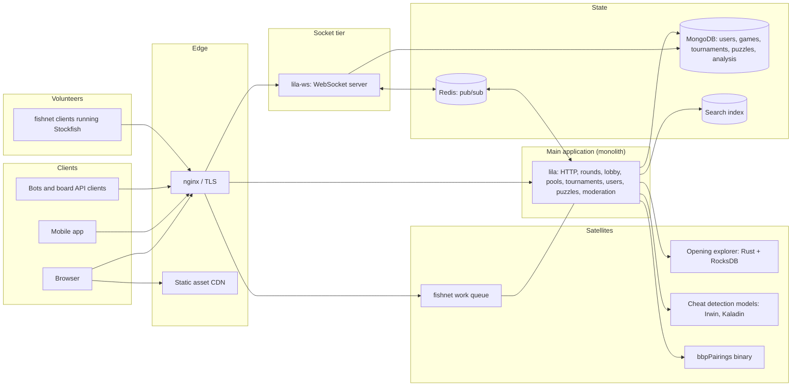
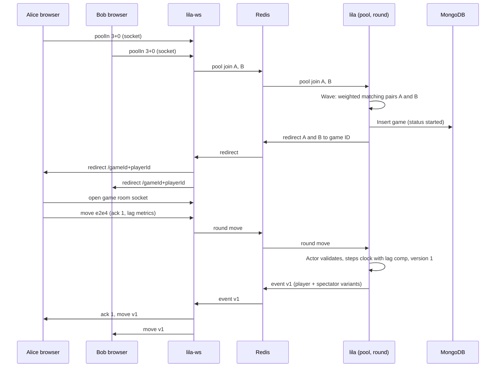

# Lichess

Design an online chess server in the style of Lichess: real-time games from 15-second bullet to
multi-day correspondence, matchmaking and ratings, tournaments, spectating, computer analysis, an
opening explorer over billions of games, puzzles, and cheat detection. All of it free, without ads,
funded by donations.

Three constraints shape the design:

- Clocks. Games end when a clock hits zero, and the most popular time controls give each player one
  to three minutes for the whole game. Network lag of 100 ms per move is a large share of a bullet
  player's time budget, so the server must decide whose time a lag spike consumes, and cheaters must
  not be able to exploit that decision.
- Cost. Lichess runs on donations and a few bare-metal servers. Every subsystem is judged by
  hardware cost first, which pushes toward in-memory state, compact encodings, and volunteer or
  in-browser compute.
- Fair play. A free phone app plays far stronger chess than any human, so the service must detect
  engine assistance from move data alone, at a scale of millions of games per day.

## Contents

1. [Requirements](#1-requirements)
2. [Capacity estimates](#2-capacity-estimates)
3. [Glossary](#3-glossary)
4. [High-level architecture](#4-high-level-architecture)
5. [Real-time transport](#5-real-time-transport)
6. [Game state ownership](#6-game-state-ownership)
7. [Move protocol](#7-move-protocol)
8. [Clocks and lag compensation](#8-clocks-and-lag-compensation)
9. [Matchmaking](#9-matchmaking)
10. [Ratings](#10-ratings)
11. [Tournaments](#11-tournaments)
12. [Spectating and broadcasts](#12-spectating-and-broadcasts)
13. [Game storage and compression](#13-game-storage-and-compression)
14. [Game history, search, and export](#14-game-history-search-and-export)
15. [Computer analysis](#15-computer-analysis)
16. [Opening explorer](#16-opening-explorer)
17. [Puzzles](#17-puzzles)
18. [Fair play](#18-fair-play)
19. [Conduct and abuse](#19-conduct-and-abuse)
20. [Bots and external clients](#20-bots-and-external-clients)
21. [Data model](#21-data-model)
22. [API sketch](#22-api-sketch)
23. [End-to-end flows](#23-end-to-end-flows)
24. [Scaling and reliability](#24-scaling-and-reliability)
25. [Summary of choices](#25-summary-of-choices)
26. [References](#26-references)

---

## 1. Requirements

### Functional

- Play real-time games at any time control from 0.25+0 (15 seconds, no increment) to 180+180, and
  correspondence games with days per move.
- Start games three ways: quick pairing into a pool for a standard time control, a public seek in
  the lobby with custom settings, or a direct challenge to a user or link.
- Rated and casual games, with a separate rating per speed class and per variant.
- Draw offers, takebacks, resignation, aborting before the first moves, and claiming victory when
  the opponent disconnects.
- Tournaments: Arena, Swiss, team battles, and simultaneous exhibitions.
- Watch any live game, a curated "TV" channel of top games, and relays of over-the-board events.
- Request a full engine analysis of any finished game; analyse positions in the browser.
- Browse an opening explorer with move statistics from master games, all Lichess games, or one
  player's games.
- Solve rated puzzles filtered by theme.
- Export games through an API and publish the full game database monthly.
- Detect and act on engine assistance, sandbagging, and abusive behavior.

### Non-functional

| Property | Target |
| --- | --- |
| Move processing latency | Server-side p99 under 10 ms from receiving a move to publishing it; end-to-end latency dominated by the network |
| Clock fairness | A player's clock is charged for their thinking time, with network lag compensated within bounded, abuse-resistant limits |
| Clock precision | Centiseconds |
| Durability | Finished games are never lost; a crash may lose recent moves of games in progress, within bounded limits |
| Availability | Deploys and restarts must not disconnect players or forfeit games |
| Cost | Serve millions of games per day on a few dedicated machines |
| Openness | Source code open; game, puzzle, and evaluation data released publicly |

### Out of scope

- Forums, blogs, messaging, and the coach directory (conventional CRUD features).
- Chess variant rules (they change move generation and nothing else in the architecture).
- Studies (collaborative annotated analysis boards), except where broadcasts use them.

---

## 2. Capacity estimates

Assumptions (order-of-magnitude, chosen for a Lichess-sized service):

| Parameter | Value |
| --- | --- |
| Games per day | 5 M (Lichess reports "more than five million") |
| Peak concurrent players | 100 k |
| Average game length | 70 plies |
| Share of games with a server-side engine analysis | 5% |
| Spectators per live game | 1 on average, with a long tail into the tens of thousands |

### Game and move throughput

- Game starts: 5 M / 86,400 ≈ 58/s average, ~120/s at a 2× peak.
- Moves: 5 M × 70 = 350 M/day ≈ 4 k/s average, ~8 k/s peak.
- Concurrent live games at peak: ~50 k (two players per game, minus games against the AI and bots).
- Each move produces one event per connected viewer of that game: two players plus spectators. At
  three viewers per game that is ~25 k socket writes/s at peak before TV and broadcast fanout.

The write rate is small by the standards of large services. The hard parts are the latency tail
(a 200 ms stall costs a bullet player real clock time) and the per-game consistency of the clock.

### Connections

- Each open page (game, lobby, puzzle, analysis board, tournament) holds a WebSocket. With players,
  spectators, and people browsing, assume 3 to 5 sockets per concurrent player: 300 k to 500 k
  concurrent WebSockets.

### Game storage

- Moves: Huffman-coded move indexes (section 13) take a fraction of a byte per ply. The 2018
  migration to this format saved about 70 GB across 680 M games, roughly 100 bytes per game.
- Clock history: about one byte per ply after compression, so ~70 bytes per game.
- Metadata (players, ratings, status, timestamps, clock settings, field names): ~150 bytes.
- Total ≈ 250 to 300 bytes per game before database block compression.
- 5 M games/day × 300 B ≈ 1.5 GB/day ≈ 550 GB/year. Ten billion games ≈ 3 TB. The whole history
  fits on one server's disks, and the working set of recent and ongoing games fits in RAM.

### Engine analysis

- 5% of 5 M = 250 k analyses/day × 70 positions ≈ 17.5 M positions/day.
- At ~1.5 M nodes per position and ~1 M nodes/s per CPU core, that is ~26 M core-seconds/day, or
  ~300 cores busy around the clock. Renting this is a significant share of a donation budget, which
  is why Lichess sources it from volunteers (section 15).

### Public data

- The open database held 7.9 B rated standard games as of July 2026, growing by ~100 M rated games
  per month.
- 6.1 M rated puzzles and 410 M engine-evaluated positions (September 2026).

---

## 3. Glossary

| Term | Meaning |
| --- | --- |
| Ply | One side's move. A game of 35 moves by each side has 70 plies. |
| Game ID | 8-character base62 identifier, public, used in game URLs. |
| Player ID | 4 extra secret characters appended to the game ID for each side. The 12-character full ID authorizes moves. |
| Perf | A rating category: bullet, blitz, rapid, classical, correspondence, ultrabullet, each variant, and puzzles. Each user has one rating per perf. |
| Speed | Speed class derived from a time control's estimated duration: limit + 40 × increment seconds. |
| Seek (hook) | A lobby entry advertising a desired game (time control, rated, rating range) that anyone compatible can accept. |
| Pool | A matchmaking queue for one standard time control (for example 3+0). |
| Wave | One run of the pool's matching algorithm over everyone currently waiting. |
| Round | The live phase of a game. `lila`'s `round` module owns live games. |
| Room | A set of WebSocket connections that receive the same events: a game, a tournament, the lobby. |
| SRI | Socket random identifier: a per-tab random ID that distinguishes connections of the same user. |
| Socket version | Monotonic counter of events in a room. Clients use it to detect missed events. |
| Lag quota | Per-player budget of lag compensation that refills a little each move (section 8). |
| Arena | Lichess tournament format with continuous pairing over a fixed duration. |
| Berserk | Arena option: halve your clock for a chance at an extra point. |
| fishnet | Volunteer-run distributed Stockfish analysis. |
| Eval | An engine evaluation of a position: score, depth, and principal variation. |
| Mark | A moderation flag on an account (engine, booster, troll) that changes how the system treats it. |

---

## 4. High-level architecture



Principles:

- One large monolith (`lila`, Scala) holds nearly all business logic and live game state in memory.
  It scales vertically on one big machine.
- A separate socket tier (`lila-ws`) owns all WebSocket connections and talks to `lila` through
  Redis pub/sub. Restarting `lila` does not drop a single connection.
- Specialized workloads with different resource profiles run as satellites: the opening explorer
  (disk-heavy), search (index-heavy), cheat detection models (GPU or batch), and Swiss pairing (an
  external C++ program).
- CPU-heavy engine work runs on volunteer machines (fishnet) or in the user's browser (WebAssembly
  Stockfish), off the operator's budget.

---

## 5. Real-time transport

### Client transport options

| Option | Latency | Server cost | Notes |
| --- | --- | --- | --- |
| HTTP polling | Poll interval | Wasted requests | Useless for bullet |
| Long polling | One RTT plus reconnect | Reconnect churn | Early chess sites; works through old proxies |
| Server-sent events + POST for moves | One RTT down; a new request up | Low | Upstream moves pay HTTP overhead; HTTP/2 makes this acceptable |
| WebSocket over TLS | One RTT | One connection per tab | Lichess's choice for browsers and the mobile app |
| NDJSON streaming over HTTP + POST | Same as SSE | Low | Lichess's Board and Bot APIs: easy for third-party programs |
| WebTransport / QUIC | One RTT; survives network changes; no head-of-line blocking | Similar | Browser support is incomplete |
| WebRTC data channel between players | Lowest (peer to peer) | None | Server must still validate moves and own the clock, so the peer path adds nothing but complexity |
| Raw TCP with a custom protocol | One RTT | Low | FICS and ICC, with desktop clients |

Chess traffic is tiny and bursty: a move is tens of bytes. Latency and connection count dominate
the design.

### Where sockets live

| Option | How it works | Pros | Cons |
| --- | --- | --- | --- |
| Sockets in the main application | The app process holds connections and game state together | No hop; simplest | Every deploy or crash disconnects everyone |
| Separate socket tier + message bus (Lichess) | Socket servers hold connections; app talks to them over pub/sub | App restarts invisible to clients; socket tier scales separately | One extra hop; message schema between the two |
| Socket tier with sticky routing to game shards | Load balancer or gateway routes a game's sockets to the shard owning that game | No broadcast bus needed | Requires sharded game ownership (section 6) |
| Managed pub/sub service (Pusher, Ably, AWS API Gateway WebSockets) | Third party holds sockets | No socket ops | Cost per message and connection; latency outside your control |

Lichess moved sockets out of the monolith in 2019. `lila-ws` (Scala, Netty, Pekko) accepts
WebSockets, authenticates sessions against MongoDB, groups connections into rooms, and exchanges
messages with `lila` over Redis pub/sub channels per domain (site, lobby, round, tournament, study,
and so on). The round channel uses 16 parallel Redis connections because it carries the move
traffic.

`lila-ws` handles some work itself so that it never reaches `lila`: pings and lag measurement,
spectator counts, and rate limiting. It also keeps, per game room, the recent versioned
event list so that a reconnecting client can catch up from its last socket version without asking
`lila`.

The split has a second benefit: if `lila` restarts, clients stay connected, see a short pause, and
continue. If `lila-ws` goes down, the site still serves pages but nobody can play.

---

## 6. Game state ownership

Every live game needs exactly one writer that validates moves and updates the clock. Two
concurrent moves for the same game (a move racing a flag claim, a double click, a takeback accept)
must serialize.

### Options

| Option | How it works | Per-move DB writes | Crash behavior | Scale-out |
| --- | --- | --- | --- | --- |
| Stateless handlers + DB as source of truth | Each move reads the game, validates, writes with compare-and-set on ply count | 1 per move | Nothing lost | Any node handles any game |
| In-memory actor per game, write-behind (Lichess) | One actor per live game holds state; writes flush to the DB later | Far fewer than 1 per move | Unflushed moves lost | One process, or shard actors by game ID |
| Sharded game servers | Game ID hashes to one node that owns the actor; routing layer forwards moves | Configurable | Node loss loses its games' unflushed state | Horizontal |
| Event-sourced log | Moves append to a durable log (Kafka, a replicated journal); state rebuilt from log | 1 append per move | Nothing lost | Partition by game ID |
| Client-authoritative, signed moves | Players sign moves; server only relays | None | Nothing to lose | Trivial, but the client owns the clock, which fails fairness |

At ~8 k moves/s the DB-per-move option is feasible, so the choice is about latency tails and cost.
Every DB round trip adds variance directly to the mover's clock.

### Lichess's model

- Each live game has a `RoundAsyncActor`: a single-threaded asynchronous actor that processes
  that game's messages in order. The actor holds a `GameProxy`, an in-memory cached copy of the
  game.
- Saving a move updates the in-memory game and records a dirty diff. It writes to MongoDB
  immediately only when the game's status changes (start, end), for simultaneous exhibitions, and
  for rated correspondence games.
- Otherwise the flush is scheduled 30 seconds out, and each new move reschedules it. A blitz game
  with moves every few seconds may never be written until it ends.
- Writes are diffs (`GameDiff`): only changed fields are `$set` in the document.
- An actor idle for 60 seconds terminates after flushing. The next message for that game reloads it
  from MongoDB.

The trade-off is explicit: a crash of the `lila` process loses recent moves of games in progress.
Graceful shutdowns flush every actor first, so the loss only happens on real crashes. In exchange,
the database sees about one write per game instead of seventy, and the move path never waits on
disk.

---

## 7. Move protocol

### Server-authoritative validation

The server validates every move with its own move generator (`scalachess`), because a client can
send anything. The client also runs move generation (`chessops` in TypeScript) to show legal moves
and play premoves instantly, but its opinion is advisory.

### Message flow

1. The client sends a move over the socket: the move in UCI notation, an acknowledgement ID, and
   lag metrics (section 8).
2. `lila-ws` forwards it to `lila` on the round channel.
3. The game's actor validates the move, steps the clock, detects game end (checkmate, stalemate,
   threefold repetition, insufficient material, 50-move rule), and emits events.
4. Each event gets the next socket version for that game room. `lila-ws` sends them to both players
   and all spectators. The mover receives an acknowledgement.

### Reliability

| Problem | Mechanism |
| --- | --- |
| Lost move on a flaky connection | Client resends with the same acknowledgement ID until acknowledged; the server ignores a move for a ply that has already been played |
| Missed events | Every event carries a socket version. A client that sees a gap asks for events since its last version; if `lila-ws` no longer has them, the client reloads the full game state |
| Reconnect | Client reconnects with its last version and catches up the same way |
| Duplicate tabs | Each tab has its own SRI; both receive events, and either may move |
| Player-only events | Events are split into player and spectator variants; a takeback proposal awaiting one player's answer goes only to that player's connections |

### Premoves

A premove is a move queued on the client during the opponent's turn and sent the instant the
opponent's move arrives. The client reports its own move time as zero for a premove, so the
lag compensation (section 8) charges the premove nothing. Server-side premoves (queued on the
server) would remove the network round trip entirely but let a disconnected player keep moving,
and they complicate takebacks.

### Game lifecycle actions

- Abort: allowed before both sides have moved; no rating change.
- Draw offers and takebacks: stored as flags on the game until the opponent answers or moves.
- Resignation, draw claims (threefold, 50-move), and adding time to the opponent's clock.
- Disconnect: when a player's socket drops, the opponent may claim victory or a draw after a
  timeout (30 seconds by default, 10 seconds when the player closed the tab on purpose, scaled by
  the game's stakes and the player's history).

---

## 8. Clocks and lag compensation

The server owns the clock. The question is what "time spent on a move" means when the server can
only observe when messages arrive.

The server measures `elapsed` = time from sending the opponent's move to receiving this move. That
interval contains the network trip down, the client's render time, the player's thinking time, and
the network trip up. Only the thinking time belongs on the player's clock.

### Options

| Option | How elapsed is charged | Fair to laggy players | Abuse resistance | Example |
| --- | --- | --- | --- | --- |
| Server time only | `elapsed` in full | No: lag is charged to the mover | Strong | Naive servers |
| Trust the client's reported move time | Client-measured thinking time | Yes | None: report 0 every move | Nobody, for rated play |
| Subtract measured RTT | `elapsed − ping` | Mostly | Moderate: a player can inflate pings | Common in games |
| Tamper-resistant client timestamps | Client-side program timestamps moves with an obfuscated protocol | Yes | Depends on obscurity | FICS/ICC timeseal |
| Compensation capped by a refilling quota | `elapsed − min(lag, quota)` | Yes for typical lag | Strong: the quota bounds total benefit | Lichess |
| Delay-based time controls | Each move gets a fixed delay before the clock runs | Partly | Strong | Bronstein and US delay (over-the-board) |

### Lichess's quota algorithm

From `scalachess` (`LagTracker.scala`, `Clock.scala`), all values in centiseconds:

```
estimatedTotalSeconds = limit + 40 × increment
quotaGain = min(100, estimatedTotalSeconds × 2 / 5 + 15)
quota     = 3 × quotaGain          # initial
quotaMax  = 7 × quotaGain

on each move:
  lag         = elapsed − clientMoveTime   # if the client reported its move time
                                           # else the client's lag estimate
  comp        = min(lag, quota)
  quota       = min(quota + quotaGain − comp, quotaMax)
  moveTime    = max(elapsed − comp, 0)
  remaining  -= moveTime − increment
```

Worked numbers:

| Time control | quotaGain | Initial quota | Max quota |
| --- | --- | --- | --- |
| 1+0 | 0.39 s | 1.17 s | 2.73 s |
| 3+0 | 0.87 s | 2.61 s | 6.09 s |
| 5+0 and slower | 1.00 s | 3.00 s | 7.00 s |

- A player with steady 100 ms lag in bullet is fully compensated forever: 0.1 s per move is well
  under 0.39 s of refill.
- A single lag spike of 2 seconds in bullet is compensated up to the current quota; the rest comes
  off the clock.
- A cheater claiming large lag on every move exhausts the quota in a few moves and then gains at
  most `quotaGain` per move.
- When the client reports its render frame lag, `quotaGain` is further capped at frame lag plus an
  estimated 140 ms of CPU lag, so a fast, low-latency client gets less slack to abuse.
- Flagging uses a grace period: a player is out of time when `remaining ≤ elapsed − min(quota, 2 s)`,
  so a flag cannot fire while that player's move may still be in flight.

### Displaying the opponent's clock

The client runs both clocks locally between events. To avoid the opponent's clock jumping back when
their move arrives with compensation applied, the server sends a conservative estimate of the next
compensation: the decaying mean of the opponent's lag minus 0.8 standard deviations, capped at their
current quota. The client pre-subtracts it.

### Server-side pauses

A stop-the-world garbage collection pause on the server lands inside `elapsed` for whoever is on
move. Mitigations: low-pause collectors, keeping per-move allocation small, and monitoring pause
time as a fairness metric alongside latency.

---

## 9. Matchmaking

### Entry points

| Entry | Mechanism |
| --- | --- |
| Quick pairing | Join the pool for a standard time control; the server pairs you |
| Lobby seek | Publish a seek with custom settings; anyone compatible clicks it |
| Challenge | Direct invitation to a user, or an open link |
| Tournament | Tournament-specific pairing (section 11) |

### Pairing algorithm options

| Option | Match quality | Wait time | Complexity |
| --- | --- | --- | --- |
| FIFO: pair the two oldest waiters | Poor | Minimal | Trivial |
| Rating buckets: separate queues per band | Good inside a band; empty bands at the edges | Long at extreme ratings | Low |
| Expanding window per player, greedy | Good | Adapts per player | Greedy choices can strand players |
| Periodic batch ("wave") + maximum weight matching | Globally optimal per wave | Up to one wave interval | O(n³) per wave, fine for n up to hundreds |
| Human choice (lobby seeks) | Players decide | Varies | Trivial |
| Rating + latency + region | Good for lag-sensitive play | Longer | Needs latency estimates per region |

### Lichess pools

Eleven pools, from 1+0 to 30+20. Each pool runs a wave either on a timer or when enough players have
joined:

| Pool | Wave every | Or when waiting reaches |
| --- | --- | --- |
| 1+0, 3+0 | 12 s | 40 players |
| 5+0 | 14 s | 40 |
| 10+0 | 13 s | 30 |
| 2+1, 3+2, 10+5 | 18 to 22 s | 30 |
| 5+3 | 25 s | 26 |
| 15+10, 30+0, 30+20 | 30 to 60 s | 20 |

The timer gets up to one second of random jitter so pools do not run in lockstep.

Each wave:

1. Collects waiting pool members plus lobby seeks with the same time control ("hook thieving"), so
   the lobby and the pool share one population.
2. Partitions out marked players (engine or booster marks), who are paired only with each other,
   by simple rating order.
3. Runs weighted maximum matching (Edmonds' algorithm, `WMMatching`) over everyone else, minimizing
   a score for each potential pair:

   ```
   score = |ratingA − ratingB|
         − min(missBonus(A), missBonus(B))  # 12 per missed wave, capped at 460
         − 200 if both set rating ranges that accept each other
         − ragesitBonus                     # similar conduct histories pair together
         − 30 if both are provisional
   ```

   A pair is forbidden if either player's rating range excludes the other, either blocks the other,
   or the score exceeds a ceiling: 130 below rating 1000, 100 up to 1500, and rating / 15 above
   (133 at 2000, 200 at 3000).
4. Unpaired members stay and increment their miss count, which widens what they accept next wave.
5. The same user is never paired twice in consecutive waves (a guard against client double joins).

Batching lets the matcher see everyone at once. A greedy matcher pairing on arrival gives the first
arrival the nearest available opponent even if a better global assignment exists one second later.

---

## 10. Ratings

### Options

| System | Tracks uncertainty | Handles inactivity | Multiplayer | Notes |
| --- | --- | --- | --- | --- |
| Elo, fixed K | No | No | No | Simple; new players take many games to converge |
| Elo, variable K (FIDE) | Roughly, via K by games played and rating | No | No | Over-the-board standard |
| Glicko | Rating deviation (RD) | RD grows with time | No | Converges fast for new players |
| Glicko-2 | RD plus volatility | Yes | No | Lichess; Glicko-2 variants also used by chess.com |
| TrueSkill / TrueSkill 2 | Gaussian belief | Yes | Yes, teams | Built for team games |
| Whole-History Rating | Full history re-estimation | Yes | No | Most accurate; expensive to recompute |

### Lichess's Glicko-2

- One rating per perf. Defaults: rating 1500, RD 500, volatility 0.09, system constant τ = 0.75.
- Each game is its own rating period, applied immediately at game end. RD inflates with calendar
  time at 0.21436 rating periods per day, tuned so a typical player's RD grows from 60 to 110 in a
  year of inactivity.
- A rating with RD ≥ 110 is provisional and displayed with a question mark. Leaderboards require
  RD ≤ 75 in standard chess (65 in variants).
- Bounds: rating 400 to 4000, RD 45 to 500, volatility at most 0.1. One game changes a rating by at
  most 700 points.
- White's first-move advantage is modeled as about 12 rating points in standard chess (about 20 in
  crazyhouse), so a draw against an equal opponent with Black gains a little.
- New players pair as if rated 1450 on their first game, so the expected score against a 1500
  opponent sits near 50% without changing the stored default.
- A per-perf regulation factor (1.005 for blitz up to 1.02 for some variants) slightly amplifies
  rating gains to counter long-term deflation of the rating pool. Games between a human and a bot
  move the human's rating half as much.

Puzzles use the same system: each attempt is a rated game between the player and the puzzle, and
both ratings update (section 17).

---

## 11. Tournaments

### Formats

| Format | Pairing | Duration | Scale | Notes |
| --- | --- | --- | --- | --- |
| Arena | Continuous: re-paired as soon as you finish | Fixed clock time | Thousands of players | Lichess's main format |
| Swiss | Rounds; players with equal scores meet; no rematches | Fixed rounds | Hundreds | Standard over-the-board format |
| Round robin | Everyone plays everyone | n − 1 rounds | Small | Broadcast events |
| Knockout | Bracket | log₂ n rounds | Any | Needs tiebreak games |
| Simultaneous exhibition | One host plays many | Until done | Tens of boards | Host's clock is shared or absent |
| Team battle | Arena, scored by top players per team | Fixed clock time | Many teams | Arena with team constraints |

### Arena

Rules (from the Lichess tournament help):

- Win 2 points, draw 1, loss 0. After two consecutive wins, wins are worth double until the streak
  breaks.
- Draws within the first 10 moves score nothing. Consecutive draws only score in limited cases.
- Berserk halves the player's clock and removes the increment; a berserk win scores one extra point
  if the game lasted at least 7 moves.
- The player with the most points when the clock runs out wins.

Pairing (`arena/PairingSystem.scala`, `AntmaPairing.scala`):

1. Collect idle players (finished their game and are waiting).
2. At the very start, pair by rating in order.
3. With up to 100 idle players, run weighted maximum matching with cost
   `|rankA − rankB| × rankFactor + |ratingA − ratingB|`, where `rankFactor` runs from 2000 near the
   top of the standings to 300 at the bottom. Leaders should meet leaders; lower down, close ranks
   matter less.
4. With more than 100 idle players, run two matching groups of up to 100 ordered by rank, then pair
   up to six further groups by simple rank proximity, keeping the cubic matcher bounded.
5. Forbid pairing players who just played each other, pairings that would give someone the same
   color more than three times in a row, and (in team battles) teammates.

The standings are a live sorted set of thousands of players with frequent score updates. Options: an
in-memory sorted structure in the process that owns the tournament, rebuilt from the database on
restart; a Redis sorted set; or a database index on `(tournament, score)`. The in-memory structure is
cheapest and matches the single-owner model of section 6.

### Swiss

Swiss pairing rules are intricate (FIDE's Dutch system has dozens of criteria). Lichess shells out
to `bbpPairings`, an open-source C++ implementation. It writes the tournament state as a TRF file
(FIDE's tournament report format), runs the binary, and parses the pairings. It uses the Dutch
system below 250 players, Burstein below 700, and a fast approximate mode above that, trading rule
fidelity for pairing time.

Reusing a certified external implementation beats rewriting a rules engine whose correctness is
defined by a federation handbook.

---

## 12. Spectating and broadcasts

### Live game spectating

Spectators join the game's room in `lila-ws` and receive the spectator variant of each event. The
cost is one socket write per spectator per move, all inside the socket tier.

### Lichess TV

TV channels (one per speed and variant, plus "top rated", "bots", "computer") each pick a featured
game: the highest-rated suitable game in progress, switching when it ends. Every TV viewer receives
every move of the featured game, which makes the top channels the largest routine fanout on the
site.

### Over-the-board broadcasts

Broadcasts relay games from physical tournaments. `lila` polls an upstream source (PGN URLs on the
organizer's server, LiveChessCloud, or Lichess games and users) every few seconds, or accepts PGN
pushed by the organizer's client (the Lichess Broadcaster app reading DGT boards). It diffs the
result against the current state and writes new moves into a study that viewers watch. Organizers
can set a delay, reduced by the estimated polling lag (about 6 seconds for polling, 1 for push), to
stop spectators from relaying engine analysis back to players in the hall.

### Fanout options for large audiences

| Option | Latency | Cost at 100 k viewers | Notes |
| --- | --- | --- | --- |
| Per-viewer WebSocket push from one socket tier | Lowest | 100 k writes per move | What Lichess does |
| Pub/sub across many socket nodes | Low | Spread across nodes | Needed once one socket tier is not enough |
| CDN-cached state polled by clients | Poll interval + CDN TTL | Nearly free on origin | Good for broadcasts where seconds of latency are acceptable |
| Server-sent events through a CDN that supports streaming | Low | CDN pays fanout | Few CDNs handle long-lived streams well |
| Deliberate spectator delay | Delay | Same | Anti-cheat measure; also reduces urgency |

Chess moves are small and infrequent, so even a World Championship broadcast is a modest fanout
problem compared to video.

---

## 13. Game storage and compression

### Move encoding options

| Encoding | Size per ply | Random access to ply N | Decode cost | Notes |
| --- | --- | --- | --- | --- |
| PGN text | ~6 to 7 bytes | Parse from the start | Low | Human-readable standard |
| SAN tokens in a compact binary | ~1 to 2 bytes | Scan from the start | Low | Lichess's older format |
| UCI from-square, to-square | 12 bits (+ promotion) | Direct | Trivial | Easy, but wastes most of the code space |
| Index in the legal move list, fixed width | 8 bits (at most 218 legal moves) | Replay from the start | Move generation per ply | Every ply decode needs the position |
| Legal move index, Huffman-coded with heuristic ordering | A fraction of a byte on average | Replay from the start | Move generation per ply | Lichess since 2018 |
| Arithmetic coding with an engine or neural predictor | Smaller still | Replay | Engine evaluation per ply | Research; decode is far too slow for a serving path |

### Lichess's Huffman format

- For each position, generate all legal moves with bitboards and sort them with a cheap heuristic:
  promotions first, then captures, then moves that avoid squares attacked by enemy pawns, then by a
  piece-square table score, then a lexicographic tie-break.
- The played move's index in that list is usually small. Encode indexes with a fixed Huffman table
  built from real game statistics, so index 0 takes very few bits.
- Decoding replays the game, so it produces as byproducts the final position, position hashes for
  repetition detection, castling rights, and the last move.
- The 2018 migration saved about 70 GB across 680 M games (~100 bytes per game) and encoded a
  40-move game in about 100 µs.

Consequences: reading ply N requires replaying plies 1 to N-1, and the move ordering heuristic and
Huffman table are frozen into the format forever. Changing either requires a format version tag.

### Clock history

Real-time games store remaining time after every ply for both sides. Encoding (from
`lichess-org/compression`, `clock/Encoder.scala`), per side:

1. Truncate each value by 3 low bits (8-centisecond granularity).
2. Predict each value by linear interpolation: recursively bisect the sequence and store the
   midpoint's difference from the average of its endpoints.
3. Predict the final value from the starting time and number of moves, for games under 32 moves.
4. Write the residuals as variable-length signed integers.
5. Write back the 3 truncated low bits only for values under 10 seconds, where precision matters to
   a player looking at a time scramble.

Encoding a side takes about 160 ns. Clocks spend time smoothly, so the residuals are small.

### Database options for games

| Option | Fit | Issues |
| --- | --- | --- |
| Document store (MongoDB) | One document per game with short field names and binary blobs; secondary indexes for user and date | Index size dominates at billions of documents |
| Relational (Postgres) with `bytea` columns | Same, with stronger schema | Vacuum under high update churn of live games |
| Wide-column (Cassandra, Scylla) keyed by game ID, plus a per-user table | Horizontal writes | Two write paths to keep consistent; no ad-hoc queries |
| Hot store + cold object storage | Old games moved to compressed files | Slower access to old games |

Lichess stores games in MongoDB with abbreviated field names and every chess-specific field
binary-encoded: moves, clock histories, the 2-byte castling rights and last move, the 8 to 12 byte
clock state. Access paths:

- By game ID (primary key).
- By user, newest first: an index over `(player user IDs, created at)`.
- A user's games in progress: a separate small index or collection, because this query runs on
  every page load.
- By tournament.

---

## 14. Game history, search, and export

- Per-user history is an index scan over `(user, created at)`, paginated by date.
- Advanced search (by opening, rating range, result, length, date) runs against a separate search
  index, maintained by a satellite service and fed from game-end events.
- Game export API: streams NDJSON or PGN for a user's games, filtered by date and type, rate limited
  per client. A single export of a prolific account scans hundreds of thousands of documents, so
  serving exports from a secondary replica keeps them off the primary that live games write to.
- Public database: every month's rated games are dumped as zstandard-compressed PGN at
  `database.lichess.org`, alongside the puzzle and evaluation datasets, released under CC0. Offering
  bulk dumps removes most of the incentive to scrape the API.

---

## 15. Computer analysis

Server-side analysis runs a strong engine on every position of a finished game to produce
evaluations, mistake annotations, and accuracy numbers. Cheat detection needs the same data.

### Compute sourcing options

| Option | Cost to operator | Latency | Trust | Notes |
| --- | --- | --- | --- | --- |
| Operator-owned engine cluster | High, proportional to demand | Predictable | Full | Straightforward |
| Cloud spot/preemptible instances | Lower | Variable | Full | Preemption handling |
| Volunteer distributed computing (fishnet) | Near zero | Depends on volunteer supply | Must validate results | Lichess |
| Client-side engine (WebAssembly) | Zero | Instant for the user's own analysis | Untrusted, private to the user | Lichess analysis board |
| Cache of evals by position | Storage only | Instant | Depends on source | Deduplicates opening positions |
| Precomputed evals for common positions | Storage only | Instant | Full | Opening books |

### fishnet

- Volunteers run a Rust client that embeds Stockfish (and Fairy-Stockfish for variants).
- Each volunteer has a key tied to their Lichess account.
- Protocol: `POST /fishnet/acquire` returns a job (202) or nothing (204). The client submits results
  to `POST /fishnet/analysis/{work_id}` and receives the next job in the same response, avoiding an
  extra round trip.
- An analysis job contains the starting position, the game's UCI moves, a node limit per position,
  and `skipPositions`: plies already covered by the eval cache or the opening book, which the client
  skips.
- A job abandoned by a stopping client is released through `POST /fishnet/abort/{work_id}`, or
  reassigned after a timeout.
- Queue priorities: user-requested analyses come before system-requested ones (for cheat
  detection), and per-user limits stop one account from flooding the queue.
- The protocol also has a move work type, used when a user plays against the computer.

Trust: a malicious volunteer could submit fabricated evaluations, which would corrupt both user
analysis and cheat detection inputs. Keys trace every result to an account and can be revoked.
Further mitigations: validate that PVs are legal and depth and node counts are plausible, and
re-analyse a random sample of submitted work on trusted machines.

### In-browser analysis and the eval cache

- The analysis board runs Stockfish compiled to WebAssembly, using the user's CPU.
- Deep enough evaluations from browsers are submitted to a shared eval cache keyed by position.
  Other users who open that position get the cached result instantly ("cloud analysis").
- This dataset, 410 M evaluated positions as of September 2026, is published as part of the open
  database.

---

## 16. Opening explorer

For any position, show each next move with its win/draw/loss counts and average rating, filtered by
source (masters, all Lichess games, one player), speed, rating band, and date range. The input is
billions of games; queries must return in milliseconds.

### Options

| Option | Query cost | Index cost | Notes |
| --- | --- | --- | --- |
| Query the game database on demand | Scan billions of games | None | Impossible at interactive latency |
| Precomputed position → move statistics in a key-value store | One prefix read | Write per ply per indexed game | Lichess |
| Search engine with a position-hash field | Aggregation query | Large index | Aggregations over billions of documents are slow |
| Columnar OLAP (ClickHouse) with a `(position hash, month, bucket)` table | Fast aggregation | Moderate | Good for ad-hoc filters; more memory |
| Ship a subset to the client | Local | Download size | Only works for small databases (masters) |

### Lichess's explorer

- A Rust service on RocksDB.
- The key starts with a 12-byte prefix: a stable 128-bit Zobrist hash of the position, XORed with a
  per-variant constant and, for the player explorer, with a SHA-1 of the player name and color. Two
  bytes of month (or year, for masters) follow. A prefix seek returns every month for a position,
  and the date filter picks months from that range.
- The value holds statistics per move, bucketed by speed and by 11 average-rating groups (below
  1000, 1000, 1200, … 2500, 2800, 3200), plus a few top and recent game IDs.
- Column families have associative merge operators, so indexing a game is a series of blind merge
  writes with no read-modify-write. RocksDB combines operands during compaction.
- Prefix bloom filters make lookups of absent positions cheap.
- The player explorer indexes on demand: the first request for a player enqueues a job that
  streams that player's games from `lila` and indexes them.
- Reported production figures (2023): about 12,000 requests per minute from four spinning disks in
  RAID 10 with 128 GiB RAM, 100 GiB of it block cache; indexing at ~1 MiB/s of compressed PGN; the
  database stays under 3× the size of the compressed PGN it indexes.

The source notes that Zobrist hashing is cheap, and that someone could craft a position that
collides with another player's entry. The incentive is negligible, so the design accepts it.

---

## 17. Puzzles

### Generation

1. Take games with engine analysis.
2. Find positions where one side has a decisive continuation after the opponent's mistake.
3. Keep only positions where each of the solver's moves is the only good move, verified by deeper
   search with multiple principal variations. Puzzles with two winning answers frustrate players.
4. Tag themes (fork, pin, mate in 2, endgame type) with pattern detectors.
5. Use player votes and solve statistics to drop bad puzzles after release.

Lichess runs this offline in a separate tool (`lichess-puzzler`) and imports results.

### Rating

Each attempt is a Glicko-2 game between the player and the puzzle; both ratings update. A
puzzle's rating becomes its difficulty, measured by how players actually do on it.

### Selection

The query is "a puzzle near my rating, in this theme, that I have not seen". Options:

| Option | Cost per request | Freshness | Notes |
| --- | --- | --- | --- |
| Random sample from an index on `(theme, rating)` | An index range scan plus sampling | Always current | Hot index under load |
| Precomputed paths (Lichess) | One small lookup | Rebuilt periodically | Paths are lists of puzzle IDs per theme, quality tier, and rating range |
| Per-user recommender | Model inference | Personalized | Heavier infrastructure |

Lichess precomputes "paths": documents each holding an ordered list of puzzle IDs for one theme,
quality tier (top, good, all), and rating range. A session picks a random path matching the player's
rating (adjusted by the chosen difficulty) and walks it. If no unused path matches, the rating
window widens step by step. The source comments record that selecting a path was once the heaviest
query on the puzzle database, which is why selection happens once per path rather than per puzzle.

---

## 18. Fair play

### Threats

| Threat | Description |
| --- | --- |
| Engine assistance | Blatant (every move) or selective (a few critical moves per game) |
| Rating manipulation | Win-trading with alternate accounts (boosting) or losing on purpose to get lower-rated opponents (sandbagging) |
| Lag abuse | Faking lag to gain clock time (bounded by the quota in section 8) |
| Automation | Unauthorized bots playing on human accounts |

### Detection signals

| Signal | Source | Needs engine analysis |
| --- | --- | --- |
| Agreement with engine top moves, average centipawn loss, accuracy in complex positions | fishnet analysis | Yes |
| Move-time distribution: uniform thinking time regardless of position complexity | Clock history | No |
| Focus loss (tab switches) during the player's turn | Client events | No |
| Piece hold and drag timing | Client events | No |
| Performance relative to the player's own history (sudden jumps) | Aggregated player statistics | No |
| Result patterns between the same pairs of accounts | Game results | No |
| Shared IPs and device fingerprints between accounts | Security logs | No |

### Models

- Irwin: a neural network over Stockfish-derived features of a player's games (loss metrics per
  move, in context). It detects play that looks like an engine and needs fishnet analysis of a
  sample of games.
- Kaladin: a convolutional network over the player's aggregated "insights" data. It detects play
  that is uncharacteristic of the player and needs no engine analysis, so it can screen far more
  players.
- Both produce scores for moderator queues. Very clear cases are acted on automatically; everything
  else and all appeals go to humans.
- The score thresholds for automatic reports and marks are runtime settings stored in the database,
  so publishing the code does not publish them.

### Enforcement options

| Option | Effect | Trade-off |
| --- | --- | --- |
| Ban and close the account | Removes the player | Creates a new account next day |
| Mark and segregate | Marked players leave leaderboards and pair only with each other in pools | Keeps them playing each other, harmlessly |
| Rating refund | Opponents get back rating lost to the cheater | Requires tracking every affected game |
| Delay or hide live games | Prevents real-time assistance by spectators | Worse spectating |
| Client anti-tamper | Detects some local engines | Useless against a second device; incompatible with an open-source client |
| Proctoring (camera, screen share) | Strong for prize events | Invasive; only for small events |

Lichess combines marks, segregation in pools (visible in the pool code, where marked players are
partitioned out before matching), and rating refunds. False positives are the main risk: a marked
strong player is a public and costly mistake, which is why the models feed human review.

---

## 19. Conduct and abuse

- Playban. The system classifies how each game ended for each player: normal play, aborting at the
  start, never making a first move, rage-quitting by disconnecting, or sitting on a lost position
  until the clock runs out. Repeated bad outcomes produce escalating temporary bans from the pools
  and lobby.
- Rage-sit counter. Each player has a running conduct score. Matchmaking (section 9) rewards pairing
  players with similar scores and penalizes pairing a good-conduct player with a bad one, so
  habitual sitters meet each other.
- Chat. A scoring module flags insults and spam; repeated offenses lead to chat timeouts. Kid mode
  and per-game settings disable chat entirely.
- Rate limits on logins, account creation, seeks, challenges, API endpoints, and socket messages,
  kept in memory in `lila` and `lila-ws`.
- Multi-account detection: shared IPs, device fingerprints, and game patterns between accounts feed
  moderator tools for boosting and ban evasion.

---

## 20. Bots and external clients

Lichess exposes two HTTP streaming APIs for programs:

| API | Account type | Purpose |
| --- | --- | --- |
| Bot API | Accounts upgraded to BOT, which can no longer play as humans | Engines and experiments play rated games against people who challenge them |
| Board API | Normal human accounts | Physical e-boards and alternative clients; open seeks limited to rapid, classical, and correspondence, because the server cannot tell who produced moves arriving through an API |

Both follow the same shape: a long-lived NDJSON event stream (`GET /api/stream/event`) announces
challenges and game starts; a per-game stream delivers full state then each move; moves are
`POST` requests. HTTP streams are easier for third-party authors than a WebSocket protocol with
versions and acknowledgements, and they reuse the same round actors underneath.

Bots cannot join pools or most tournaments. They play through challenges, and have their own TV
channel.

---

## 21. Data model

| Collection / store | Key | Fields | Notes |
| --- | --- | --- | --- |
| `users` | user ID (lowercase name) | profile, marks, roles, created, seen, perf ratings (rating, RD, volatility, game count per perf) | Perfs embedded or in a sibling collection |
| `games` | game ID | player user IDs and secret player IDs, ratings before and after, status, winner, variant, clock config, Huffman moves, clock histories, 2-byte castling + last move, created/updated, tournament ID | Indexes: `(user IDs, created)`, tournament |
| `analysis` | game ID | per-ply evals and PVs | From fishnet |
| `fishnet_work` | work ID | game ID, type, acquired by, acquired at, tries, sender | Work queue; stale acquisitions reset |
| `eval_cache` | position (normalized FEN) | multi-PV evals, depth, nodes | From browsers and fishnet |
| `tournaments` | tournament ID | schedule, clock, status, conditions | |
| `tournament_players` | `(tournament, user)` | score, rating, performance, fire (streak) flag, berserk count | Index on `(tournament, score)` |
| `tournament_pairings` | game ID | tournament, users, winner, berserks, turns | For standings and history |
| `swiss`, `swiss_players`, `swiss_pairings` | | similar | TRF generated from these |
| `puzzles` | puzzle ID | FEN, solution moves, themes, Glicko, votes, plays | |
| `puzzle_paths` | path ID (theme, tier, rating range) | ordered puzzle IDs, min/max rating | Rebuilt periodically |
| `puzzle_rounds` | `(user, puzzle)` | win, date, rating change | Also answers "already seen" |
| `playbans` | user ID | outcome history, bans, rage-sit counter | |
| `reports`, `modlog` | ID | reporter, suspect, reason, scores, actions | Moderation |
| `relay_rounds`, `studies`, `chapters` | ID | sources, sync settings, delay; PGN trees | Broadcasts |
| Explorer (RocksDB) | 12-byte position prefix + 2-byte month | per-move stats by speed and rating group | Separate service |
| Search index | game ID | searchable projections of game fields | Satellite service |

---

## 22. API sketch

Illustrative, modeled on Lichess's public API and socket protocol.

### HTTP

| Method and path | Purpose |
| --- | --- |
| `POST /api/board/seek` / pool join over socket | Seek a game |
| `POST /api/challenge/{username}` | Challenge a user |
| `GET /api/stream/event` | NDJSON stream of incoming challenges and game starts (bots, board API) |
| `GET /api/board/game/stream/{gameId}` | NDJSON stream of one game's state and moves |
| `POST /api/board/game/{gameId}/move/{uci}` | Play a move |
| `GET /api/games/user/{username}` | Stream a user's games as PGN or NDJSON |
| `GET /api/tournament/{id}/results` | Stream standings |
| `POST /fishnet/acquire`, `POST /fishnet/analysis/{workId}` | Volunteer analysis protocol |
| `GET explorer.lichess.ovh/lichess?fen=…&speeds=…&ratings=…` | Opening explorer query |
| `GET /api/puzzle/next?angle={theme}` | Next puzzle |

### WebSocket messages (game room)

| Direction | Message | Contents |
| --- | --- | --- |
| Client → server | `move` | UCI move, acknowledgement ID, lag metrics, premove flag |
| Server → client | `move` | version, UCI, SAN, FEN, clocks for both sides, compensation estimate |
| Server → client | `ack` | acknowledgement ID |
| Client → server | `flag` | claim the opponent is out of time; the server checks |
| Either | `draw-yes`, `takeback-yes`, `resign`, `abort`, `moretime` | Lifecycle actions |
| Server → client | `end`, `endData` | Result, rating changes |
| Server → client | `resync` | Tell the client to reload full state |
| Client → server | `p` (ping) | With the client's measured lag; the server replies with pong |

---

## 23. End-to-end flows

### Quick pairing to first move



### Reconnect after a network drop

1. Bob's socket drops at version 41. `lila-ws` tells `lila` Bob went offline; the actor starts his
   disconnect timer. Bob's clock keeps running if it is his turn.
2. Bob reconnects with `v=41`. `lila-ws` has the room's events up to version 44 in memory and sends
   42 to 44.
3. If the history no longer covers version 41, the client receives `resync` and reloads the game.
4. The actor marks Bob online and cancels the claim-victory option for Alice.

### Game end

1. The move is checkmate. The actor sets status, winner, and final clocks, and flushes to MongoDB
   immediately (status changed).
2. Ratings update for both players (Glicko-2), and playban outcomes are recorded.
3. The game is published to tournament standings, the search indexer, and activity feeds.
4. If cheat screening wants it, the game enters the fishnet queue at system priority.

---

## 24. Scaling and reliability

### Monolith versus services

| Option | Pros | Cons |
| --- | --- | --- |
| One vertically scaled monolith + satellites (Lichess) | In-process calls; single owner for live state; small team can run it; lowest hardware cost | Ceiling at the largest machine; a crash affects all games |
| Microservices per domain | Independent deploys and scaling | Network hops on the move path; distributed state; operations cost |
| Monolith sharded by game ID | Keeps in-process simplicity per shard; horizontal | Cross-shard features (lobby, tournaments, TV) need coordination |

Lichess runs one `lila` process on a single large dedicated machine (a third-party write-up
describes 96 logical cores and 192 GiB of RAM), with MongoDB, Redis, `lila-ws`, and the satellites on
other dedicated servers rented from OVH. The monolith is fully asynchronous (Scala futures and
Pekko), so one process serves all live games. If it outgrows the largest machine, the round module
is the natural shard boundary: games are independent, and the socket tier already routes by room.

### Deploys

1. Deploy `lila`: the process shuts down gracefully, flushing every game actor to MongoDB.
2. `lila-ws` keeps all sockets open and buffers or drops messages while `lila` is away.
3. The new process loads games lazily when messages arrive for them.
4. Clients see a brief pause at most. The clock timer is a stored timestamp, so the restart gap
   lands inside `elapsed` for the player on move. Short restarts fit within the lag quota; a longer
   outage needs an explicit fix, either giving back the downtime to games in progress or pausing
   clocks during planned maintenance.

### Failure modes

| Failure | Effect | Mitigation |
| --- | --- | --- |
| `lila` crash | Unflushed moves of live games lost | Graceful shutdown for planned restarts; immediate flush on status changes |
| `lila-ws` crash | Everyone disconnects and reconnects | Clients reconnect with backoff and version resync |
| Redis down | No messages between tiers; play stops | Single dedicated Redis for pub/sub; fast restart; nothing durable in it |
| MongoDB primary failover | Seconds of write unavailability | Replica set; live games continue in memory during the failover |
| fishnet volunteers drop off | Analysis queue grows | Priorities; operator-owned fallback capacity |
| Stop-the-world GC pause | Clock time charged to players on move | Low-pause collector; allocation discipline; pause monitoring |

### Cost discipline

- Dedicated bare-metal servers rented by the month.
- Compact encodings keep the entire game history on a small number of disks.
- Engine work on volunteers' and users' CPUs.
- Monthly public data dumps reduce API scraping load.
- A small operations surface: one monolith, a handful of satellites, one database technology for
  most data.

---

## 25. Summary of choices

| Problem | Lichess's choice | Main alternative | Why the choice |
| --- | --- | --- | --- |
| Client transport | WebSocket; NDJSON streams for bots and boards | SSE + POST, WebTransport | Low latency both ways; streams are easier for third parties |
| Socket ownership | Separate `lila-ws` tier over Redis pub/sub | Sockets inside the monolith | App restarts do not disconnect players |
| Live game state | In-memory actor per game, write-behind flush | DB write per move, event log | Minimal DB load and no disk on the move path |
| Move validation | Server-side with `scalachess`; client-side for UX | Client-authoritative | Clients are untrusted |
| Lag handling | Capped compensation with a refilling quota | Server time only, trusted client time | Fair for normal lag, bounded gain for abusers |
| Matchmaking | Pool waves + weighted maximum matching | Greedy expanding window | Globally best pairs per wave |
| Ratings | Glicko-2, one per perf, per-game periods | Elo | Fast convergence and explicit uncertainty |
| Arena pairing | Weighted matching on rank and rating, bounded group size | Pure rating proximity | Leaders meet leaders; bounded cubic cost |
| Swiss pairing | External `bbpPairings` via TRF | Custom implementation | Rules fidelity to the FIDE handbook |
| Move storage | Legal-move index, Huffman-coded | PGN, UCI | ~100 bytes saved per game across billions |
| Clock storage | Truncation + linear prediction residuals | Raw centiseconds | About one byte per ply |
| Game database | MongoDB with binary fields | Wide-column store | Flexible queries at a size one cluster handles |
| Engine analysis | Volunteer fishnet + in-browser WASM + eval cache | Owned engine cluster | Near-zero compute cost |
| Opening explorer | RocksDB, position-hash prefix keys, merge operators | OLAP database | Blind writes and single prefix reads |
| Puzzle selection | Precomputed paths per theme, tier, rating | Random sample per request | One cheap lookup per session |
| Cheat detection | Irwin + Kaladin feeding human moderators | Client anti-tamper | Works with an open-source client and catches second-device cheating |
| Enforcement | Marks, pool segregation, rating refunds | Bans only | Contains cheaters and repairs damage to victims |
| Deployment | One vertically scaled monolith on bare metal | Microservices on cloud | Lowest cost and operational load for a donation-funded service |

---

## 26. References

Lichess source code:

- [lichess-org/lila](https://github.com/lichess-org/lila): main application. Relevant files:
  `modules/round/src/main/GameProxy.scala`, `modules/round/src/main/RoundAsyncActor.scala`,
  `modules/pool/src/main/MatchMaking.scala`, `modules/pool/src/main/PoolList.scala`,
  `modules/tournament/src/main/arena/PairingSystem.scala`,
  `modules/tournament/src/main/arena/AntmaPairing.scala`, `modules/swiss/src/main/PairingSystem.scala`,
  `modules/rating/src/main/Glicko.scala`, `modules/game/src/main/BinaryFormat.scala`,
  `modules/puzzle/src/main/PuzzlePath.scala`
- [lichess-org/lila-ws](https://github.com/lichess-org/lila-ws): WebSocket server
- [lichess-org/scalachess](https://github.com/lichess-org/scalachess): chess rules, clocks
  (`LagTracker.scala`, `Clock.scala`, `MoveMetrics.scala`), Glicko-2
- [lichess-org/compression](https://github.com/lichess-org/compression): move and clock history
  encoders
- [lichess-org/fishnet](https://github.com/lichess-org/fishnet) and its
  [protocol](https://github.com/lichess-org/fishnet/blob/main/doc/protocol.md)
- [lichess-org/lila-openingexplorer](https://github.com/lichess-org/lila-openingexplorer)
- [lichess-org/lichess-puzzler](https://github.com/lichess-org/lichess-puzzler)
- [lichess-org/kaladin](https://github.com/lichess-org/kaladin) and
  [clarkerubber/irwin](https://github.com/clarkerubber/irwin)
- [BieremaBoyzProgramming/bbpPairings](https://github.com/BieremaBoyzProgramming/bbpPairings)

Lichess pages and posts:

- [About lichess.org](https://lichess.org/about)
- [Developer update: 275% improved game compression](https://lichess.org/@/lichess/blog/developer-update-275-improved-game-compression/Wqa7GiAA)
- [Arena tournament rules](https://lichess.org/tournament/help)
- [Is Lichess lagging?](https://lichess.org/lag)
- [Lichess open database](https://database.lichess.org/)
- [Lichess API reference](https://lichess.org/api)

Background:

- Mark Glickman. [The Glicko-2 system](http://www.glicko.net/glicko/glicko2.pdf)
- Jack Edmonds. Paths, trees, and flowers. Canadian Journal of Mathematics, 1965 (maximum matching).
- FIDE Handbook, C.04 Swiss pairing systems (Dutch and Burstein rules).
- David Reis. [What happens when you make a move in lichess.org?](https://www.davidreis.me/2024/what-happens-when-you-make-a-move-in-lichess)
