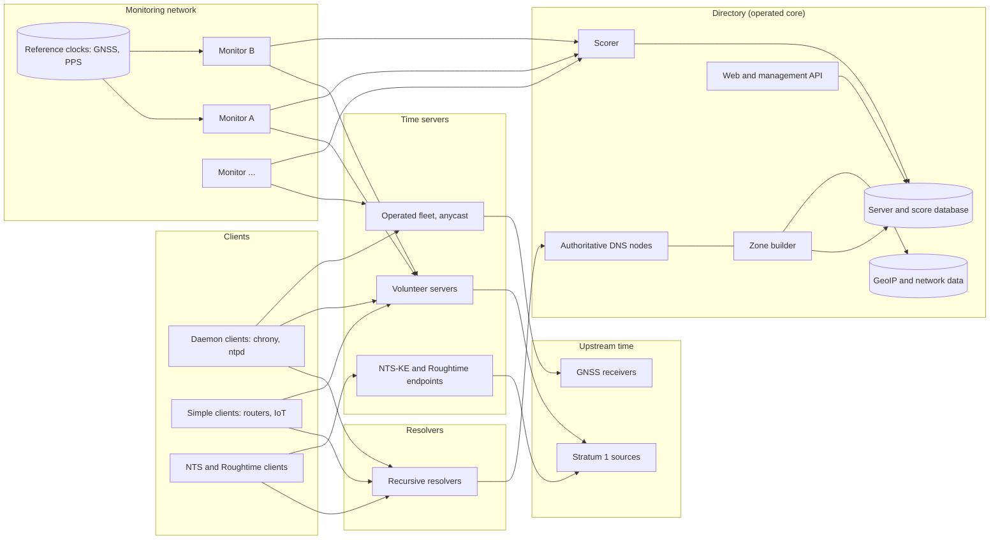
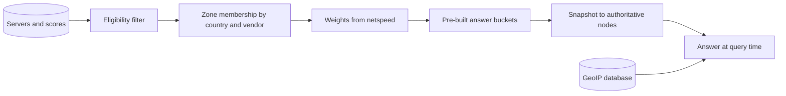
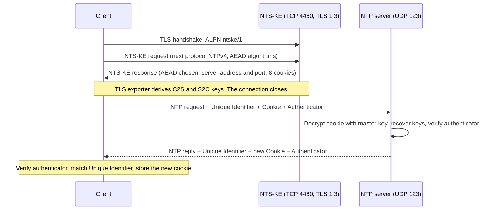
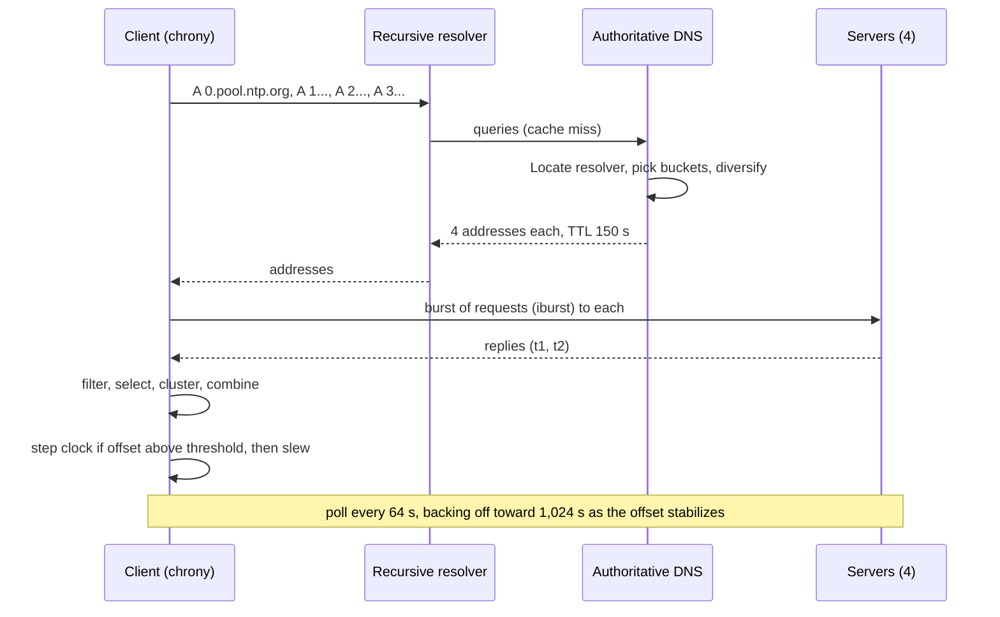

# NTP Pool

Design a global public time service in the style of the NTP Pool Project (`pool.ntp.org`): hundreds
of millions of devices ask a well-known name for the time, receive the addresses of a few servers,
and synchronize their clocks to within a few milliseconds of UTC over UDP. The servers are run by
thousands of volunteers, and the operators of the pool never touch the time packets. They run the
directory that decides which servers each client hears about, and the monitoring that decides which
servers deserve to be listed.

The packet exchange fits in 48 bytes, so the interesting questions sit around it:

- Who serves. Aggregate load is a few hundred thousand small packets per second, which a dozen
  well-tuned machines could handle. Volunteer servers, an operated anycast fleet, and hypervisor
  or edge time each buy different trust, cost, and geography, and the design can mix them.
- Who is believed. Time is a single number that every client trusts to make certificates, logs,
  tokens, and distributed databases behave. Servers may be wrong by accident (a failed GPS
  receiver) or on purpose (an operator who wants to shift the clocks of a region). Scoring,
  diversity rules, client-side selection algorithms, and cryptographic authentication defend
  against different parts of that threat.
- Who is protected. Every open UDP time service is also an amplifier for spoofed-source floods,
  and every fleet of embedded devices contains firmware that polls one hardcoded address as fast as
  the network allows. The directory, the servers, and the protocol all carry defenses for that.

## Contents

1. [Requirements](#1-requirements)
2. [Capacity estimates](#2-capacity-estimates)
3. [Glossary](#3-glossary)
4. [High-level architecture](#4-high-level-architecture)
5. [Time sources](#5-time-sources)
6. [NTP packet exchange and the server data path](#6-ntp-packet-exchange-and-the-server-data-path)
7. [Serving models](#7-serving-models)
8. [Client discovery](#8-client-discovery)
9. [DNS answer generation](#9-dns-answer-generation)
10. [Server monitoring and scoring](#10-server-monitoring-and-scoring)
11. [Load distribution and overload](#11-load-distribution-and-overload)
12. [Abuse and reflection](#12-abuse-and-reflection)
13. [Authenticated time](#13-authenticated-time)
14. [Threat model: liars and delay attacks](#14-threat-model-liars-and-delay-attacks)
15. [Client algorithms and polling](#15-client-algorithms-and-polling)
16. [Leap seconds and era boundaries](#16-leap-seconds-and-era-boundaries)
17. [Error bounds and high-accuracy variants](#17-error-bounds-and-high-accuracy-variants)
18. [Multi-site operation and availability](#18-multi-site-operation-and-availability)
19. [Data model](#19-data-model)
20. [API sketch](#20-api-sketch)
21. [End-to-end flows](#21-end-to-end-flows)
22. [Scaling and reliability](#22-scaling-and-reliability)
23. [Summary of choices](#23-summary-of-choices)
24. [References](#24-references)

---

## 1. Requirements

### Functional

- Resolve a stable name (`pool.ntp.org`, `2.pool.ntp.org`, `de.pool.ntp.org`) to a handful of NTP
  server addresses close to the client.
- Answer NTP client requests (RFC 5905, mode 3) from every listed server with correct timestamps,
  stratum, and root delay and dispersion.
- Let anyone contribute a server: register an address, choose how much traffic it accepts, and
  join or leave the pool at will.
- Continuously measure every listed server from several locations, and remove servers that are
  wrong, unreachable, or unstable.
- Provide regional zones (continent, country, and in some places sub-country), IPv4 and IPv6
  answers, and vendor zones (`debian.pool.ntp.org`) so that operating systems and device makers
  can ship a name that belongs to them.
- Offer authenticated time to clients that want it: Network Time Security (NTS) for NTP and
  Roughtime for signed, auditable timestamps.
- Publish per-server and per-zone status so that operators can debug their servers and clients
  can see how the pool behaves.

### Non-functional

| Property | Target |
| --- | --- |
| Accuracy at the client | Typically 1 to 10 ms from UTC over the public internet; bounded by half the round-trip delay plus server error |
| Server accuracy | Listed servers within 50 ms of UTC at all times, and within 10 ms in normal operation |
| Availability of discovery | 99.99% for DNS answers; answers keep flowing when every control-plane component is down |
| Availability of time | Any client can reach at least four healthy servers in its zone or a neighboring zone |
| Correctness | A server that is off by more than the configured threshold leaves the DNS answers within one scoring interval (minutes) |
| Diversity | No single operator, network, or country supplies a majority of the servers in any answer or, where avoidable, in any zone |
| Abuse resistance | The service cannot be used to amplify traffic; abusive clients receive less service, not more |
| Cost | Bandwidth and hardware are volunteer-donated; the operated core (DNS, monitors, web) runs on a small budget |

### Out of scope

- Time distribution inside a single datacenter or LAN at microsecond accuracy (PTP, White Rabbit),
  except where section 17 compares it.
- Building national time laboratories or the atomic clocks that feed UTC.
- Operating system clock disciplining internals (kernel PLL and FLL loops), except where the
  client behavior shapes server load (section 15).
- Paid time-as-a-service with contractual accuracy (traceability certificates, audit reports).

---

## 2. Capacity estimates

Assumptions sized to a large public pool. The public pool reports several thousand active servers
across IPv4 and IPv6. The client population is an assumption in the right order of magnitude, since
NTP servers do not track clients.

| Parameter | Value |
| --- | --- |
| Active client hosts | 100 M |
| Daemon clients (chrony, ntpd, systemd-timesyncd in polling mode) | 30% of hosts, 4 servers each, mean poll interval 512 s |
| Simple clients (SNTP in routers, IoT, scripts) | 70% of hosts, 1 query per 4 hours on average |
| Listed servers | 5,000 (4,000 IPv4, 1,000 IPv6) |
| Monitors | 10 vantage points |
| Monitor check interval | 20 minutes per server per monitor |
| Peak-to-average ratio | 4× (top-of-hour cron jobs, mass power restoration, popular firmware boot storms) |

### NTP request rate

- Daemons: 30 M × 4 servers / 512 s ≈ 234 k requests/s.
- Simple clients: 70 M / 14,400 s ≈ 4.9 k requests/s.
- Total ≈ 240 k requests/s average, ≈ 1 M requests/s at peak.
- Frame size on the wire: 48 B NTP + 8 B UDP + 20 B IPv4 + 14 B Ethernet = 90 B (plus preamble and
  gap on a real link). Average 240 k/s × 90 B ≈ 22 MB/s ≈ 175 Mbit/s inbound and the same outbound.
  Peak ≈ 700 Mbit/s each way, spread across the whole pool.
- Per listed server: 240 k / 5,000 ≈ 48 requests/s on average. The spread is wide: zones with
  few servers per client (parts of Asia, South America, and Africa) push hundreds of requests per
  second per server, while well-served European zones send a few.

### DNS rate

- Daemons resolve the pool name at start, after restarts, and when replacing unreachable servers.
  Assume one lookup per source per 6 hours: 30 M × 4 / 21,600 s ≈ 5.6 k/s.
- Simple clients often resolve before every query: ≈ 4.9 k/s.
- Recursive resolver caching (TTL of a couple of minutes) removes a large share of these, while
  broken clients that resolve in a loop add a heavy tail. Budget 30 k queries/s average and
  200 k/s peak at the authoritative tier.

### Monitoring

- 5,000 servers × 10 monitors × 3 checks/hour ≈ 42 checks/s. Trivial on the network side, and the
  cost is in storage and scoring logic.
- One check record of ~100 B: 5,000 × 10 × 72 per day × 100 B ≈ 360 MB/day, ≈ 130 GB/year. Keep
  raw checks for 90 days and aggregates for years.

### Authenticated time

- NTS-KE (TLS 1.3 handshake plus cookie issue) per NTS client per day at most: with 5% of hosts on
  NTS, 5 M / 86,400 ≈ 58 handshakes/s. Small next to the NTP packet rate.
- Roughtime servers sign one Ed25519 signature per batch of requests, so signing cost is far below
  the request rate.

### Serving cost on one machine

- A stateless UDP responder on the kernel network stack with `SO_REUSEPORT`, `recvmmsg`, and
  `sendmmsg` handles several hundred thousand packets per second per core. With kernel bypass
  (AF_XDP or DPDK), millions of packets per second per core.
- The entire pool's peak of ~1 M requests/s therefore fits on a handful of cores. The pool's
  distribution across thousands of volunteer machines serves geography, independence, and trust
  diversity. Raw compute is not the constraint (section 7).

---

## 3. Glossary

| Term | Meaning |
| --- | --- |
| NTP | Network Time Protocol (RFC 5905): a request-response protocol over UDP port 123 that estimates clock offset and delay. |
| SNTP | Simple NTP (RFC 4330): a client that sends one request and sets its clock from one reply, without filtering or selection. |
| Stratum | Distance from a reference clock. Stratum 0 is the clock itself, stratum 1 a server attached to it, stratum 2 a server synchronized to stratum 1, and so on. |
| Offset | Estimated difference between client and server clocks. |
| Delay (round trip) | Network time between sending a request and receiving its reply, excluding server processing. |
| Root delay, root dispersion | Accumulated delay and error bound back to the stratum 1 source; their sum defines the root distance. |
| Refid | A 4-byte field naming a stratum 1 clock type (`GPS`, `PPS`) or the IPv4 address (or hash of the IPv6 address) of the upstream server. |
| Leap indicator | Two bits in each packet announcing an upcoming leap second or an unsynchronized clock. |
| KoD | Kiss-o'-Death: a reply with stratum 0 and an ASCII code (`RATE`, `DENY`) telling a client to slow down or stop. |
| Pool | A DNS name backed by a changing set of servers, plus the monitoring that decides membership. |
| Zone | A named subset of the pool by geography (`europe`, `de`) or ownership (`debian`). |
| Netspeed | An operator's declared share of traffic that their server can handle, used as a DNS selection weight. |
| Score | A number per server and monitor summarizing recent correctness and reachability. Listing requires a threshold. |
| Monitor | A machine outside the pool that queries servers, compares their time with its own reference, and reports results. |
| NTS | Network Time Security (RFC 8915): authenticates NTP packets with keys negotiated over TLS. |
| NTS-KE | The TLS-based key establishment protocol of NTS, on TCP port 4460. |
| Cookie | An opaque encrypted blob in NTS that carries per-session keys to a server, so the server holds no per-client state. |
| Roughtime | A protocol that returns signed timestamps with an uncertainty radius, which clients can chain into proof of server misbehavior. |
| PTP | Precision Time Protocol (IEEE 1588): hardware-assisted synchronization used inside datacenters. |
| GNSS | Global navigation satellite systems: GPS, Galileo, BeiDou, GLONASS. |
| PPS | Pulse-per-second signal from a GNSS receiver, giving a hardware edge at the start of each second. |
| Holdover | How long a local oscillator keeps time within a bound after losing its source. |
| Smear | Spreading a leap second over hours by slowing or speeding the clock slightly, so that no second is repeated or skipped. |
| Falseticker | A source whose time disagrees with the majority and is excluded by the selection algorithm. |
| Truechimer | A source whose interval overlaps the consensus. |
| Era | One 2^32-second span of NTP's 32-bit seconds field; era 0 ends on 2036-02-07. |

---

## 4. High-level architecture



Principles:

- The directory and the time servers are independent. Clients query servers directly over UDP.
  The directory only decides which addresses appear in DNS answers, so a directory outage leaves
  every client that already knows its servers unaffected.
- The data plane keeps no per-client state. An NTP server answers each packet from its clock and
  its own upstream status. NTS cookies carry the session keys, so even authenticated service is
  stateless at the time server.
- Membership follows measurement. Nothing enters DNS answers until monitors have observed the
  server for a while, and it leaves as soon as measurements degrade.
- Trust is layered. The pool bounds harm through diversity and scoring, clients bound it through
  selection algorithms over several sources, and authentication bounds it further for clients
  that need it.
- The control plane precomputes DNS data. Authoritative nodes answer from in-memory snapshots and
  make no database call per query.

### Reference implementations

| Service | Notes |
| --- | --- |
| NTP Pool Project | Volunteer servers, geo-aware DNS, a monitoring network with a scorer, vendor zones, IPv4 and IPv6 name variants |
| Google Public NTP (`time.google.com`) | Operated fleet behind anycast, leap smearing on all servers, GPS and atomic sources |
| Cloudflare Time Services (`time.cloudflare.com`) | Anycast fleet, NTS, and Roughtime on the same edge network |
| NIST Internet Time Service | Government-operated servers with DNS-based rotation across several sites; historically overloaded by hardcoded clients |
| AWS Time Sync Service, Azure and GCP host time | Link-local NTP (`169.254.169.123` on AWS) and hypervisor-attached PTP hardware clocks |
| Microsoft `time.windows.com`, Apple `time.apple.com` | Vendor-operated fleets embedded in operating system defaults |
| chrony, ntpd, ntpd-rs, NTPsec | Client and server daemons, with NTS support in chrony, NTPsec, and ntpd-rs |
| Meta and Google internal fleets | Datacenter time from GNSS-fed appliances with PTP fan-out and error-bounded APIs |

---

## 5. Time sources

Every server depends on a chain that ends in a physical reference. The chain's quality bounds what
the pool can offer.

### Reference clock options

| Source | Typical accuracy to UTC | Notes |
| --- | --- | --- |
| GNSS receiver with PPS | 10 to 100 ns at the pulse; tens of microseconds after the kernel and NIC | Needs an antenna with sky view; vulnerable to jamming and spoofing |
| GNSS over serial only (NMEA) | 1 to 100 ms | Serial latency and message jitter dominate; usable as a coarse label with another source supplying the second edge |
| Radio time signals (DCF77, WWVB, MSF) | 1 to 50 ms | Weak signal indoors, no fix needed; regional coverage |
| Upstream stratum 1 servers over NTP | 1 to 20 ms | Cheapest; inherits network asymmetry and the upstream's health |
| Atomic oscillator (rubidium, cesium) | Holdover of microseconds per day | Keeps time through a GNSS outage; needs periodic steering |
| Optical fiber time transfer, national laboratory links | Nanoseconds | Reserved for laboratory-grade sites |

### Volunteer server tiers

- Stratum 1 with a GNSS PPS receiver: the best case, and a hobbyist-grade setup costs tens of
  dollars for the receiver and antenna.
- Stratum 2 following several diverse stratum 1 sources: the most common case.
- Stratum 3 and above, or a single-upstream server: accepted by some pools, with lower netspeed
  or restricted to specific zones.
- Servers that synchronize only to the pool itself create a loop. Monitors detect loops through
  refids and root distance, and the directory refuses servers whose refid points at another
  listed pool member of the same operator.

### GNSS failure modes

| Failure | Effect | Defense |
| --- | --- | --- |
| Jamming | Loss of fix, receiver enters holdover | Holdover oscillator; fall back to network sources; monitors see rising offset |
| Spoofing | Receiver reports plausible but wrong time | Cross-check GNSS against network sources; multi-constellation and multi-frequency receivers; stop advertising stratum 1 when disagreement exceeds a threshold |
| Week rollover, firmware bugs | Time off by 1,024 weeks or a fixed offset | Sanity range checks on absolute date; monitors alert on multi-second offsets |
| Antenna or cable fault | Fix lost | Alarm on satellite count and SNR |
| Leap second table out of date | One-second offset after the event | Leap second file refresh from multiple sources; monitors alert on ±1 s |

### Server-side selection

A well-run server never trusts a single upstream. The local daemon runs the same selection
algorithm as a client (section 15) across at least four upstream sources, at least one of which
is local hardware. Operators publish their upstream policy, and the directory shows it as part of
the server's public profile.

---

## 6. NTP packet exchange and the server data path

### The exchange

A client sends a 48-byte UDP packet containing its transmit time `t0`. The server records its
receive time `t1` and its transmit time `t2` in the reply. The client records the arrival time `t3`.

```
offset  θ = ((t1 - t0) + (t2 - t3)) / 2
delay   δ = (t3 - t0) - (t2 - t1)
```

- The offset estimate is exact if the forward and return network delays are equal. Any asymmetry
  `a` between them causes an error of `a / 2` that no single-path measurement detects.
- The client can bound its error at `δ / 2` plus the server's root distance, because the true
  offset must lie within that interval under any asymmetry.
- Timestamps are 64 bits: 32 bits of seconds since 1900-01-01 and 32 bits of fraction (about
  233 ps resolution).

### Packet fields that matter for the pool

| Field | Use |
| --- | --- |
| Leap indicator | Announces an upcoming leap second; value 3 means "unsynchronized" |
| Version, mode | Mode 3 (client) and 4 (server); modes 6 and 7 carry control and private queries |
| Stratum | 1 to 15, 16 for unsynchronized, 0 for KoD |
| Poll, precision | Advertise polling interval and clock resolution |
| Root delay, root dispersion | Feed the client's root distance and error bound |
| Reference ID | Identifies the upstream |
| Origin timestamp (echo of client's `t0`) | Anti-spoofing: the client accepts a reply only if this matches its request, so off-path attackers must guess 64 random bits |
| Extension fields | Carry NTS data (section 13) |

### Server data path options

| Approach | Rate per core | Timestamp quality | Fits when |
| --- | --- | --- | --- |
| Userspace daemon on kernel sockets (`recvmsg` with `SO_TIMESTAMPNS`) | 50 to 100 k packets/s | Software timestamps at interrupt time, tens of µs | Volunteer machines, small servers |
| Same with `SO_REUSEPORT`, `recvmmsg`, `sendmmsg`, one socket per core | 300 to 500 k/s per core | Kernel software timestamps | A mid-size operated server |
| Kernel hardware timestamping (`SO_TIMESTAMPING`) on a PTP-capable NIC | 100 to 300 k/s | Sub-microsecond receive and transmit stamps | Stratum 1 servers that care about accuracy at the wire |
| Kernel bypass (AF_XDP, DPDK) | 2 to 10 M/s per core | Hardware stamps when the NIC supports it | A few large anycast sites; DDoS-resilient front ends |
| Programmable NIC or XDP in-kernel responder | Line rate | Microsecond-level, transmit stamp approximated | Extreme load with cheap hardware |

### Stateless server design

- Handle each request independently: read the packet, stamp the receive time, look up the current
  system time and status (stratum, leap indicator, root delay and dispersion; these change slowly
  and are cached), stamp the transmit time, and send.
- Keep the transmit timestamp as late as possible. The gap `t2 - t1` is subtracted from the delay
  but any error in it becomes offset error at the client.
- Validate cheaply: length, version, mode, and (for NTS) an authenticator. Drop everything else
  without reply.
- Rate limiting must be per source address, which is state. Keep it in a fixed-size hash table
  with random replacement, so that a flood of forged sources evicts entries and never grows memory.

### Precision of the server clock

- Servers discipline their clock with a PLL/FLL (chrony, ntpd) and report residual error in root
  dispersion. A server with poor dispersion still answers correctly, and its dispersion tells
  clients how much weight to give it.
- Virtual machines add scheduling jitter and steal time. Volunteer servers on VMs generally
  achieve 1 to 10 ms accuracy, which meets the pool's threshold but limits how many can offer
  stratum 1 quality.

---

## 7. Serving models

Section 2 shows that the entire pool's traffic needs little compute. The choice of who serves is
therefore a decision about trust, cost, geography, and resilience.

### Options

| Model | Description | Strengths | Weaknesses |
| --- | --- | --- | --- |
| A. Volunteer pool | Thousands of independent operators; DNS spreads clients across them | No bandwidth bill; dispersed operators, networks, and countries; no single legal or technical point of control | Servers vary in quality; monitoring must be strict; operators leave; regions may lack servers |
| B. Operated anycast fleet | A company runs servers at many sites advertising one address (`time.example.com`) | Uniform quality and policy; hardware timestamps; easy leap smear or NTS; instant failover through BGP | Requires a global network presence; one operator and one policy; BGP incidents move all traffic |
| C. Operated fleet behind DNS | Same servers, distinct unicast addresses, geo-DNS chooses | No anycast dependence; per-server rate limiting is simple | DNS caching slows failover; clients that hardcode one address overload one server |
| D. Hypervisor or link-local time | The cloud provider exposes time at a fixed local address, or a PTP clock device in the VM | Lowest latency (microseconds to sub-millisecond); no internet path | Available only to tenants of that provider |
| E. ISP and IXP time | Networks run servers for their customers and peers | Shortest paths; least asymmetry; local traffic stays local | Fragmented; no global coordination |
| F. Peer-to-peer among clients | Clients synchronize among themselves and cross-check | No server cost | Bootstraps from servers anyway; poor accuracy; easy to poison |
| G. Hybrid | Volunteer pool for breadth, small operated fleet for baseline capacity and authenticated services | Combines diversity with guaranteed capacity | Two operating models to maintain |

### Why the volunteer model persists

- Independence. A client that draws four servers from four operators in four networks has
  mutually independent error sources. That property produces the resilience that selection
  algorithms rely on (section 15), and one operated fleet cannot supply it.
- Cost. At 175 Mbit/s of aggregate response traffic, a volunteer with a 1 Gbit uplink absorbs
  the whole pool many times over, so a modest number of donated machines suffices.
- Resistance to compulsion. No single organization can be ordered to change the time for a
  region.

### Why an operated tier still helps

- Underserved zones. A country with 10 volunteer servers and 5 M clients puts 100 k+ requests/s
  on each. An operated node in that country restores balance (section 11).
- Services that need central keys and uniform policy: NTS-KE certificates and cookie keys,
  Roughtime long-term keys, and smearing policy.
- Baseline capacity for anycast, when the pool wants a `time.` name that never depends on
  volunteers being online.

### Recommended mix

- Keep volunteer servers in the general pool, weighted by netspeed.
- Run operated servers in the zones where volunteer capacity per client is low, listed like any
  other server so that scoring and diversity rules still apply to them.
- Run NTS-KE and Roughtime as operated services with a small number of keys, and let volunteers
  optionally run NTS-capable servers (section 13).

---

## 8. Client discovery

A client must find a few working servers, keep finding them over years, and cope with names
that outlive the servers behind them.

### Options

| Method | How it works | Strengths | Weaknesses |
| --- | --- | --- | --- |
| Hardcoded IP address | Firmware contains an address | No dependency on DNS | Server owner cannot retire or move it; the address becomes a permanent traffic sink |
| Hardcoded single hostname, one A record | One name, one address | Simple | Same as above, plus DNS caching pins clients |
| DNS round robin over a fixed list | Many A records for one name, returned in rotating order | Spreads load evenly | Full list is returned each time; failures need manual edits; no geography |
| Geo-aware DNS over a dynamic list (pool) | The authoritative server picks a few healthy nearby servers for each query | Automatic health and proximity; short TTL removes dead servers | Depends on resolver-location accuracy and on DNS being reachable |
| Anycast address | One IP announced from many sites; routing picks the nearest | Instant failover; one stable address | Route flaps can move a client mid-session (harmless for stateless NTP); needs an operator with a network |
| DHCP option 42 / DHCPv6 option 56 | The local network hands out NTP servers | Local control; uses the network's own servers | Depends on network operator; often empty or points at a router |
| Vendor zone (`vendor.pool.ntp.org`) | Vendor ships a name that resolves inside the pool | Per-vendor traffic visibility and rate control; can be redirected | Requires registration and vendor discipline |
| SRV or service discovery records | `_ntp._udp.example.com` returns targets, priority, weight | Standard load-balancing fields | Little client support |
| NTS-KE server negotiation | NTS-KE can return a different NTP server address and port than the KE endpoint | Lets a central KE service point to a fleet | NTS clients only |

### Design decisions

- Provide many names, each with a purpose. The numbered names `0.pool.ntp.org` through
  `3.pool.ntp.org` let daemons request four distinct sets. The `2.` name returns IPv6 addresses
  and the others return IPv4 only, so that dual-stack clients can hold a mix.
- Publish zone names for every country with adequate servers. Publish continent zones as
  fallbacks and `pool.ntp.org` as the global fallback.
- Give each vendor its own zone. It costs nothing, lets the pool measure each vendor's share of
  traffic, and provides a lever for rate limiting or redirecting a misbehaving firmware without
  penalizing everyone else.
- Document the rules for client authors: use the pool DNS names and never hardcode addresses;
  resolve names at startup and re-resolve when a server stops responding; poll no more often than
  64 seconds by default; back off on KoD.
- Use an anycast name on top of the pool for clients that cannot do DNS well, and for NTS-KE and
  Roughtime, whose keys a central operator holds anyway.

### Names as a stable interface

- Names outlive servers. A hardcoded name works for decades because the directory behind it
  changes freely.
- Names also outlive clients. Firmware from the early 2000s still resolves `pool.ntp.org`. The
  design keeps old names working and treats any name ever published as permanent.

---

## 9. DNS answer generation

### What a DNS answer is

A query for `de.pool.ntp.org` returns a small set of addresses (usually four `A` records, or four
`AAAA` for the IPv6 name) with a TTL of a couple of minutes. Each query samples from the eligible
servers of the zone in proportion to weight.

### Pipeline



1. Eligibility: score above the listing threshold from a quorum of monitors, correct family
   (IPv4 or IPv6), operator not paused, and not in a penalty state.
2. Zone membership: each server belongs to its country zone, its continent zone, and the global
   zone. Servers in a country with few servers may also be added to neighboring zones.
3. Weights: derived from netspeed, so that a server declaring a low rate gets fewer answers.
4. Pre-built answer buckets: for each zone, build a large set of candidate answers, each a
   diversified group of servers (below). At query time, pick one bucket at random.
5. Snapshot: publish the whole thing every minute or two. Authoritative nodes replace their
   in-memory tables atomically.

### Choosing a zone for a query

| Signal | Accuracy | Notes |
| --- | --- | --- |
| Source IP of the recursive resolver | Good when clients use their ISP's resolver, poor for public resolvers (`8.8.8.8`, `1.1.1.1`) that sit in a different country | Default |
| EDNS Client Subnet (ECS) | Good: a truncated client prefix reaches the authoritative server | Adds cache fragmentation; privacy cost; only some resolvers send it |
| Anycast DNS node that received the query | Coarse | Fallback |
| Explicit zone in the name | Exact | Client chooses (`jp.pool.ntp.org`) |

For queries with no reliable location, answer from a continent or global zone.

### Diversification within one answer

An answer of four servers is useful only if they fail independently. The bucket builder enforces:

- No two servers in the same /24 (IPv4) or /48 (IPv6).
- No two servers with the same operator account, and, where possible, the same autonomous system.
- At most one server per operator per bucket, and at most a fixed share of any zone's buckets from
  one operator or one AS, so that a large operator cannot dominate.
- A guaranteed minimum number of servers whose stratum is 1 or 2, and (in zones that have them)
  at least one server in the same country as the resolver.

### Fallback when a zone is small

| Zone size | Behavior |
| --- | --- |
| At least 4 well-weighted servers | Answer only from the zone |
| Fewer than 4 | Fill with servers from the parent continent zone, near neighbors first |
| Zero | Answer from the continent zone; publish a call for volunteers in that country |

Clients located in small zones should not be pinned to far-away servers whose asymmetric paths
degrade accuracy. Where possible, add operated nodes (section 7).

### Answer counts

- Four addresses per answer let a client run majority selection with one falseticker (section 15).
- Daemons configure three to eight sources from repeated queries and different numbered names,
  so the pool should return different groups on each query.
- Returning more than four per query gives resolvers larger packets and gives simple clients no
  benefit.

### TTL

- A short TTL (on the order of minutes) lets the directory remove a failing server from new
  answers quickly. It also keeps every recursive resolver sending queries to the authoritative
  tier, which costs capacity.
- A long TTL cuts DNS load, but cached answers keep pointing at removed servers and pile traffic
  onto whichever servers the cache happens to hold.
- Recommendation: 2 to 5 minutes at the authoritative side. Because NTP clients cache their
  chosen servers for hours, the DNS TTL matters most for boot storms and simple clients.

### DNSSEC

- Dynamic answers can be signed online (ECDSA P-256 with compact denial of existence), or answer
  buckets can be pre-generated and signed ahead of time. Pre-generation is attractive because
  each bucket is a fixed RRset that can be signed once and cached at resolvers.
- DNSSEC gives NTS and Roughtime clients help bootstrapping trust, at the price of pre-signing
  thousands of RRsets per zone every publication cycle.

### Authoritative tier

- Nodes are small, stateless, and replicated across sites and providers.
- Each node holds the full snapshot (a few hundred MB) in memory, answers at hundreds of
  thousands of queries per second, and serves stale data until the snapshot expires (section 18).
- Query logs are sampled and aggregated by client resolver and by name. They feed abuse
  detection (section 12) without storing per-user logs.

---

## 10. Server monitoring and scoring

DNS membership depends on the monitors. They are the pool's only source of truth about server
correctness.

### What a monitor does

Every few minutes, a monitor sends an NTP request to each server and records:

- Reachability and round-trip time.
- Offset: server time minus the monitor's own time reference.
- Stratum, leap indicator, root delay, root dispersion, refid.
- Response validity: origin timestamp matches, version and mode correct, no KoD.

Each measurement becomes one row in a check log with the monitor identity attached.

### Monitor clocks

The monitor's own accuracy limits what it can detect.

| Monitor clock source | Achievable check quality | Use |
| --- | --- | --- |
| GNSS with PPS | Under 1 ms | Preferred |
| Stratum 1 servers with multiple upstreams | 1 to 5 ms | Common |
| Chrony following the pool | Circular | Avoid |

Monitors compare against each other. A monitor whose offset from the majority on shared servers
exceeds a threshold is marked suspect and its results carry no weight until it recovers.

### Scoring

A rolling score per (server, monitor) rises with good checks and drops with bad ones. Illustrative
design:

| Event | Effect on score |
| --- | --- |
| Offset within 50 ms | +1 (capped at 20) |
| Offset between 50 ms and 3 s | Small negative, scaled by offset |
| Offset above 3 s | Large negative (−5) |
| No reply | −5 |
| Stratum 0 or unsynchronized leap indicator | −5 |
| Stratum above 7, or root distance above a limit | Negative |

- Listing requires a score above a threshold (say 10 on a scale from −100 to 20).
- Fast to fall, slow to rise: a single bad check drops the score by a large step while recovery
  takes many good checks. A flapping server stays out.
- New servers enter a testing state and must accumulate a track record before receiving traffic.

### Multiple monitors

One monitor can be wrong, blocked by a firewall, or itself misconfigured. The scorer combines
several:

| Combination rule | Behavior | Trade-off |
| --- | --- | --- |
| Any monitor says fail | Remove server | Fast to remove; one broken monitor empties the pool |
| Majority of monitors | Remove when most fail | Resilient to a broken monitor |
| Per-region decision | Server is listed only in zones served by monitors that see it working | Handles regional routing faults; more complex |
| Median offset across monitors | Use the middle measurement | Rejects one bad monitor |
| Weighted by monitor reliability | Monitors with a good agreement history count more | Needs history and care against a fleet-wide drift |

Recommended: median offset across monitors, majority for reachability, and per-region visibility
so that a server unreachable from Asia stays listed in Europe.

### Adding monitors and bootstrapping

- New monitors run in a candidate state, submitting checks that the scorer records but ignores.
  Promotion to active requires agreement with existing monitors above a threshold over several
  days.
- A monitor that disagrees on a large share of servers returns to candidate state.
- Monitors run in different networks and operators, and the directory keeps their identities and
  locations public.

### Gaming and deception

| Attack | Description | Defense |
| --- | --- | --- |
| Monitor-aware serving | Server recognizes monitor addresses and answers correctly for them but wrongly for others | Monitors rotate source addresses; some checks use randomized source ports and mix into client traffic patterns; secret monitors that do not appear in public lists |
| Selective clock steering | Server serves correct time only at check moments | Continuous checking at random intervals; compare against client-observed anomalies where available |
| Boosting through many servers | Operator registers many servers to dominate a zone | Per-operator caps in the diversification rules (section 9) |
| Dropping monitor traffic | Firewalls block probes so score falls, then unblock | Report reachability in the operator's status page; automatic score recovery |
| Delay injection on the monitor path | Attacker on the monitor's network shifts measured offset | Multiple monitors in different networks; median combination |

### Feedback to operators

The web interface shows per-monitor offset and delay graphs and a log of score changes. Clear
diagnostics are what turn a volunteer with a broken server into a volunteer with a working one.

---

## 11. Load distribution and overload

### Sources of imbalance

- Geographic. Client density and server density diverge by an order of magnitude between regions.
- Netspeed. Operators with 100 Mbit/s and 1 Gbit/s links want different shares.
- Time. Traffic spikes at the top of the hour and at boot-storm events.
- Firmware. A product launch or a firmware bug can multiply requests from one client population.

### Netspeed

An operator declares a bandwidth class (for example 512 kbit/s up to 1 Gbit/s and above) and the
directory assigns a weight proportional to it. Selection in section 9 uses the weight.

| Design choice | Behavior |
| --- | --- |
| Static netspeed from the operator | Simple; operators can misjudge or forget to update |
| Measured capacity (probe with bursts) | Accurate, at the price of stress-testing volunteer servers |
| Feedback control: reduce weight when monitors see rising delay or loss | Responds to overload on its own; needs care against oscillation |

Feedback control works well as a supplement. Loss or delay that grows across several monitors
means the server is overloaded, so the scorer reduces its weight by a step and lets it recover
slowly.

### Zone-level capacity

Track, per zone: total declared netspeed, estimated client request rate (from DNS query volume
multiplied by an observed ratio), and the resulting per-server load. When the load per unit of
netspeed in a zone exceeds a threshold:

1. Widen answers to include the continent zone.
2. Alert the operators of the zone's servers with information about the load.
3. Recruit volunteers or add operated nodes in that country.
4. As a last resort, split the country zone so that clients spread across more networks.

### Overload behavior at a server

| Mechanism | Description |
| --- | --- |
| Per-source rate limit | Drop or KoD packets above a rate per source address |
| Fair queueing across sources | Token bucket per source hash bucket |
| Load shedding | Under CPU pressure, reply only to requests that look valid and from sources under their limit |
| Stop listing | An operator can pause a server in the interface; the directory removes it within a snapshot cycle |

### Load and query mix

The DNS tier counts queries by client resolver. A resolver sending an unusually high share
indicates a large network behind it (an ISP or public resolver) or a loop. Both cases are worth
knowing, and neither justifies dropping the queries.

---

## 12. Abuse and reflection

### Amplification and reflection

NTP over UDP allows source address spoofing, so an attacker can send small requests with the
victim's address as source and direct the responses at the victim.

| Feature | Amplification | Status |
| --- | --- | --- |
| Mode 3 client request, mode 4 reply | About 1× (48 B in, 48 B out) | Inherent; harmless as reflection |
| Mode 7 `monlist` (MON_GETLIST) | Several hundred times | Removed from current daemons; 2013 to 2014 attacks abused it at scale |
| Mode 6 control queries (`rv`, `peers`) | Tens of times | Restrict to localhost by default |
| NTS replies with cookies | Larger than a bare request | RFC 8915 requires clients to pad requests so the reply is never larger than the request |
| Roughtime | Response similar in size to the request | Requests must be at least 1,024 bytes |

Server rules:

- Answer only mode 3 (and NTS) to the public. Drop modes 6 and 7 from non-local sources.
- Never send a reply larger than the request.
- Keep rate limits per source (below).
- Ask operators to deploy source address validation at the network edge (BCP 38), and provide
  test tools.

### Abusive clients

| Client class | Symptom | Response |
| --- | --- | --- |
| Hardcoded firmware polling too fast | Thousands of requests per second from one address or /24 | KoD `RATE`, then silent drop |
| Retry storms after outage | Sudden synchronous surge | Randomized backoff in client guidance; drop at the server |
| Misconfigured `iburst` or `minpoll` | Regular bursts | Same as above, with an alert to the vendor zone owner if known |
| Scanning for open servers | Broad address sweeps | No reply to invalid packets |
| Reflection victims | Source addresses of the victims appear as clients | Nothing to do at the server; rate limits cap reflected volume per victim |

### Kiss-o'-Death

- The server replies with stratum 0 and a code: `RATE` (slow down), `DENY` (stop), `RSTR`
  (restricted).
- A well-behaved client backs off polling. Many do not.
- KoD is itself a reply that can be spoofed. Clients ought to accept only KoDs with a matching
  origin timestamp.
- A server that answers every violating packet with KoD reflects traffic at the rate limit.
  Better: KoD only the first violation in a window, then silence.

### DNS-level responses

The directory can act on abusive client populations because it controls the names:

| Action | Effect |
| --- | --- |
| Answer with fewer or slower servers | Reduces load on a chosen subset |
| Answer with an address that never responds | Gives abusive resolvers a null result |
| Redirect a vendor zone to operated capacity | Absorbs a misbehaving firmware without harming volunteers |
| Rate limit DNS answers per resolver | Stops loops that resolve for every packet |

### Server-side abuse by operators

- An operator can register a server that serves wrong time, or that logs client addresses.
  Wrong time is detected by scoring (section 10). Logging clients is legal in most places for a
  server operator, and the pool documents it in its terms so that clients know.
- Hosting on a residential or shared network can expose the operator to abuse complaints. The
  directory lets operators cap traffic (netspeed) and pause at will.

### Operator hygiene

- Servers are removed after prolonged inactivity and after repeated scoring failures.
- Ownership uses an account with a verified email. IP addresses map to one account at a time.
- Bulk registration by one account triggers review.

---

## 13. Authenticated time

Plain NTP has no authentication. An on-path attacker can replace any reply. Authentication
options trade deployment cost against protection.

### Options

| Mechanism | How it works | Fit for the public pool |
| --- | --- | --- |
| None (plain NTP) | Origin timestamp echo defeats off-path spoofing only | Default for the pool |
| Symmetric keys (MD5, SHA-1, AES-CMAC) | Pre-shared key between client and server | Requires per-client provisioning; unfit for public service |
| Autokey (RFC 5906) | Public-key-based key exchange inside NTP | Deprecated for security and scaling problems |
| NTS (RFC 8915) | TLS 1.3 handshake yields keys and cookies; NTP packets carry an authenticator | Standard answer for public servers |
| Roughtime | Signed timestamp and uncertainty radius over UDP; responses chainable | Complement: detects lying servers with a transferable proof |
| GNSS-level authentication (Galileo OSNMA) | Authenticates satellite data | Helps servers, not directly clients |
| DNSSEC-secured discovery | Authenticates the name-to-address mapping | Protects the directory step only |

### NTS in detail



Design points:

- The cookie is an encrypted container holding the two AEAD keys. The server decrypts it with a
  rotating master key, so it holds no per-client state and can scale across servers that share the
  master keys.
- Each request spends one cookie and each reply returns a fresh one, so requests are unlinkable
  by cookie value on the wire, and a replayed request receives a reply that fails the Unique
  Identifier match at the real client.
- Requests are padded so that a reply is never larger than its request (no amplification).
- NTS-KE can point the client at a different NTP server than the KE host. A central KE service
  can therefore hand out addresses of many NTP servers that all hold the same master keys.

### Key management

| Item | Practice |
| --- | --- |
| Cookie master keys | Rotate every day or two; servers accept the previous key for a grace window; distribute through a secrets service to all NTS servers |
| TLS certificate for KE | From a public CA (ACME automation); the client validates the hostname |
| Fleet layout | NTS-KE on a small operated tier; NTP servers behind it hold the master keys |
| Volunteer NTS servers | Each volunteer would run its own KE with its own certificate and keys; only some pool members will; the pool advertises which ones do |

### The bootstrapping problem

An NTS client needs the time to verify the KE server's certificate, and needs NTS to learn the
time.

| Approach | Description | Trade-off |
| --- | --- | --- |
| Hardware clock plus tolerance | Trust the battery-backed RTC within a wide window | Fails after RTC battery loss or long power-off |
| Relaxed first sync | Accept any certificate validity for the first exchange, then enforce | Weakens the first step |
| Unauthenticated bootstrap | One plain NTP sync, then switch to NTS | On-path attacker can shift the initial time |
| Roughtime bootstrap | Use signed Roughtime with pinned server keys, then use NTS | Requires embedded public keys |
| DNSSEC time | Signature validity periods give a coarse bound | Coarse (days) |
| Build timestamp floor | Clock may not go before the firmware's build time | Protects against rollback only |

Combining the RTC or build-time floor with a Roughtime check gives a low-cost path to a coarse but
authentic time from which NTS certificate checks work.

### Roughtime in detail

1. The client creates a random nonce and sends a request padded to at least 1,024 bytes.
2. The server gathers a batch of nonces, builds a Merkle tree over them, signs the root together
   with the current time (`MIDPT`) and a radius (`RADI`) using a short-lived online key, and returns
   each client its own Merkle path.
3. The online key is certified by a long-term key through a delegation (`DELE`) with a validity
   window (`MINT`, `MAXT`), so that the long-term key can remain offline.
4. The client verifies the signature chain and that its nonce is in the tree.
5. To detect misbehavior, the client asks several servers in sequence and derives each next nonce
   from the previous response. If a server reports a time that is inconsistent with the
   ordering of the chain, the client holds a signed proof that server lied.

Design points:

- Batching keeps the per-request cost low. One signature covers thousands of requests.
- The radius states the server's own uncertainty. It does not include network asymmetry.
- Published proof of misbehavior lets an ecosystem list, monitor, and remove faulty servers.
- Accuracy is coarser than NTP (typically tens of milliseconds to seconds). The purpose is to
  detect large lies and to bootstrap.

### Recommended posture

- Plain NTP from the pool for most clients.
- NTS for clients that can tolerate a TLS dependency, with servers drawn from operated and
  volunteer NTS-capable nodes.
- Roughtime as a periodic cross-check against operated servers, for any client whose failure
  mode is severe if the time moves by seconds or more.

---

## 14. Threat model: liars and delay attacks

### Adversaries

| Adversary | Capability | Goal |
| --- | --- | --- |
| Faulty server | Wrong time by accident | None; harms clients who trust it |
| Malicious operator | Runs listed servers with a chosen offset | Shift time for some or all clients |
| Off-path attacker | Sends forged packets to clients | Inject fake replies or KoDs |
| On-path attacker | Sees and modifies traffic | Alter timestamps, delay packets |
| Resolver or DNS attacker | Controls answers for the pool name | Direct clients to attacker servers |
| BGP hijacker | Captures traffic for server prefixes | Same as on-path, at scale |
| GNSS spoofer | Alters signals at a server | Shift time of one server |
| Insider at the directory | Modifies the server list | Insert attacker servers |

### What a shifted clock breaks

- Certificate validity checks (expired certificates accepted, valid ones rejected).
- Token and session expiry, Kerberos ticket lifetimes, TOTP codes.
- Log ordering, forensics, and event correlation.
- Distributed databases that assume bounded clock skew (lease expiry, last-writer-wins
  resolution).
- Financial timestamping and regulatory logs.
- DNSSEC and RPKI signature validity windows, which extend the attacker's opportunities.

### Defenses by layer

| Layer | Defense | What it covers |
| --- | --- | --- |
| Pool scoring | Remove servers that disagree with monitors | Faulty servers, naive malicious operators |
| Diversity rules | No majority from one operator or network in an answer | Single malicious operator |
| Client selection | Intersection and clustering across at least 4 sources | Up to (n−1)/2 liars among sources, see below |
| Sanity limits | Clients refuse steps above a threshold (panic threshold) and slew slowly | Large sudden shifts |
| NTS | Authenticated packets from the chosen server | On-path modification, forged KoD |
| Roughtime | Signed evidence of lying | Malicious operators, when clients check |
| DNSSEC | Signed answers | Resolver poisoning |
| Multiple path diversity | Different network paths to different servers | Localized on-path attacker |

### Client selection math

With `n` sources, each reporting an offset interval, the intersection algorithm (Marzullo, refined
in NTP) finds the largest set of intervals that overlap. It tolerates `f` falsetickers when
`n ≥ 2f + 1`.

| Sources | Falsetickers tolerated |
| --- | --- |
| 1 | 0 |
| 2 | 0 (cannot tell which is right) |
| 3 | 1 |
| 4 | 1 (and keeps a majority if one more is temporarily unreachable) |
| 5 | 2 |
| 7 | 3 |

Consequences for the directory: an answer of four servers is the minimum that gives a daemon
real protection, and diversification (section 9) is what makes the assumption "falsetickers are
few and independent" believable.

### Delay attacks

An attacker who controls the path can delay packets in one direction only. The client computes
`θ = ((t1 - t0) + (t2 - t3)) / 2` and believes the delay was split evenly. If the attacker adds
`d` to the forward direction only, the client's offset error is `d / 2`, and no authentication
can detect it because every packet is genuine.

| Defense | Effect |
| --- | --- |
| Multiple servers on diverse paths | The attacker must control all paths |
| Limits on round-trip delay | An attacker who adds seconds is visible; small `d` remains effective |
| Roughtime radius and chain | Bounds error by the roundtrip time, and delays produce inconsistencies across servers |
| Local reference (GNSS) for clients that need it | Removes the network from the trust path |
| Hardware timestamping and symmetric paths (in datacenters) | Shrinks the asymmetry that legitimate variation causes |

### Directory attacks

- Compromise of the directory can steer clients to attacker servers. Defenses: signed snapshots
  between control and DNS nodes, operator-facing audit logs of membership changes, a public
  history of zone membership, and DNSSEC for clients that validate.
- The control plane has no access to time packets. Its worst case is steering, which selection
  algorithms and authentication still bound.

---

## 15. Client algorithms and polling

Clients determine load and observed accuracy. The pool's design has to assume the population of
clients it has.

### Client types

| Type | Behavior | Accuracy | Load impact |
| --- | --- | --- | --- |
| Full NTP daemon (ntpd, chrony, ntpd-rs) | Multiple sources, filtering, selection, clustering, combining, disciplined clock | 1 to 10 ms | Low: minutes between polls, backing off to about 17 minutes |
| `systemd-timesyncd` and other SNTP-style daemons | One server at a time, no selection | 10 to 100 ms | Low to moderate |
| One-shot SNTP (`ntpdate`, boot scripts, IoT) | One query, set the clock | Depends on the server and path | Bursty at boot |
| Application-level time checks (HTTPS `Date` headers, custom) | Occasional | Seconds | None on the pool |
| Mobile operating systems | Vendor servers | Similar to NTP | Not on the pool, but same protocol |

### The NTP client pipeline

1. Filter: per source, keep the last 8 samples and prefer the one with the smallest delay.
2. Select: intersect intervals across sources and discard falsetickers.
3. Cluster: remove the outlier with the highest jitter until a minimum number remain.
4. Combine: weight survivors by root distance.
5. Discipline: feed the offset into a PLL or FLL that slews the clock, stepping only when the
   error exceeds a limit (typically 128 ms) at startup.

### Polling policy

- Poll interval is a power of two seconds. Default range 64 s (2^6) to 1,024 s (2^10), with
  clients extending to 2^17 s when stable.
- Polling too often costs the pool with no accuracy gain, since the variation between samples is
  dominated by network jitter that filtering absorbs.
- Polling too rarely lets the local oscillator drift: a typical uncompensated crystal drifts
  10 to 50 parts per million, which is about 1 to 4 seconds per day; a disciplined clock
  with a stored frequency correction stays within milliseconds for hours.
- `iburst` sends a burst of 4 to 8 packets at startup to converge fast. Acceptable once, harmful
  on every retry.

### Guidance to client authors

| Rule | Reason |
| --- | --- |
| Use pool names and re-resolve on failure | Directory can move traffic |
| Do not hardcode addresses | Retired servers keep receiving traffic forever |
| Start with a jittered delay after boot | Avoids synchronized storms |
| Honor KoD and back off exponentially | Servers can protect themselves |
| Verify the origin timestamp | Off-path spoof resistance |
| Persist the last good time and frequency correction | Fast recovery after reboot |
| Use at least four sources for daemons | Falseticker tolerance (section 14) |
| Prefer `pool` directive (chrony) or `pool` (ntpd) that replaces bad servers automatically | Self-healing |

### Client-side scale factors

- A single IoT vendor with 10 M devices at 64 s polling produces 156 k requests/s: a large
  fraction of the whole pool's normal load. Vendor zones make this visible, and the guidance
  above (jitter, backoff, longer poll) reduces it 10-fold or more.
- Large deployments can run a local NTP server (stratum 2 or 3) inside their network. It cuts
  load on the pool by the number of hosts per server, and the pool's guidelines recommend it.

---

## 16. Leap seconds and era boundaries

### Leap seconds

UTC occasionally inserts a 61st second (23:59:60) so that the civil day follows Earth's rotation.
NTP timestamps count UTC seconds and do not represent the inserted second, so the clock either
repeats a second, stops for a second, or moves in a different way.

| Strategy | Behavior | Effect |
| --- | --- | --- |
| Step at midnight | Clock repeats 23:59:59 (or shows 23:59:60 in software that supports it) | Time appears to go backward; breaks software that assumes monotonic time |
| Slew after | Clock runs slow until the offset is absorbed | Accurate ordering, wrong by up to 1 s for a while |
| Smear (linear over 24 h, or cosine over a shorter window) | Every second is slightly longer, with no jump | No repeated second; the clock is off from UTC by up to 0.5 s in the middle |
| Kernel leap flag with correct handling | Kernel inserts the second, applications see `CLOCK_REALTIME` repeat and `CLOCK_TAI` progress | Exact, but needs software that handles TAI |
| Work in TAI internally, convert at the edge | Time is monotonic and continuous | Application-level change |

### The mixed-smear hazard

Servers that smear and servers that do not disagree by up to half a second during the smear.
A client with both types among its sources sees a set of intervals that may not overlap, and the
selection algorithm can produce a wrong or unstable result.

Pool policy therefore:

- Servers in the general pool must not smear. They must announce the leap second through the
  leap indicator and step or slew in the standard way.
- Smearing servers belong to a separate name (`time.google.com`, `time.aws.com`), and clients
  must choose one behavior for all their sources.
- Monitors flag servers whose offset shows a smear signature (a slow ramp) and remove them from
  the general pool during the event.
- The pool announces each leap second ahead of time and publishes a leap second file from an
  authoritative source (IERS Bulletin C).

### Leap indicators

The leap indicator bits in server responses warn clients of a pending leap second in the current
day. Servers set it based on a leap second file updated from several upstreams. A server with
a stale file will not announce and will be off by one second after the event. Monitors treat
±1 s offsets after a leap event as a signal to alert the operator.

### End of leap seconds

The 2022 General Conference on Weights and Measures resolved to stop applying leap seconds to UTC
by 2035, allowing the difference between UT1 and UTC to grow. Design implications:

- Software still needs to handle past leap seconds for historic times.
- Servers should keep supporting the leap indicator until a formal announcement retires it.
- The design of the pool should not depend on a leap event occurring in any given year.

### NTP era rollover

NTP's 32-bit seconds counter wraps on 2036-02-07 at 06:28:16 UTC. The protocol handles this by
interpreting timestamps relative to the receiver's own approximate date, which works if the
client's clock is correct within 68 years of the true time.

| Risk | Impact | Mitigation |
| --- | --- | --- |
| Clients that assume era 0 forever | Time jumps back to 1900 | Firmware update; the server cannot fix it |
| Clients with a bad initial clock | May pick the wrong era | Build-time floor; use the RTC |
| Servers with 32-bit `time_t` on the OS | Wrong time in 2038 | Update the operating system |
| Monitors | Must handle era boundaries in comparisons | Test with simulated time |

The pool can publish a test name that serves time offset into the far future for client authors
to test with. Its DNS name carries no production traffic.

---

## 17. Error bounds and high-accuracy variants

The public pool is a millisecond-class service. Some clients need more, or need a guaranteed
bound.

### Options

| Approach | Accuracy | Mechanism | Where it fits |
| --- | --- | --- | --- |
| Public pool over the internet | 1 to 10 ms | NTP, software timestamps | General computing |
| Local stratum 1 (GNSS + PPS) in the client's network | 1 to 100 µs | NTP with hardware timestamps or PPS | Financial firms, telecom, labs |
| PTP with hardware timestamping | Sub-microsecond to microseconds | IEEE 1588 with boundary or transparent clocks | Datacenters, broadcast, power grids |
| White Rabbit | Sub-nanosecond | PTP extended with synchronous Ethernet | Physics facilities |
| Cloud provider host time (PHC device, link-local NTP) | 10s of µs to 100s of µs | Hypervisor-attached PTP clock | Cloud workloads |
| Error-bounded time API (TrueTime, ClockBound) | Bound reported per call | Time returned as `[earliest, latest]` | Databases needing external consistency |
| Roughtime | Radius reported per response | Signed midpoint and radius | Auditable coarse time |

### Bounded-error time as an API

A time API returns an interval instead of a point. Google's TrueTime returns
`[earliest, latest]` from GPS and atomic clocks in each datacenter. Its bound is typically a few
milliseconds and covers three things: the reference uncertainty, the time since the last sync
with a time master, and the worst-case local clock drift.

The same shape can be derived from an NTP client:

```
error_bound = root_dispersion + root_delay / 2 + max_drift_rate × time_since_last_sync
```

- `clockbound`-style daemons publish `earliest` and `latest` in shared memory, so that
  applications read them without a syscall.
- Applications that need commit-wait or lease safety use the interval. A transaction waits until
  `earliest` of the next call exceeds the transaction's `latest`, which guarantees a global
  ordering that follows real time.
- The pool's contribution is to supply servers with honest root dispersion values, and to
  monitor that those values bound the true error. A server whose measured offset regularly exceeds
  its stated bound has a defect in its accounting, which the scorer treats like a wrong clock.

### Offering a premium tier

Some operators run a separate list of servers that meet a stricter profile: stratum 1 with GNSS
PPS, hardware timestamps, measured offset under 100 µs from monitors with hardware references,
and no smear. Clients that need them use a dedicated name. It shares the monitoring
infrastructure and its higher threshold.

### Hardware time in servers

| Hardware | Role |
| --- | --- |
| NIC with hardware timestamping and a PHC | Removes kernel and driver latency from stamps |
| PPS input to NIC or serial | Direct second edge to the OS |
| OCXO or rubidium oscillator | Holdover during GNSS loss |
| Time card (PCIe GNSS receiver with oscillator and PHC) | Integrates the above in one card |
| Multi-constellation, multi-band GNSS receiver | Resists single-system failure and some spoofing |

---

## 18. Multi-site operation and availability

### What must stay up

| Component | Effect when down | Priority |
| --- | --- | --- |
| Authoritative DNS | New lookups fail; cached answers keep working for the TTL | Highest |
| Time servers | Clients lose sources and fall to others; servers are independent | High, but no central failure |
| Monitors | Scores freeze; no new listing or removal | Medium; tolerate hours |
| Scorer and zone builder | DNS keeps serving the last snapshot | Medium |
| Web interface and API | Operators cannot change settings | Low |
| Database | Control plane stalls | Medium; data plane unaffected |

### Deployment

- Authoritative DNS nodes at several sites on different providers and networks, each with its own
  copy of the snapshot. Anycast or multiple NS records give resolvers alternatives.
- Zone builders run in at least two sites. One is active and the other stands by. Snapshots carry
  a sequence number and a signature; DNS nodes take the highest valid sequence.
- Monitors run at many sites and providers. No provider hosts more than a minority of monitors.
- The database is replicated across sites with one primary. Losing it halts membership changes.

### Degradation modes

| Failure | Behavior |
| --- | --- |
| Zone builder down | DNS serves the last snapshot; it expires after several days, at which point nodes keep serving with an alert instead of going empty |
| All monitors down | Scores freeze; listed servers stay listed; an alarm goes to the operators |
| Half of monitors see a regional outage | Per-region decision (section 10) avoids removing servers wrongly |
| DNS site loss | Remaining sites and anycast take the load; capacity headroom 3× |
| Database loss | Restore from replica; membership edits queue |
| Snapshot bug (empty or tiny zone) | DNS nodes validate a snapshot (minimum server count per major zone, maximum change per cycle) and reject it |

### Snapshot safety

The most dangerous failure is a bad snapshot that the DNS tier obediently serves: a bug that
lists zero servers, or that lists only servers of one operator. Guards:

- Compare each snapshot with the previous: reject changes that remove more than a fixed share of
  servers in any zone without human approval.
- Keep the last N snapshots and support a one-command rollback.
- Canary: deploy a snapshot to one DNS node first and compare answers with production for a
  sample of queries.

### Correctness over availability

For the directory, an answer that lists servers of dubious quality is worse than a stale answer
from ten minutes ago. Serve stale. For time servers, the reverse holds at the server level: a
server that lost its upstream should mark itself unsynchronized (leap indicator 3, stratum 16) so
that clients ignore it, and never answer with a free-running clock at a normal stratum.

---

## 19. Data model

```
Account(id, email, password_hash?, oauth_ids[], created_at, status, max_servers)

Server(id, account_id, ip, family[v4|v6], hostname?, country, asn, prefix,
       netspeed, status[pending|testing|active|paused|removed],
       stratum_declared, upstream_policy_note, nts_ke_host?, nts_ke_port?,
       smears[bool], created_at, removed_at?)

ServerZone(server_id, zone_id, source[geo|manual|vendor])

Zone(id, name, kind[country|continent|global|vendor|subdivision], parent_id?,
     min_servers, ipv6_enabled)

Monitor(id, name, operator, location, network_asn, status[candidate|active|suspect|retired],
        clock_source, created_at)

Check(id, server_id, monitor_id, at, reachable, rtt_us, offset_us, stratum, leap,
      root_delay_us, root_disp_us, refid, kod?, error?)

Score(server_id, monitor_id, value, updated_at, last_state_change_at)

ServerStatus(server_id, region, listed[bool], weight, reason, updated_at)

Snapshot(seq, created_at, digest, signature, zone_count, server_count, applied_at?)

DnsQueryStat(bucket_start, zone, resolver_prefix, qtype, count)     -- sampled, aggregated

VendorZone(zone_id, vendor_name, contact, rate_limit?, redirect_zone?, created_at)

RateEvent(at, scope[server|zone|resolver], subject, action, reason)

NtsKeyEpoch(epoch, created_at, activates_at, retires_at, key_ref)   -- key material in secrets store

LeapFile(version, valid_until, source, fetched_at, digest)

AuditLog(at, actor, action, subject, before, after)
```

Notes:

- `Check` is append-only and large. Partition by day and downsample after 90 days into hourly
  aggregates in `ServerStatus` history.
- `Score` holds one row per (server, monitor), so the scorer can compute combination rules
  without scanning `Check`.
- `Snapshot` stores metadata only; the compiled tables live in object storage keyed by `seq`.
- `DnsQueryStat` keeps resolver prefixes (a /24 or coarser), not client addresses. Individual
  users cannot be identified through it.
- NTS key material lives in a secrets service. The database stores epoch metadata only.

---

## 20. API sketch

### DNS

| Query | Result |
| --- | --- |
| `A pool.ntp.org` | Four IPv4 addresses from the global zone |
| `AAAA 2.pool.ntp.org` | Four IPv6 addresses |
| `A de.pool.ntp.org` | Four IPv4 addresses from the German zone |
| `A 0.debian.pool.ntp.org` | Four IPv4 addresses from the vendor zone |
| `TXT` and `NS` | Zone metadata and name servers |

### NTP and related protocols

| Endpoint | Purpose |
| --- | --- |
| UDP 123, mode 3 | Time request |
| TCP 4460 (TLS 1.3, ALPN `ntske/1`) | NTS key establishment |
| UDP 2002 (Roughtime) | Signed time with radius |
| Mode 6 (local only) | Daemon control queries |

### Operator web API

| Method and path | Purpose |
| --- | --- |
| `POST /api/servers` | Register a server (`ip`, `netspeed`, `zone hints`) |
| `PATCH /api/servers/<id>` | Change netspeed, pause, or set NTS details |
| `DELETE /api/servers/<id>` | Remove a server |
| `GET /api/servers/<id>/status` | Current score, listing state, reasons |
| `GET /api/servers/<id>/checks?from=&to=` | Check history for graphs |
| `GET /api/servers/<id>/log` | Score change log |
| `POST /api/servers/<id>/test` | Request an immediate check from a monitor |

### Public data

| Path | Purpose |
| --- | --- |
| `GET /zone/<name>` | Zone size, netspeed total, per-server list |
| `GET /stats/traffic` | Aggregate DNS query volume by zone and vendor |
| `GET /monitors` | Monitor list, locations, and states |
| `GET /leap-seconds.list` | Current leap second file |
| `GET /snapshots/<seq>` | Signed snapshot metadata |

### Internal

| Call | Purpose |
| --- | --- |
| `Monitor.SubmitChecks(batch)` | Monitors push measurements |
| `Scorer.Recompute(server)` | Refresh a score and listing |
| `ZoneBuilder.Build()` | Produce a snapshot |
| `DnsNode.LoadSnapshot(seq)` | Load and validate a snapshot |
| `Keys.RotateNtsEpoch()` | Create the next cookie key epoch and distribute it |

---

## 21. End-to-end flows

### Client boot and first sync



### Volunteer joins the pool

1. The operator signs in, registers an IPv4 address, and picks netspeed.
2. The directory validates the address (public, not in a reserved range, not already registered)
   and starts monitoring in the testing state.
3. Monitors check the server. The scorer accumulates positive checks. Failures reset progress.
4. When the score passes the threshold from a quorum of monitors, the server becomes active.
5. The next snapshot includes it in its country and continent zones, at a weight set by netspeed.
6. The operator sees the traffic ramp on their graphs and can adjust netspeed.

### A server drifts

1. A GNSS antenna fails. The server's daemon falls back to network sources and its clock offset
   grows slowly over hours, or the receiver locks on a spoofed signal and jumps.
2. Monitors see offset above 50 ms. Scores start to fall.
3. At offset above 3 s the score drops rapidly, and the scorer removes the server in the next
   cycle.
4. The next snapshot omits the server. Recursive resolvers refresh within the TTL.
5. Clients that were using the server see it as a falseticker relative to other sources and
   ignore it, in most cases before removal.
6. The operator receives an email and sees the offset graph. After fixing the source, the server
   re-enters through the testing period.

### Reflection attack against a victim

1. An attacker sends spoofed mode 3 requests to many pool servers with the victim's address as
   source.
2. Each server's per-source rate limit caps replies to the victim (say a few per second per
   server). Replies match the request size, so no amplification.
3. Attack volume equals the attacker's own spoofed volume, and the victim's provider sees a
   dispersed flow of small UDP packets from port 123.
4. The pool provides guidance to victims: filter inbound UDP source port 123 unless they run an
   NTP client, and use the `pool`-style names.
5. Operators receive abuse complaints. The documentation states that the servers behave correctly
   and cannot see the spoofed origin.

### Firmware storm

1. A vendor ships firmware whose clients poll one hardcoded pool IP at 1 Hz. DNS query volume for
   the vendor's zone is small, but the servers in the resulting addresses see 100 k requests/s.
2. Server operators observe overload; scoring shows rising delay and loss. Feedback control
   reduces weights.
3. The directory identifies the traffic source by IP ranges and, if the vendor zone is used,
   by zone.
4. The pool operators contact the vendor and, in the meantime, redirect the vendor zone to
   operated capacity or an address that returns KoD.
5. The vendor ships a fix. Old devices remain, and the redirect stays as long as needed.

### Leap second event

1. A month ahead: the leap second file is refreshed from IERS Bulletin C. Servers pick it up, and
   monitors verify that the file's expiry is in the future.
2. Six hours before: servers set the leap indicator.
3. During: general pool servers apply the leap second in the standard way. Monitors record
   offsets of up to 1 s for servers that mishandle it.
4. After: the scorer removes servers off by a second. Operators fix their leap files.
5. Post-mortem: publish counts of servers that failed and the effect on clients.

### NTS client bootstrap

1. A device boots with a battery-backed RTC that may be wrong by minutes. It reads its build
   timestamp as a lower bound.
2. It queries two Roughtime servers with embedded public keys. The chained responses agree within
   the radius, so the device gets coarse authentic time.
3. It connects to NTS-KE with the coarse time. Certificate validation succeeds.
4. It receives cookies and the address of an NTP server, then runs NTS-protected NTP.
5. It refreshes cookies with every reply. If cookies run out or the server rotates its key
   beyond the grace window, it repeats the NTS-KE handshake.

### Time server compromise detected by Roughtime chain

1. A client queries three Roughtime servers in sequence, each nonce derived from the previous
   response.
2. Server B's midpoint is earlier than server A's by more than the two radii allow, given the
   order of queries.
3. The client holds signed responses from A and B that cannot both be honest. It saves them as a
   proof.
4. The proof is submitted to the ecosystem operators, who investigate and remove the server from
   the published list.

---

## 22. Scaling and reliability

### Bottlenecks and levers

| Bottleneck | Symptom | Lever |
| --- | --- | --- |
| Packets per second at a volunteer server | Loss and delay growing in monitor data | Lower netspeed; `SO_REUSEPORT` and multiple sockets; upgrade the daemon |
| Zones with too few servers | High per-server load; distant fallback answers | Recruit volunteers; add operated nodes; widen answers |
| DNS authoritative capacity | Timeouts at resolvers during boot storms | More nodes; anycast; pre-signed static buckets; response rate limiting |
| Monitor coverage | Regional faults undetected | More monitors in diverse networks |
| Check log growth | Storage and query cost | Partition by day; downsample |
| Scorer latency | Slow removal of bad servers | Incremental scoring per check; keep scores in memory |
| NTS-KE handshakes | CPU spikes after a key rotation | Stagger rotation; long cookie grace; session resumption |
| Vendor zone floods | One zone dominates traffic | Rate control by zone; redirect to operated servers |

### Failure modes

| Failure | Effect | Mitigation |
| --- | --- | --- |
| Monitor clock error | Good servers appear wrong; mass delisting | Monitors cross-check; median combination; delist-rate limit in the scorer |
| GNSS event affecting many volunteers | Many servers shift together | Diversity across upstream types; monitors with independent references; rapid delisting |
| Upstream stratum 1 outage | Volunteers lose sources | Require at least four upstreams; monitor root distance |
| Resolver with wrong geolocation | Clients get distant servers | ECS; explicit zones; continent fallback |
| BGP hijack of a server prefix | Traffic goes to an attacker | Monitors from several networks see inconsistency; NTS and selection limit the impact |
| DNS cache poisoning | Clients get attacker servers | DNSSEC; source port randomization; NTS; client-side selection |
| Snapshot bug | Empty or biased zones | Snapshot validation, canary, rollback |
| Leap second bug in a popular daemon | Mass step or hang | Staged announcements; guidance; wide server diversity |
| Era rollover in old firmware | Wrong date | Firmware updates; test names for authors |
| Cloud provider outage for operated tier | Loss of NTS-KE and Roughtime | Multi-provider deployment; volunteers and plain NTP unaffected |

### Testing

- A staging directory with a subset of test servers, a fake GeoIP database, and a shortened
  scoring window exercises the pipeline from registration to DNS answers.
- Fault injection servers respond with configurable offset, jitter, loss, smearing, wrong leap
  indicator, and KoD. Monitors and the scorer run against them continuously, and alerts confirm
  that each fault is detected.
- Time-warp tests: run a simulated client and server with clocks set near the leap second and
  the era boundary.
- Load tests: replay a day of DNS query logs at 3× against the authoritative tier, and a synthetic
  packet flood against a reference server.
- Client compatibility matrix: chrony, ntpd, ntpd-rs, `systemd-timesyncd`, Windows W32Time, and
  Android/iOS behaviors against pool answers, including NTS.

### Observability

- Per zone: DNS query rate, answer diversity, eligible server count, netspeed total.
- Per server: score, offset, delay, loss, stratum, root dispersion, refid changes.
- Per monitor: agreement rate with the majority, check latency, own offset from reference.
- Scorer: rate of delistings and relistings per hour, with an alert on abnormal churn.
- Snapshot pipeline: build time, size, validation results, deployment lag per DNS node.
- Vendor and resolver hot spots.
- NTS: handshake rate, cookie failures, key epoch distribution.
- Leap second and era readiness dashboards.

---

## 23. Summary of choices

| Problem | Choice | Main alternative | Why |
| --- | --- | --- | --- |
| Who serves | Volunteer pool plus operated nodes in underserved zones | Operated anycast fleet only | Independence of error sources and no single point of control, with baseline capacity where volunteers are scarce |
| Discovery | Geo-aware DNS over a dynamic list, short TTL, numbered and vendor names | Hardcoded addresses, DNS round robin | Health, proximity, and the ability to move traffic |
| Answer composition | Four servers, diversified by network and operator | Single address | Falseticker tolerance and resilience |
| Zone location | Resolver address with ECS where present, continent fallback | Resolver address only | Public resolvers otherwise misplace clients |
| Membership | Multi-monitor scoring, fast to fall and slow to rise, median offset | Single monitor, manual review | Correctness at volunteer scale |
| Monitor trust | Cross-checks among monitors with candidate and suspect states | Trust all monitors equally | A broken monitor must not empty the pool |
| Load balancing | Netspeed weights with measurement feedback | Uniform selection | Heterogeneous capacity |
| Directory data path | Precomputed snapshots in DNS memory, validated and rollbackable | Database queries per request | Speed and independence from the control plane |
| Abuse control | Per-source rate limits, KoD once, vendor zones, DNS-level redirects | Blocking by IP only | Handles firmware populations with lever points |
| Reflection defense | Mode 3 and NTS only, reply no larger than request | Open control queries | Removes amplification |
| Authentication | NTS for those who want it, Roughtime for cross-checks, plain NTP by default | Symmetric keys, Autokey | Public service with no pre-shared secrets |
| Bootstrapping | RTC floor plus Roughtime, then NTS | Trust first NTP answer | Certificate validation needs a coarse time |
| Leap seconds | No smearing in the general pool; separate smeared names | Mixed smearing | Selection algorithms need consistent sources |
| Higher accuracy | Separate premium profile with hardware timestamps and GNSS | Single profile | Keeps the general pool inclusive |
| Error bounds | Publish root dispersion and monitor its honesty | Ignore | Clients can build bounded-error APIs |
| Availability | Serve the last snapshot when the control plane fails | Fail closed | Time discovery must outlast the directory |

---

## 24. References

Services and documentation:

- NTP Pool Project. [pool.ntp.org](https://www.ntppool.org/) and its
  [guidelines for vendors](https://www.ntppool.org/vendors.html)
- NTP Pool Project. [How do I join the pool](https://www.ntppool.org/join.html) and
  [scoring documentation](https://www.ntppool.org/scores/)
- Google. [Public NTP](https://developers.google.com/time) and its leap smear description
- Cloudflare. [Cloudflare Time Services](https://developers.cloudflare.com/time-services/) and the
  [Roughtime service](https://developers.cloudflare.com/time-services/roughtime/)
- NIST. [Internet Time Service](https://www.nist.gov/pml/time-and-frequency-division/time-distribution/internet-time-service-its)
- Amazon Web Services. [Amazon Time Sync Service](https://aws.amazon.com/about-aws/whats-new/2017/11/introducing-the-amazon-time-sync-service/)
  and ClockBound
- chrony. [Documentation](https://chrony-project.org/documentation.html)
- NTPsec. [Project site](https://ntpsec.org/)
- ntpd-rs. [Project site](https://github.com/pendulum-project/ntpd-rs)
- Roughtime. [Google Roughtime](https://roughtime.googlesource.com/roughtime) and the
  [IETF NTP working group drafts](https://datatracker.ietf.org/wg/ntp/documents/)
- Meta. [Time Appliance Project](https://github.com/opencomputeproject/Time-Appliance-Project) (Open
  Compute)

Engineering posts and papers:

- Corbett et al. Spanner: Google's Globally-Distributed Database (2012), the TrueTime description.
- Marzullo, Owicki. Maintaining the Time in a Distributed System (1983).
- Mills. Computer Network Time Synchronization: The Network Time Protocol on Earth and in Space.
- Malhotra, Cohen, Brakke, Goldberg. Attacking the Network Time Protocol (NDSS 2016).
- Czyz et al. Taming the 800 Pound Gorilla: The Rise and Decline of NTP DDoS Attacks (IMC 2014).
- Kamp. Reports on NTP abuse by embedded devices, including the 2006 D-Link incident, and
  Plonka. The Flawed Netgear NTP Routing Incident at the University of Wisconsin (2003).
- Google. Leap Smear (2011 onward) and Meta. Leap second smearing engineering posts.
- Cloudflare. Introducing Time Services (2021) and NTS deployment posts.

Standards:

- [RFC 5905: Network Time Protocol Version 4](https://www.rfc-editor.org/rfc/rfc5905)
- [RFC 4330: Simple Network Time Protocol (SNTP) Version 4](https://www.rfc-editor.org/rfc/rfc4330)
- [RFC 8915: Network Time Security for the Network Time Protocol](https://www.rfc-editor.org/rfc/rfc8915)
- [RFC 8633: Network Time Protocol Best Current Practices](https://www.rfc-editor.org/rfc/rfc8633)
- [RFC 5906: Network Time Protocol Version 4: Autokey Specification](https://www.rfc-editor.org/rfc/rfc5906)
- [RFC 7822: NTP Extension Fields](https://www.rfc-editor.org/rfc/rfc7822)
- [RFC 2131 and RFC 2132: DHCP options, option 42](https://www.rfc-editor.org/rfc/rfc2132) and
  [RFC 5908: DHCPv6 NTP server option](https://www.rfc-editor.org/rfc/rfc5908)
- [BCP 38 / RFC 2827: Network Ingress Filtering](https://www.rfc-editor.org/rfc/rfc2827)
- [IEEE 1588: Precision Time Protocol](https://standards.ieee.org/ieee/1588/)
- IERS. [Bulletin C](https://hpiers.obspm.fr/iers/bul/bulc/bulletinc.dat), leap second announcements
- CGPM. Resolution 4 of the 27th meeting (2022) on the use and future development of UTC
