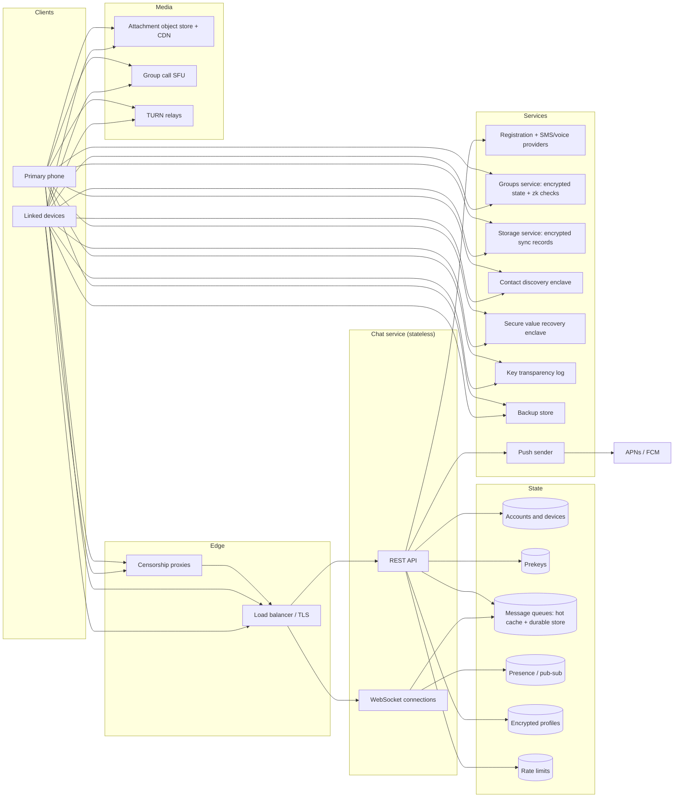
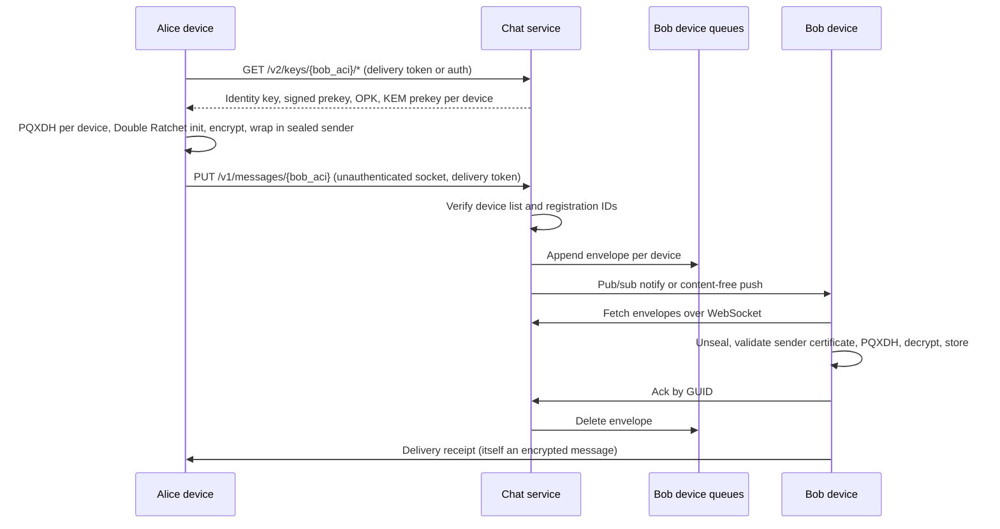
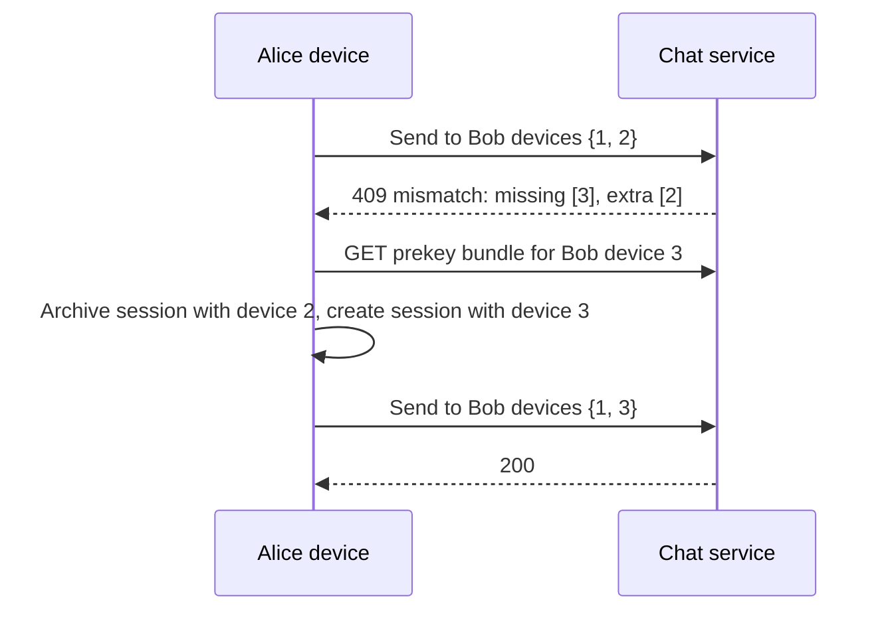

# Signal

Design a private messenger in the style of Signal: one-to-one and group messaging, voice and video
calls, and multi-device support, where the service operator can read neither message content nor,
as far as tractable, who talks to whom.

The defining constraint is the threat model. Most chat system designs treat the server as trusted
and optimize for throughput. Here the server is an adversary for confidentiality purposes, and that
single decision reshapes every subsystem: fanout moves to the client, group membership becomes
ciphertext, contact discovery needs special hardware or cryptography, and backups need a key the
operator cannot guess.

## Contents

1. [Requirements](#1-requirements)
2. [Threat model](#2-threat-model)
3. [Capacity estimates](#3-capacity-estimates)
4. [Glossary](#4-glossary)
5. [High-level architecture](#5-high-level-architecture)
6. [Identity and registration](#6-identity-and-registration)
7. [Session establishment](#7-session-establishment)
8. [Ongoing session encryption](#8-ongoing-session-encryption)
9. [Transport and delivery](#9-transport-and-delivery)
10. [Message queue storage](#10-message-queue-storage)
11. [Push notifications](#11-push-notifications)
12. [Multi-device](#12-multi-device)
13. [Group messaging](#13-group-messaging)
14. [Metadata protection](#14-metadata-protection)
15. [Contact discovery](#15-contact-discovery)
16. [Profiles](#16-profiles)
17. [Attachments](#17-attachments)
18. [Voice and video calls](#18-voice-and-video-calls)
19. [Recovery, sync, and backups](#19-recovery-sync-and-backups)
20. [Key verification](#20-key-verification)
21. [Abuse and spam](#21-abuse-and-spam)
22. [Message lifecycle features](#22-message-lifecycle-features)
23. [Censorship resistance](#23-censorship-resistance)
24. [Data model](#24-data-model)
25. [API sketch](#25-api-sketch)
26. [End-to-end flows](#26-end-to-end-flows)
27. [Scaling and reliability](#27-scaling-and-reliability)
28. [Summary of choices](#28-summary-of-choices)
29. [References](#29-references)

---

## 1. Requirements

### Functional

- Register an account, identified by a phone number and optionally a username.
- Send and receive one-to-one text messages, with delivery and read receipts.
- Group conversations with admins, invite links, and membership changes.
- Attachments: images, video, voice notes, files.
- One-to-one and group voice and video calls.
- A primary phone plus several linked devices (desktop, tablet, second phone), all showing the same
  conversations.
- Find which of my contacts use the service.
- Profiles with a name and avatar, visible to people I choose.
- Disappearing messages, edits, delete-for-everyone, reactions, typing indicators, stories.
- Restore an account and, optionally, message history on a new phone.

### Non-functional

| Property | Target |
| --- | --- |
| Confidentiality | Only the conversation's devices can read content, including attachments and call media. |
| Forward secrecy (FS) | Compromising a device today does not reveal messages already deleted from it. |
| Post-compromise security (PCS) | After a transient compromise ends, the session heals within a round trip. |
| Post-quantum resistance | Traffic recorded today stays confidential against a future quantum adversary. |
| Metadata minimization | The server learns as little as tractable about who talks to whom, group membership, and social graph. |
| Deniability | A transcript does not cryptographically prove to a third party who wrote a message. |
| Delivery latency | p99 under 1 s when the recipient device is online. |
| Availability | 99.95% or better for send and receive. |
| Asynchrony | Senders can start a conversation with a recipient that is offline. |
| Mobile efficiency | Minimal battery and data use; works on poor networks. |

### Out of scope

- Server-side search and server-side history (they conflict with the confidentiality target).
- Public channels with millions of subscribers.
- Payments (Signal has a MobileCoin integration; it is orthogonal to the messaging design).

---

## 2. Threat model

| Adversary | Capability | Design response |
| --- | --- | --- |
| Operator or anyone who compromises the servers | Reads all server storage and traffic, modifies responses, serves wrong keys | End-to-end encryption; sealed sender; encrypted group state; key transparency; minimal data retention |
| Legal compulsion | Demands all data about an account | Store only what is required to operate. Signal's published subpoena responses contain only account creation time and last connection date. |
| Network observer | Sees IPs, timing, sizes | TLS everywhere; padding; optional call relaying; censorship circumvention |
| Harvest-now-decrypt-later | Records ciphertext, breaks elliptic curves later with a quantum computer | Hybrid post-quantum key agreement (PQXDH) and ratchet (SPQR) |
| Device compromise | Reads keys on one device for a period of time | FS and PCS from ratcheting; disappearing messages; separate keys per device |
| Malicious user | Spam, enumeration of phone numbers, draining prekeys, fake registrations | Rate limits, captchas, message requests, delivery tokens |
| Hardware vendor (SGX) | Breaks enclave guarantees | Defense in depth: enclaves protect contact discovery and PIN recovery, and data exposed to a broken enclave is limited in scope |

Assumed out of reach: a fully compromised endpoint (malware on the phone reads the screen), and a
global passive adversary correlating all traffic timing across the internet. Section 14 discusses
what it would cost to defend against the second one.

---

## 3. Capacity estimates

Assumptions (order-of-magnitude, chosen for a Signal-sized service):

| Parameter | Value |
| --- | --- |
| Registered accounts | 100 M |
| Daily active accounts | 40 M |
| Devices per account | 1.6 on average (maximum 1 primary + 5 linked) |
| Messages sent per active account per day | 40 |
| Share of sends that target a group | 50%, average group size 10 |
| Envelope size | ~1 KB after padding |
| Share of messages with an attachment | 10%, average 500 KB |
| Attachment retention on the server | 45 days |

### Message throughput

- Sends: 40 M × 40 = 1.6 B/day ≈ 18.5 k/s average, ~55 k/s at a 3× peak.
- Every send produces one envelope per recipient device plus one per sender's other devices (sync
  copies). A one-to-one send yields about 1.6 + 0.6 = 2.2 envelopes. A group send to 9 other members
  yields about 9 × 1.6 + 0.6 ≈ 15 envelopes.
- Weighted average ≈ 8.6 envelopes per send → ~160 k envelopes/s average, ~480 k/s peak.
- Peak envelope bandwidth ≈ 480 k × 1 KB ≈ 480 MB/s ≈ 4 Gbps. This is modest; connection count is
  the harder dimension.

### Connections

- Assume 30% of active devices hold a live connection at peak: 40 M × 1.6 × 0.3 ≈ 20 M concurrent
  WebSockets.
- At 50 k to 100 k connections per host, that is 200 to 400 connection-serving hosts.

### Queue storage

- Envelopes are deleted after the device acknowledges them, so storage holds only backlog for
  offline devices.
- Daily envelopes ≈ 1.6 B × 8.6 ≈ 14 B. If 20% wait for an offline device for 12 hours on average,
  the steady backlog is 14 B × 0.2 × 0.5 ≈ 1.4 B envelopes ≈ 1.4 TB.
- A retention cap (for example 30 days) bounds the worst case from abandoned devices.

### Prekey storage

- Each device uploads batches of one-time prekeys: 100 X25519 keys (32 B each) and 100 ML-KEM-1024
  keys (1,568 B each).
- 160 M devices × ~160 KB ≈ 25 TB. The post-quantum keys dominate by a factor of 50. Prekey
  storage was a rounding error before PQXDH and is now one of the larger tables.

### Attachments

- Uploads: 1.6 B × 0.1 × 0.5 MB ≈ 80 TB/day. At 45-day retention: ~3.6 PB stored.
- Each attachment is downloaded by every recipient device: ~8.6 × 80 TB ≈ 690 TB/day ≈ 64 Gbps
  average egress. This belongs on a CDN.

### Calls

- Media volume dwarfs messaging, but most one-to-one calls are peer-to-peer and cost the operator
  nothing. The operator pays for TURN relaying (when peers cannot connect directly or the user asks
  to hide their IP) and for group-call forwarding units.

---

## 4. Glossary

These terms are used consistently throughout.

| Term | Meaning |
| --- | --- |
| Account | A user's server-side record. Has two service identifiers: ACI and PNI. |
| ACI | Account identity: a random UUID that stays fixed for the account's lifetime. |
| PNI | Phone number identity: a random UUID tied to the current phone number. Changing numbers changes the PNI. |
| Device | One installation of the app linked to an account. Device 1 is the primary. |
| Identity key | Long-term Curve25519 key pair per identity (ACI and PNI each have one), shared by all of the account's devices. |
| Signed prekey | Medium-term X25519 key per device, signed by the identity key, rotated periodically. |
| One-time prekey | Single-use X25519 key per device, consumed by the first message of a new session. |
| Kyber prekey | ML-KEM-1024 public key per device, signed by the identity key. One-time and last-resort variants exist. |
| Session | Pairwise ratchet state between one local device and one remote device. |
| Envelope | The unit the server stores and delivers: a ciphertext addressed to one destination device, plus routing fields. |
| Message queue | Ordered store of pending envelopes for one device. |
| Profile key | Random 256-bit key that encrypts a user's profile. Shared with contacts inside encrypted messages. |
| Master key | Random 256-bit account secret from which the storage service key and registration lock token derive. Protected by the PIN through secure value recovery. |
| Sender certificate | Short-lived, server-signed statement binding an ACI and device to an identity key. Used by sealed sender. |
| Delivery token | 16-byte value derived from a recipient's profile key. Knowing it authorizes sealed-sender delivery to that recipient. |

---

## 5. High-level architecture



Principles that fall out of the threat model:

- The chat service is a relay and a directory. It stores envelopes until delivered, public keys,
  and ciphertext blobs.
- Clients do the fanout. The server delivers one envelope per destination device and cannot merge
  them because each is encrypted under a different session.
- Anything the server must enforce without seeing it (group membership, profile access, backup
  authorization) uses zero-knowledge anonymous credentials.
- Anything that requires computing over plaintext user data (contact discovery, PIN guess limiting)
  runs inside a remotely attested enclave.

---

## 6. Identity and registration

### Identifier options

| Option | Discoverability | Spam resistance | Privacy | Notes |
| --- | --- | --- | --- | --- |
| Phone number only | Automatic from address book | Good: numbers cost money and SMS verification rate-limits signups | Poor: number is a real-world identifier and must be shared to connect | Signal's original model |
| Email | Automatic from address book, less common | Weak: emails are free | Moderate | Common in enterprise messengers |
| Username | Manual exchange | Weak without extra friction | Good | Needs reservation, squatting, and enumeration controls |
| Random ID only (Session, Threema) | QR code or ID exchange | Weak; needs proof-of-work or payment | Best | Hard onboarding; no contact discovery |
| Phone number for signup + optional username + hideable number | Both | Good | Good | Signal since 2024 |

Signal separates the account from the phone number with two identifiers. The ACI is the durable
identity used for contacts and groups. The PNI is a second identity with its own identity key,
used when someone reaches you only through your phone number. Changing numbers rotates the PNI
without breaking existing conversations, and users can make their number undiscoverable while
remaining reachable by username.

### Usernames

- A username is `nickname.discriminator` (for example `alice.42`). The discriminator lets many
  people use the same nickname and makes enumeration expensive.
- The server stores a hash of the username (computed with a Ristretto-based hash plus a
  zero-knowledge proof that the client knows the preimage) and an encrypted copy for the owner's
  devices. Lookup by exact username returns the ACI.
- Username links encode an encrypted username in a URL fragment so the link can be shared without
  the server seeing which username a link resolves to until someone looks it up.

### Phone verification

Options for proving control of a phone number:

1. SMS one-time code. Universal, but vulnerable to SIM swap and to SMS pumping (toll fraud where
   attackers trigger codes to premium numbers they profit from).
2. Voice call code. Fallback for SMS failures.
3. Flash call or missed-call verification. Cheaper in some regions, Android only.
4. Carrier APIs (silent network authentication). Strong but patchy coverage.
5. Push challenge through an already-registered device (for re-registration).

A production service routes verification across multiple SMS and voice providers per country based
on cost, delivery success, and fraud signals, and puts a captcha or push challenge in front of code
sending to limit pumping.

### Registration lock

SIM swap lets an attacker receive the verification code. Registration lock requires the PIN as well:
the client derives a registration lock token from the master key, and re-registration requires
either that token (recovered from secure value recovery with the PIN, see section 19) or waiting out
a long inactivity period, after which the old account data is discarded.

---

## 7. Session establishment

The problem: Alice wants to send an encrypted first message to Bob's device while Bob is offline,
and the result should have forward secrecy and resist a future quantum adversary.

### Options

| Option | Works with offline recipient | Forward secrecy for first message | Post-quantum | Deniable | Notes |
| --- | --- | --- | --- | --- | --- |
| TLS to server only | Yes | N/A | Depends on TLS | N/A | Server reads everything. Fails the threat model. |
| Static long-term keys (PGP style) | Yes | No | No | No if signed | One key compromise exposes all history |
| Interactive handshake (OTR, Noise XX) | No | Yes | Optional | Yes | Both parties must be online |
| Noise IK / static-ephemeral | Yes | Partial: depends on recipient's long-term key | Optional | Yes | Weak FS for the first flight |
| X3DH with prekeys | Yes | Yes when a one-time prekey is available | No | Yes | Signal 2016 to 2023 |
| PQXDH (X3DH + ML-KEM) | Yes | Yes | Yes for confidentiality | Yes | Signal since 2023 |
| MLS KeyPackages | Yes | Yes | With a PQ ciphersuite | Weaker (signatures) | Designed for groups; see section 13 |

### PQXDH as used by Signal

Each device publishes to the server:

- Identity key `IK` (shared per account identity).
- Signed prekey `SPK`, signed by `IK`.
- A batch of one-time prekeys `OPK`.
- A signed last-resort ML-KEM prekey `PQSPK` and a batch of signed one-time ML-KEM prekeys `PQOPK`.

To start a session, Alice fetches Bob's prekey bundle for each of his devices. The server hands out
and deletes one `OPK` and one `PQOPK` per fetch, falling back to the last-resort keys when the
batches run out. Alice then computes:

```
DH1 = DH(IK_A, SPK_B)
DH2 = DH(EK_A, IK_B)
DH3 = DH(EK_A, SPK_B)
DH4 = DH(EK_A, OPK_B)            # when an OPK was available
(CT, SS) = ML-KEM.Encaps(PQPK_B) # PQOPK when available, else PQSPK
SK = KDF(DH1 || DH2 || DH3 || DH4 || SS)
```

The first message carries `EK_A`, `CT`, and identifiers of the prekeys used. Bob recomputes `SK`
and deletes the one-time private keys. An attacker must break both X25519 and ML-KEM to recover
`SK`.

### Prekey management

- Clients periodically ask the server how many one-time prekeys remain and upload a new batch when
  the count falls below a threshold.
- Signed prekeys and last-resort Kyber prekeys rotate on a schedule (days to weeks). Old private
  halves are kept briefly to decrypt in-flight messages, then deleted.
- Prekey draining is an attack: someone fetches bundles repeatedly to exhaust one-time prekeys and
  force weaker last-resort sessions. Rate limit bundle fetches per requester and per target.
- A malicious server can hand out a key it controls. Only key verification (section 20) detects
  this; session establishment alone cannot.

---

## 8. Ongoing session encryption

After the shared secret exists, each message needs its own key.

### Options

| Option | FS per message | PCS | Out-of-order delivery | Post-quantum PCS | Cost |
| --- | --- | --- | --- | --- | --- |
| Single session key | No | No | Yes | No | Trivial |
| Symmetric hash ratchet only | Yes | No | Yes, by caching skipped keys | N/A | Very cheap |
| DH ratchet per round trip (OTR) | Yes | Yes | Poor | No | One DH per message turn |
| Double Ratchet | Yes | Yes | Yes | No | One DH per turn, hashes per message |
| Triple Ratchet (Double Ratchet + SPQR) | Yes | Yes, hybrid | Yes | Yes | ML-KEM traffic amortized across messages |
| MLS (TreeKEM) | Per epoch | Per commit | Requires ordered commits | With PQ suite | Built for groups |

### Double Ratchet

- A symmetric-key ratchet derives a fresh message key from a chain key for every message and deletes
  it after use. This gives forward secrecy.
- A Diffie-Hellman ratchet mixes a new DH output into the root key each time the conversation turns
  around. A compromised state stops being useful once both sides have sent a new ratchet key. This
  gives post-compromise security.
- Messages carry the sender's current ratchet public key and a message counter, so the receiver can
  derive keys for messages that arrive out of order. Skipped message keys are cached with a bound
  (for example 2,000) to stop memory exhaustion.

### Sparse Post-Quantum Ratchet (SPQR)

PQXDH protects the initial secret, but the Double Ratchet's healing step is elliptic-curve only, so a
quantum adversary who compromises a session once could keep reading. SPQR adds a post-quantum
ratchet that runs alongside the Double Ratchet. The two ratchets' outputs pass through a KDF to form
each message key (the "Triple Ratchet"), so an attacker must break both.

The engineering problem is size. ML-KEM public keys and ciphertexts are over a kilobyte, and sending
one with every message would multiply bandwidth. SPQR sends them in erasure-coded chunks spread
across ordinary message headers, one party sending key chunks and the other sending encapsulation
chunks, then alternating. Healing takes more messages than the DH ratchet, which is why it is
"sparse", and per-message overhead stays small.

### Padding

Ciphertext length reveals plaintext length. Signal pads plaintext to a multiple of 160 bytes before
encryption. Alternatives: padding to powers of two (less leakage, more overhead) or Padmé-style
padding (leakage bounded to O(log log n) bits with at most 12% overhead).

---

## 9. Transport and delivery

### Client connection options

| Option | Latency | Battery | Server cost | Notes |
| --- | --- | --- | --- | --- |
| Periodic HTTP polling | Poll interval | Bad | Wasted requests | Only for fallback |
| HTTP long polling | Low | Moderate | Reconnect churn | Easy through proxies |
| Persistent WebSocket over TLS | Lowest | Good when idle | One connection per online device | Signal's choice |
| MQTT over TLS | Lowest | Good | Similar | Facebook Messenger |
| XMPP-derived binary protocol | Lowest | Good | Similar | Early WhatsApp |
| HTTP/2 or HTTP/3 streams (gRPC) | Lowest | Good; QUIC survives network changes | Similar | Connection migration helps mobile |
| Push-only (content in APNs/FCM) | Push latency | Best | None | Hands metadata to Apple/Google and size-limits payloads |
| Peer-to-peer (Briar, Session over onion routing) | Variable | Poor | None or volunteer nodes | Needs both online or third-party mailboxes; exposes IPs without onion routing |

Signal clients keep two WebSockets when in the foreground: an authenticated one (the server knows
the device) for receiving and for ordinary requests, and an unauthenticated one for sealed-sender
sends (section 14) so those requests carry no account credentials. Requests and responses are
multiplexed over the socket as framed request/response messages with IDs.

### Send path

1. The client encrypts once per destination device (recipient's devices plus its own other devices)
   and submits the batch in one request: `PUT /v1/messages/{destination}` with one ciphertext per
   device and each device's registration ID.
2. The server checks the device list. If the client is missing a device, has an extra device, or
   used a stale registration ID (the device re-registered), the server rejects the whole batch with
   the mismatch. The client refreshes its view, establishes new sessions as needed, and retries. This
   keeps the sender's device list authoritative without the server ever encrypting anything.
3. The server assigns each envelope a GUID and a server timestamp, appends it to the destination
   device's queue, and notifies the device (section 9.4 and section 11).

### Delivery semantics

- At-least-once. The server deletes an envelope only after the device acknowledges it by GUID, which
  the device sends after durably storing the decrypted message.
- The client deduplicates by `(sender ACI, sender device, sent timestamp)`; the sent timestamp also
  serves as the message ID for quotes, reactions, edits, and deletes.
- Ordering: the queue preserves server arrival order per destination device. There is no global
  order across senders. Clients display by sent timestamp, and the ratchet handles out-of-order
  arrival within a session.
- Receipts (delivered, read, viewed) and typing indicators are ordinary end-to-end encrypted
  messages; the server cannot distinguish them from content.

### Routing to an online device

The chat service is stateless apart from open sockets. When an envelope arrives for device D, the
system must reach the host holding D's socket.

| Option | Mechanism | Trade-offs |
| --- | --- | --- |
| Presence map + direct RPC | Registry of device → host; sender host RPCs the owner host | Registry must be fresh; stale entries cause misdelivery; extra hop |
| Per-device pub/sub channel | Write to queue, then publish "new envelopes" on D's channel; the host holding D subscribes on connect | Queue is the single source of truth; notification loss is harmless because the host drains the queue on the next notification or reconnect |
| Consistent hashing of devices to hosts | Load balancer routes each device to a fixed host | No registry; rebalancing disconnects users; hot hosts |
| Broker with per-device topics (Kafka) | Each device is a topic or partition key | Kafka handles ~millions of partitions poorly and deletion per message is awkward; NATS-style subjects fit better |

Signal-Server writes the envelope to the queue first, then signals the device's host through Redis
pub/sub. The host then reads from the queue and pushes over the socket. Making the queue the source
of truth means a lost notification or a host crash delays delivery but never drops it. Presence
records also serve to detect a second connection for the same device and close the older one.

---

## 10. Message queue storage

### Retention options

| Option | Server holds | Pros | Cons |
| --- | --- | --- | --- |
| Store until delivered, then delete | Pending envelopes only | Minimal data at rest; tiny storage | New devices start empty without a separate history transfer |
| Permanent server-side encrypted history | All envelopes forever | Easy multi-device and restore | Large storage; long-lived ciphertext increases harvest risk; conflicts with disappearing messages |
| Server-readable history (Telegram cloud chats) | Plaintext | Search, sync, bots | Fails the threat model |
| No server storage (pure peer-to-peer) | Nothing | No central data | Requires online peers or mailbox nodes |

Signal deletes on acknowledgement and handles history separately through device transfer, linked
device sync, and backups (section 19).

### Storage engine options

The workload: high write rate, most envelopes read and deleted within seconds, a small tail that
waits days, reads always by `(device, all pending in order)`, deletes by GUID.

| Engine | Fit | Issues |
| --- | --- | --- |
| Redis Cluster alone | Excellent latency; sorted sets per device | Memory cost for the long tail; durability depends on replication and AOF |
| Cassandra / Scylla | Good write throughput, TTL support | Queue pattern (insert then delete) creates tombstones; reads of a partition scan tombstones until compaction. A known anti-pattern. |
| DynamoDB | Partition key `device`, sort key `server timestamp + GUID`, TTL attribute | Per-request cost; hot partitions for very active devices |
| FoundationDB | Ordered keys, transactions, range deletes | Operational expertise; transaction limits |
| Kafka | High throughput append | Per-device reads and selective deletes are unnatural |
| Postgres / MySQL sharded by device | Simple, transactional | Vacuum/purge overhead under queue churn |

### Hot cache plus durable store

Signal-Server uses two tiers. New envelopes go into a Redis-based cache keyed by destination device.
A background persister moves envelopes that stay undelivered past a short window into DynamoDB,
partitioned by destination account and device. Reads merge both tiers. Most envelopes are delivered
and deleted while still in Redis and never touch the durable store, so durable write volume scales with
the offline tail.

Risks and mitigations:

- A Redis failure before persistence can lose envelopes. Replication, persisting after a short
  delay, and client retries on missing acks bound the loss.
- A device reconnecting after a long absence may have thousands of envelopes. Deliver in pages,
  prioritize the newest conversation state if needed, and let the client acknowledge in batches.
- Retention is capped (on the order of weeks). Envelopes past the cap are dropped and the sender's
  device cannot learn it; the recipient sees a gap only if later messages reference it.

---

## 11. Push notifications

Mobile operating systems kill background sockets, so the server needs a way to wake the app.

| Option | Content exposure | Constraints |
| --- | --- | --- |
| Plaintext in the push payload | Apple/Google read content | Fails the threat model |
| E2EE content in the push payload | Apple/Google see sender timing and size | 4 KB payload limit; still per-message pushes |
| Content-free wake-up push | Apple/Google see only that the device received something | App must connect and fetch; extra latency |
| Persistent socket in a foreground service (Android without Google services) | None | Battery cost; persistent notification |
| UnifiedPush / self-hosted distributor | Distributor sees timing | Android only; user setup |

Signal sends content-free pushes. On iOS, a notification service extension wakes, connects, fetches
and decrypts envelopes, and displays a local notification. The push sender coalesces pushes for
devices that already have a pending wake-up and schedules delayed retries if the device does not
connect, which reduces push volume during message bursts.

Push tokens are identifiers tied to the device and visible to Apple and Google; this is a residual
metadata leak inherent to using platform push at all.

---

## 12. Multi-device

### Options

| Option | How it works | Pros | Cons |
| --- | --- | --- | --- |
| Primary as proxy (early WhatsApp Web) | Companion talks to the phone, which does all crypto | Simple key model | Phone must be online; drains battery |
| Clone keys to every device | All devices share session state | Single session per peer | Ratchet state cannot be shared safely across concurrent devices; one compromise equals all |
| Shared identity key, per-device sessions (Signal, Sesame) | Every device has its own prekeys and sessions; senders encrypt to each device | Devices are independent; each has its own FS/PCS | Sender cost scales with device count; device lists must stay consistent |
| Per-device identity keys with cross-signing (Matrix, new WhatsApp) | Each device has its own identity key, signed by an account key | Device compromise is revocable per device | Verification UX more complex |
| MLS with devices as leaves | Each device is a group member | Efficient large fanout | Requires ordered delivery service; loses deniability |

### Signal's model

- Devices share the account's identity key. The primary holds it and shares it with linked devices
  during linking. Each device has its own prekeys, registration ID, and sessions.
- Senders encrypt to every device of the recipient and to their own other devices. The copy sent to
  their own devices is a sync message carrying the sent message plus the recipient, so all devices
  show the same outgoing history.
- Session management across changing device sets follows the Sesame algorithm: keep sessions per
  `(address, device ID)`, treat server device-list mismatches as the trigger for adding or removing
  sessions, and archive stale sessions.
- Up to five linked devices per account. Linked devices unlink after extended inactivity, and the
  primary must connect periodically.

### Linking a device

1. The new device generates an ephemeral key pair and shows a QR code containing a provisioning
   address and its public key.
2. The primary scans it, encrypts a provisioning message (identity keys, profile key, master key,
   and a provisioning code) to that public key, and sends it through the server's provisioning
   socket.
3. The new device registers itself as a device on the account using the provisioning code, uploads
   its own prekeys, and becomes a normal destination.
4. Optionally, the primary builds a history archive (messages, reactions, receipts, call history,
   pointers to media), encrypts it with a one-time AES-256 key, uploads it, and sends the key and
   location through the provisioning channel. Signal shipped this in 2025 for desktop and iPad and
   extended it to phones in 2026. Text history comes over in full; media pointers reference server
   copies that expire after 45 days.

Without the archive, a new device starts empty, which is the direct consequence of deleting
envelopes on acknowledgement.

---

## 13. Group messaging

Two separate problems: how to encrypt one message to N members, and where group state (members,
title, admins, settings) lives.

### 13.1 Encryption fanout

For a group of n member devices:

| Option | Sender encryption work | Upload size | Membership change cost | PCS | Server sees |
| --- | --- | --- | --- | --- | --- |
| Pairwise (client fanout) | O(n) | O(n) ciphertexts | Free | Full, per pair | n envelopes |
| Sender keys + per-recipient envelopes | O(1) content + O(n) small wrappers | O(n) | On removal every member rotates its sender key: O(n²) messages | Only via rotation | n envelopes |
| Sender keys + multi-recipient upload | O(1) content + O(n) tiny headers | O(1) body + O(n) headers | Same as above | Only via rotation | One upload, fanned out server-side |
| MLS (TreeKEM) | O(1) per message; O(log n) per commit | O(1) | O(log n) per commit | Per commit | Group epoch, commit ordering |
| Server-side decrypt and re-encrypt | O(1) | O(1) | Free | N/A | Content. Fails the threat model. |

Signal uses sender keys:

- Each member device has a sender key (a symmetric chain key plus a signature key) per group. It
  distributes it to every other member device through pairwise sessions once.
- Group messages are encrypted once under the sender key's chain. The signature key authenticates
  the sender within the group.
- The ciphertext goes to the server in a single multi-recipient sealed-sender request: one body plus
  a short per-recipient header that wraps the content key for each destination device. The server
  splits it into per-device envelopes.
- When a member leaves or is removed, remaining members discard their sender keys and distribute new
  ones before the next send, so the removed member cannot read later messages.
- Devices that have not yet received a sender key get the pairwise fallback for that send.

MLS is the main alternative worth considering. It gives cheaper membership changes and real PCS in
large groups, at the cost of requiring a delivery service that orders commits (more server
knowledge), signatures that remove deniability, and a harder story for concurrent commits from
offline devices. For Signal-sized groups (up to around a thousand members) sender keys stay
tractable.

### 13.2 Group state

| Option | Server knows membership | Consistency | Admin enforcement | Example |
| --- | --- | --- | --- | --- |
| Plaintext server state | Yes | Strong | Server-enforced | WhatsApp, Telegram |
| Client-managed state gossiped in messages | No | Weak: members diverge after missed updates | None: any member can claim anything | Signal Groups v1 |
| Encrypted server state + anonymous credentials | No | Strong, versioned | Server-enforced without identities | Signal Groups v2 |
| MLS group state at the delivery service | Depends on deployment | Strong via commit ordering | Via MLS proposals and policies | MLS deployments |

Signal Groups v2 (the Signal Private Group System):

- A random group master key, shared among members, derives group secret parameters and a public
  group identifier.
- The server stores the group as ciphertext: each member's ACI and profile key are encrypted under
  the group key with a deterministic, verifiable encryption scheme, alongside encrypted title,
  avatar, and disappearing-message timer, plus plaintext role flags and access control settings.
- Every day the server issues each account auth credentials over its ACI (keyed-verification
  anonymous credentials). To act on a group, the client presents a zero-knowledge proof that its
  credential matches one of the encrypted ACIs in the group. The server verifies membership and
  role without learning which ACI it is.
- Profile key credentials let a member add their encrypted profile key to the group and prove it is
  genuine, so other members can fetch their profile.
- Changes are signed, versioned actions (add member, change role, update title). The server applies
  them atomically and keeps the log so clients fetch diffs since their last known version.
- Invite links carry a password encrypted under the group key. Pending members and join requests
  are separate lists with their own access rules.
- Group send endorsements: when a member fetches group state, the server returns zero-knowledge
  endorsements for the current members. The sender combines them into a token that authorizes a
  multi-recipient sealed-sender send to exactly those members, replacing the older approach of
  combining every recipient's delivery token.

Known leakage: the server sees group size, the timing and size of group sends, and which
destination devices each multi-recipient send reaches. Traffic analysis research has shown that
receipt patterns can reconstruct group membership over time.

---

## 14. Metadata protection

### Sealed sender

Without it, every send is authenticated, so the server logs sender, recipient, and time for every
message.

- The server issues each device a short-lived sender certificate: `{ACI, device ID, identity key,
  expiry}` signed by a server key.
- The client places the sender certificate inside the encrypted content, then encrypts that inner
  message to the recipient's identity key with an ephemeral key (a KEM-style outer layer). The
  recipient decrypts the outer layer, validates the certificate, and learns the sender.
- The client sends over the unauthenticated socket. The server knows the destination but has no
  credential identifying the sender.
- Abuse control: anonymous sends require the recipient's delivery token, derived from the
  recipient's profile key. Only people the recipient has shared their profile with hold it, so
  strangers must use authenticated sends. Users can opt in to receiving sealed-sender messages from
  anyone.

Limitations:

- The source IP and connection timing remain visible. A server correlating "A connects, an
  envelope for B appears, B sends a receipt back to A shortly after" can reconstruct pairs
  statistically (Martiny et al., NDSS 2021).
- If sealed sender fails, clients have historically fallen back to authenticated sends, which a
  malicious server could trigger selectively.

### Stronger alternatives

| Technique | Hides | Cost | Status |
| --- | --- | --- | --- |
| Tor / onion routing for all traffic | Client IP | Latency, reachability, blocking | Optional via user-run proxies |
| Mixnets with cover traffic (Loopix, Nym) | Sender-recipient linkage against global passive adversaries | Seconds of latency, constant cover traffic drains battery | Research and niche deployments |
| PIR mailboxes (Pung, Addra) | Which mailbox a client reads | Server computation linear in database size | Research |
| DC-nets (Dissent) | Sender anonymity in a group | Quadratic communication, jamming | Research |
| Ephemeral per-conversation receive addresses | Linkage across conversations | Address management | Partial in some messengers |

These are tractable only for small user bases or high latency tolerance. A mass-market messenger
aims for sealed sender plus aggressive data minimization.

### Data minimization

Store only what the service needs to function: account creation date, last connection date at day
granularity, device list, public keys, pending envelopes, ciphertext blobs. Do not log sender and
recipient pairs, contact lists, or group memberships in plaintext. Legal requests can only yield
what exists.

---

## 15. Contact discovery

Goal: given my address book, tell me which numbers have accounts, without the server learning my
address book, and without letting anyone enumerate all registered numbers.

### Options

| Option | Server learns address book | Enumeration resistance | Cost | Notes |
| --- | --- | --- | --- | --- |
| Upload plaintext numbers | Yes | Rate limits only | Cheap | Most messengers |
| Upload hashes of numbers | Yes, effectively | Rate limits only | Cheap | The phone number space is ~10¹⁰; a GPU inverts every hash in seconds |
| Truncated hash prefixes (k-anonymity) | Partial | Weak | Moderate bandwidth | Server learns a bucket per contact |
| Ship a Bloom filter of all users to clients | No | None: the filter reveals the whole user set | Large downloads | Leaks the registered-user list |
| Private set intersection (OPRF-based PSI) | No | Rate limit on OPRF evaluations | Heavy server compute, bandwidth linear in database for some protocols | Practical research deployments exist |
| Private information retrieval (PIR) | No | Rate limits | Server compute linear in database per query | Keyword PIR is improving but costly at 10⁸ entries |
| Trusted execution environment with oblivious access | No, if the enclave holds | Rate limits enforced inside enclave | Moderate | Signal's choice |
| No discovery: usernames or QR codes only | No | Strong | Cheap | Poor onboarding |

### Signal's enclave-based design (CDSI)

- The service runs inside Intel SGX enclaves. The client performs remote attestation and verifies
  the enclave measurement matches open-source code before sending anything.
- The client opens an encrypted channel to the enclave and sends its E.164 numbers.
- Inside the enclave, lookups go through an oblivious data structure (ORAM-style) so the host cannot
  learn which entries were accessed by watching memory access patterns. SGX encrypts memory
  contents but leaks access patterns, so ORAM is necessary.
- Results map numbers to `(ACI, PNI)` for accounts that allow discovery by phone number.
- Rate limiting counts new numbers per account. The enclave returns a token summarizing the set
  already queried, so later incremental queries (a user adds one contact) only spend quota for new
  numbers.

Trade-offs: SGX has a history of side-channel breaks. Defense in depth limits the damage: the enclave
only ever holds phone numbers mapped to random UUIDs, and an attacker who broke it would learn
queried address books but not message content.

---

## 16. Profiles

- A profile (name, about, avatar, badge) is encrypted client-side with the profile key and stored
  on the server. Avatars go to object storage.
- Profiles are versioned. Each version has a commitment to the profile key so the server can issue
  profile key credentials that prove possession to the groups service.
- The profile key is shared by including it in encrypted messages to people you have accepted a
  conversation with (message requests gate this). Rotating the profile key (for example after
  blocking someone) re-encrypts the profile and re-shares the new key with remaining contacts and
  groups.
- The delivery token for sealed sender derives from the profile key, so sharing a profile and
  granting sealed-sender access happen together.

Alternative: server-readable profiles (most messengers). Simpler, but the server learns names and
photos for every account.

---

## 17. Attachments

### Transport options

| Option | Pros | Cons |
| --- | --- | --- |
| Inline in the message envelope | One path | Envelopes become huge; per-device fanout multiplies upload |
| Out-of-band blob store, key in message | Upload once, download per device; CDN-friendly | Separate lifecycle and garbage collection |
| Peer-to-peer transfer | No server storage | Both online; exposes IPs |

Signal uploads out of band:

1. The client generates a random AES-256 key and HMAC-SHA256 key, pads the file, and encrypts with
   AES-CBC then MAC. It computes a digest of the ciphertext.
2. It asks the server for an upload form (a signed URL on one of several CDNs) and uploads with a
   resumable protocol (TUS-style) so large videos survive network drops.
3. The message carries a pointer: CDN number, object ID, keys, digest, size, content type, blurhash
   thumbnail.
4. Recipients download from the CDN, verify the digest and MAC, decrypt, and strip padding.

Media stays on the CDN for 45 days, which also bounds how long linked-device history sync can
reference it.

### Deduplication options

| Option | Saves | Leaks |
| --- | --- | --- |
| None: fresh key per upload | Nothing | Nothing |
| Convergent encryption (key = hash of file) | Global dedup | Confirmation-of-file attacks: anyone with a file can test whether someone uploaded it |
| Reuse the existing pointer when forwarding | Uploads on forward | Only that the same blob was re-shared, visible to the server as repeat downloads |

Signal uses fresh keys and reuses pointers for forwards while the original upload is still retained.

### Size hiding

Padding blobs to bucket sizes (for example, exponentially spaced buckets) hides exact file size,
which otherwise fingerprints well-known files.

---

## 18. Voice and video calls

### Signaling

Offer, answer, ICE candidates, hangup, and busy are end-to-end encrypted messages over the normal
messaging path. The server cannot tell a call offer from a text message except by timing and size.

### One-to-one media

| Option | Pros | Cons |
| --- | --- | --- |
| Direct peer-to-peer (ICE) | Lowest latency, no server cost | Exposes each party's IP to the other |
| Always relay through TURN | Hides IPs from the peer | Operator bandwidth; relay sees IP pairs and timing |
| Hybrid: direct by default, relay for unknown contacts or by setting | Balanced | Two code paths |

Signal uses WebRTC with DTLS-SRTP, connects directly by default, always relays calls from people not
in the user's contacts, and offers a setting to relay every call.

### Group calls

| Topology | Server load | Client upload | E2EE | Scale |
| --- | --- | --- | --- | --- |
| Full mesh | None | n − 1 streams | Yes | ~4 participants |
| SFU (selective forwarding unit) | Forwarding only | 1 stream (plus simulcast layers) | Yes, with frame encryption | Dozens |
| MCU (mixing server) | Decode, mix, re-encode | 1 stream | No: the server must decode media | Large |

Signal runs its own open-source SFU (Signal Calling Service, written in Rust). Each client encrypts
media frames end-to-end with a per-sender key before RTP packetization. Frame keys are distributed
through the Signal Protocol and rotated when participants join or leave. The SFU sees only
encrypted frames plus the headers it needs for forwarding, bandwidth estimation, and simulcast layer
selection.

Call links create a room with a root key embedded in the URL, so people outside a group can join.
The room's server-side state is keyed by a derived identifier, and admin rights come from an
anonymous credential.

---

## 19. Recovery, sync, and backups

Three separate needs, often conflated:

1. Recover the account identity and settings on a new phone (who am I, my contacts, my groups).
2. Keep settings and contacts in sync across devices.
3. Restore message history.

### Protecting a recovery secret

Any server-held backup needs a key. Where that key comes from is the central decision.

| Option | User burden | Security | Example |
| --- | --- | --- | --- |
| No recovery | None | Strongest | Early Signal |
| Server-held key | None | Server reads everything | Most cloud backups |
| Key derived from a user password (Argon2, scrypt) | Remember password | Weak passwords fall to offline brute force if the ciphertext leaks | Many "encrypted" backups |
| Short PIN + HSM-enforced guess limit | Remember PIN | Strong while the HSMs hold | WhatsApp E2EE backups (HSM variant) |
| Short PIN + enclave-enforced guess limit | Remember PIN | Strong while the enclaves hold | Signal SVR2 |
| Secret split across heterogeneous enclaves (threshold) | Remember PIN | Attacker must break multiple enclave technologies | Signal SVR3 (SGX + Nitro + SEV-SNP), removed from libsignal in 2025 |
| High-entropy recovery key | Store a 64-character key | Strong; loss is permanent | Signal Secure Backups, WhatsApp 64-digit option |
| Social recovery / trusted contacts | Coordinate with friends | Collusion threshold | Research, some wallets |

### Secure value recovery (SVR)

- The client stretches the PIN, and the enclave stores the master key under the stretched PIN
  together with a guess counter. After a small number of wrong guesses the enclave deletes the
  secret.
- The enclave cluster replicates the counter and secret with Raft running inside the enclaves, so
  an operator cannot roll back the counter by restoring an old replica.
- The master key derives the storage service key and the registration lock token.

### Storage service (settings and contacts sync)

- Contacts, group membership (group master keys), account settings, and pinned chats are stored as
  individually encrypted records with random IDs under a manifest encrypted with a key derived from
  the master key.
- A device updates records and writes a new manifest version with a compare-and-set on the version
  number. Conflicting writers re-read, merge, and retry.
- This lets a restored phone rebuild contacts and groups from the PIN alone, even without message
  history.

### Message history

| Mechanism | Channel | Scope |
| --- | --- | --- |
| Device-to-device transfer | Direct local network connection between old and new phone | Full history and media; needs both phones |
| Local encrypted backup file (Android) | File encrypted with a 30-digit passphrase | Full history; user manages the file |
| Linked device sync | Encrypted archive at link time (section 12) | Text history plus 45 days of media |
| Signal Secure Backups (2025) | Daily server-stored encrypted archive under a 64-character recovery key | All text; 45 days of media free, up to 100 GB of media on a paid tier |

Secure Backups details worth copying in any design:

- The recovery key is generated on the device and never sent to the server. Losing it loses the
  backup permanently.
- Media gets a second encryption layer with a backup-specific key and padding, so the backup store
  cannot match media to attachment uploads by size.
- Backup storage is authorized with anonymous credentials, so archives are not linked to the account
  or the payment.
- The daily refresh drops deleted and disappearing messages from the next archive.

---

## 20. Key verification

A malicious server can hand Alice a key it controls instead of Bob's and relay traffic between them.
Everything above depends on the right identity key.

| Option | User effort | Detects MITM | Notes |
| --- | --- | --- | --- |
| Trust on first use (TOFU) + key change warnings | None | Only after the first contact | Baseline |
| Safety numbers / fingerprint comparison | Compare 60 digits or scan a QR code in person | Yes | Few users do it |
| Key transparency log | None after setup | Yes, within the audit window | CONIKS, SEEMless, WhatsApp AKD, Signal automatic key verification |
| Web-of-trust / signatures (PGP) | High | Depends on graph | Not viable for mass market |
| Cross-signing with device verification (Matrix) | Moderate | Yes for verified devices | Complex UX |

### Key transparency

- The server maintains an append-only Merkle tree mapping identifiers (ACI, phone number, username)
  to identity keys, and publishes signed tree heads.
- When a client fetches a contact's key it also receives an inclusion proof. Each client monitors
  its own entries and alerts if the log ever shows a key it did not publish.
- Independent auditors check that the tree evolves append-only and is well formed, and co-sign tree
  heads. Clients accept only heads endorsed by every registered auditor recently.
- Signal shipped this as "automatic key verification" in August 2026, with Trail of Bits as an
  independent auditor. Clients require tree heads endorsed by all auditors within the last seven
  days, which bounds how long a malicious server could maintain a split view.
- Privacy: the tree uses verifiable random functions over identifiers, so proofs do not reveal other
  users' identifiers.

---

## 21. Abuse and spam

The server cannot read content, so it cannot classify messages. It relies on behavior and user
signals.

- Rate limits keyed on account, IP, destination, and phone number prefix for registration,
  verification code requests, prekey fetches, contact discovery, username lookups, and message
  sends to new recipients.
- Challenges: when behavior looks automated, require a captcha or a push challenge (proves a real
  device with platform push) before continuing.
- Message requests: a message from someone not in your contacts shows as a request. Until you accept,
  your profile key is withheld, the sender does not learn that you read it, and read receipts and
  typing indicators are suppressed.
- Reporting: when a user reports spam, the client sends the sender's ACI and the envelope GUIDs (and
  optionally a report token). The server correlates reports with sending rates to suspend accounts.
- Registration fraud: SMS pumping detection per country and number range, provider-side fraud
  scoring, device attestation (Play Integrity, App Attest) as one signal among many.
- Sealed sender abuse: delivery tokens restrict anonymous sends to people who shared their profile,
  and anonymous sends have their own rate limits by IP.

Alternative worth knowing: message franking (Facebook Messenger), where a commitment to the plaintext
lets the recipient prove to the server what a sender wrote when reporting abuse. It weakens
deniability for reported messages.

---

## 22. Message lifecycle features

All of these are ordinary encrypted messages whose semantics live entirely in clients.

| Feature | Mechanism | Limits |
| --- | --- | --- |
| Disappearing messages | Timer set per conversation (group state for groups); each client deletes after the timer starts on read or send | Relies on honest clients; screenshots and modified clients bypass it |
| Delete for everyone | A control message referencing the target by sender and sent timestamp; clients honor it within a time window | Same |
| Edit | A new message referencing the original's sent timestamp; clients keep edit history | Window of 24 hours in Signal |
| Reactions, quotes | Reference target by `(author ACI, sent timestamp)` | None |
| View-once media | Client deletes after viewing | Honest clients only |
| Stories | Encrypted sends to a distribution list via sender keys; clients expire after 24 hours | Server sees fanout |

---

## 23. Censorship resistance

| Technique | Mechanism | Weakness |
| --- | --- | --- |
| Domain fronting | TLS SNI names a major CDN domain; HTTP Host header names the real service | Large CDNs disabled it in 2018 |
| User-run TLS proxies | Volunteers run a relay; users share proxy links | Proxy IPs get discovered and blocked |
| Tor / pluggable transports | Traffic looks like other protocols | Latency; Tor itself is often blocked |
| Many front IPs and ports | Rotate endpoints | Cat-and-mouse |

Signal supports TLS proxies configured through links and uses censorship-circumvention routing in
specific countries.

---

## 24. Data model

Partition keys are chosen so every hot path is a single-partition read.

| Table | Key | Fields | Notes |
| --- | --- | --- | --- |
| `accounts` | `aci` | `pni`, `e164`, identity public keys (ACI, PNI), encrypted username, username hash, registration lock hash, discoverability flag, profile versions, capabilities, created/last-seen (day) | Secondary indexes: `e164 → aci`, `pni → aci`, `username_hash → aci` |
| `devices` | `aci`, `device_id` | registration ID, name (encrypted), auth token hash, push token and type, capabilities, last seen | Often embedded in the account record |
| `ec_one_time_prekeys` | `(aci or pni, device_id)`, `key_id` | public key | Delete on fetch; count endpoint |
| `kem_one_time_prekeys` | same | public key (1,568 B), signature | Largest key table |
| `signed_prekeys` | `(identity, device_id)` | EC signed prekey, KEM last-resort prekey, signatures | Replace on rotation |
| `message_queue` | `(aci, device_id)`, `(server_ts, guid)` | envelope type, source (for unsealed), content ciphertext, urgency | Hot tier in Redis, durable tier with TTL |
| `profiles` | `(aci, version)` | encrypted name, about, avatar pointer, commitment | Avatar in object storage |
| `groups` | `group_public_id` | version, encrypted attributes, members (encrypted ACI, encrypted profile key, role), pending, requesting, access control, invite password | Change log in `group_logs` keyed by `(group_public_id, version)` |
| `storage_manifests` | `aci` | version, encrypted manifest | Compare-and-set on version |
| `storage_records` | `(aci, record_id)` | encrypted record | |
| `usernames_reserved` | `username_hash` | aci, reservation expiry | Two-phase reserve then confirm |
| `backups` | anonymous backup ID | encrypted archive pointer, media usage | Unlinked from `aci` |
| `kt_log` | tree position | leaf commitments, tree heads, auditor signatures | Append-only |
| `rate_limits` | `(limiter, key)` | token bucket state | Redis |
| `attachments` | object ID | ciphertext | Object store with 45-day lifecycle |

---

## 25. API sketch

Modeled on Signal-Server's shape; paths are illustrative.

| Method and path | Auth | Purpose |
| --- | --- | --- |
| `POST /v1/verification/session` | None + captcha | Start phone verification |
| `POST /v1/registration` | Verification session | Create account, first device, identity keys |
| `PUT /v2/keys` | Device | Upload prekeys |
| `GET /v2/keys` | Device | Count remaining one-time prekeys |
| `GET /v2/keys/{identifier}/{device}` | Device or delivery token | Fetch prekey bundle(s); `*` for all devices |
| `PUT /v1/messages/{destination}` | Device, or delivery token for sealed sender | Send one envelope per destination device |
| `PUT /v1/messages/multi_recipient` | Group send token | Multi-recipient sealed-sender send |
| `GET /v1/messages` / WebSocket stream | Device | Fetch pending envelopes |
| `DELETE /v1/messages/uuid/{guid}` / WebSocket ack | Device | Acknowledge an envelope |
| `GET /v1/certificate/delivery` | Device | Obtain sender certificate |
| `PUT /v1/profile` / `GET /v1/profile/{aci}/{version}` | Device / delivery token | Write or read encrypted profile |
| `GET /v2/attachments/form/upload` | Device | Get a signed upload URL |
| `GET /v1/devices/provisioning/code`, `PUT /v1/devices/link` | Device / provisioning code | Link a device |
| `PUT /v1/accounts/username_hash/reserve`, `.../confirm` | Device | Claim a username |
| `GET /v1/accounts/username_hash/{hash}` | None, rate limited | Resolve a username |
| Groups service `PUT /v1/groups`, `PATCH /v1/groups`, `GET /v1/groups/logs/{from}` | Zero-knowledge auth credential presentation | Create, change, and sync groups |
| Storage service `GET/PUT /v1/storage/manifest`, `.../read` | Device-derived credentials | Sync encrypted records |
| Contact discovery WebSocket | Attested enclave channel | Discover contacts |
| SVR WebSocket | Attested enclave channel | Back up or restore the master key |

---

## 26. End-to-end flows

### First message to a new contact



### Device list mismatch



### Restore on a new phone

1. Register the phone number (SMS or voice code).
2. Registration lock applies: enter the PIN. The client derives the key, talks to the SVR enclave,
   recovers the master key, and proves the registration lock token.
3. Derive the storage service key and download contacts, group master keys, and settings.
4. Fetch each group's state from the groups service to rebuild group membership.
5. Restore history via device transfer, local backup, or Secure Backups with the recovery key.
6. Upload new prekeys. Contacts see a safety number change only if the identity key changed (it is
   restored when history transfer carries it; a fresh identity key triggers key change notices).

---

## 27. Scaling and reliability

### Chat service

- Stateless API and WebSocket hosts behind layer-4 load balancers. Horizontal scaling on connection
  count and CPU (TLS and zero-knowledge proof verification dominate CPU).
- Graceful drains on deploy: stop accepting new sockets, ask clients to reconnect with jitter, so a
  rolling deploy does not create a reconnect storm.
- Reconnect storms after a regional outage are the largest load spikes. Use jittered exponential
  backoff in clients, admission control on reconnects, and prioritize queue drains by recency.

### Queue store

- Redis Cluster shards by device key, with replicas and automatic failover. Keep a separate cluster
  for pub/sub, presence, rate limits, and push scheduling so one workload cannot starve another.
- The durable tier partitions by destination device. Very active devices can form hot partitions;
  spread with a suffix on the partition key if needed.

### Directory and keys

- Accounts and keys live in a horizontally partitioned store keyed by ACI, with global secondary
  indexes for phone number, PNI, and username hash.
- Prekey fetch deletes one key per fetch: this is a conditional delete, so two concurrent fetches
  must never receive the same one-time prekey. A transactional or conditional-write store handles
  it; with Redis, use an atomic pop.

### Large groups

- A 1,000-member group with 1.6 devices each produces ~1,600 envelopes per send. The multi-recipient
  endpoint keeps upload O(1) for the body, and server-side fanout inserts into ~1,600 queues. Apply
  per-send fanout limits and per-group rate limits.
- Sender key redistribution after a removal costs each remaining member a pairwise send to every
  other member device. Clients do it lazily on their next send.

### Enclaves

- Enclave services run in several regions. Replicas attest each other before joining a Raft group
  (SVR) or replicating the dataset (contact discovery).
- Enclave upgrades need a migration path: clients pin measurements shipped in the app, so new
  enclaves are deployed and advertised before old ones retire, and secrets migrate enclave to
  enclave over attested channels.

### Multi-region

- Accounts have a home region for strongly consistent writes (registration, device list, keys).
- Connection hosts run in many regions near users; pub/sub notifications cross regions when a
  device's socket and a sender are in different regions.
- CDNs and TURN relays are geographically distributed; the SFU for a call is chosen near the first
  participant or the median participant.

### Observability without content

Metrics are counts and latencies aggregated by endpoint, platform, and client version. Avoid logging
identifiers alongside peer identifiers; the logs themselves are a metadata store.

---

## 28. Summary of choices

| Problem | Signal's choice | Main alternative | Why the choice |
| --- | --- | --- | --- |
| Identifier | Phone number + ACI/PNI + optional username | Username or random ID only | Spam resistance and onboarding, with privacy recovered through PNI and usernames |
| Session setup | PQXDH | X3DH, MLS KeyPackages | Asynchronous, FS, deniable, hybrid post-quantum |
| Session ratchet | Triple Ratchet (Double Ratchet + SPQR) | Double Ratchet alone | Post-quantum PCS with amortized bandwidth |
| Transport | Persistent WebSocket, two sockets | MQTT, HTTP/3 | Bidirectional, low latency, separates sealed-sender traffic |
| Online routing | Queue first, pub/sub notify | Presence registry + RPC | Queue is the source of truth; notification loss is harmless |
| Queue storage | Redis hot tier + DynamoDB durable tier | Cassandra, FoundationDB | Most envelopes never reach durable storage |
| Retention | Delete on ack, capped TTL | Server-side encrypted history | Minimal data at rest |
| Push | Content-free wake-up | Encrypted push payload | Nothing but timing reaches Apple/Google |
| Multi-device | Shared identity, per-device sessions (Sesame) | Per-device identities with cross-signing | Simple verification (one safety number per contact) |
| Group encryption | Sender keys + multi-recipient sealed sender | MLS | Deniability, no commit ordering, adequate at Signal's group sizes |
| Group state | Encrypted state + anonymous credentials | Plaintext server state | Server enforces ACLs without learning membership |
| Sender metadata | Sealed sender with delivery tokens | Mixnets | Tractable at mass scale and mobile latency |
| Contact discovery | SGX enclave with oblivious data structures | PSI, PIR | Affordable at 10⁸ entries with interactive latency |
| Attachments | Client-encrypted, CDN, 45-day retention, no dedup | Convergent encryption | Avoids confirmation-of-file attacks |
| Group calls | SFU with end-to-end frame encryption | Mesh, MCU | Scales to dozens while keeping E2EE |
| Account recovery | PIN + SVR2 enclave with guess limit | Password-derived key | Short PINs become safe |
| History backup | Secure Backups with 64-character recovery key | PIN-protected backup | High-entropy key removes enclave dependence for bulk data |
| Key verification | Safety numbers + key transparency with auditors | TOFU only | Detects server key substitution without user effort |

---

## 29. References

Specifications:

- [The X3DH Key Agreement Protocol](https://signal.org/docs/specifications/x3dh/)
- [The PQXDH Key Agreement Protocol](https://signal.org/docs/specifications/pqxdh/)
- [The Double Ratchet Algorithm](https://signal.org/docs/specifications/doubleratchet/)
- [The Sesame Algorithm](https://signal.org/docs/specifications/sesame/)
- [XEdDSA and VXEdDSA signatures](https://signal.org/docs/specifications/xeddsa/)
- [RFC 9420: The Messaging Layer Security (MLS) Protocol](https://www.rfc-editor.org/rfc/rfc9420)

Signal blog:

- [Technology preview: Sealed sender for Signal](https://signal.org/blog/sealed-sender/)
- [Technology preview: Private contact discovery for Signal](https://signal.org/blog/private-contact-discovery/)
- [Technology Preview for secure value recovery](https://signal.org/blog/secure-value-recovery/)
- [Signal Protocol and Post-Quantum Ratchets (SPQR)](https://signal.org/blog/spqr/)
- [A Synchronized Start for Linked Devices](https://signal.org/blog/a-synchronized-start-for-linked-devices/)
- [Introducing Signal Secure Backups](https://signal.org/blog/introducing-secure-backups/)
- [Introducing Automatic Key Verification](https://signal.org/blog/automatic-key-verification/)
- [Government communication (subpoena responses)](https://signal.org/bigbrother/)

Papers and analysis:

- Chase, Perrin, Zaverucha. [The Signal Private Group System and Anonymous Credentials Supporting
  Efficient Verifiable Encryption](https://eprint.iacr.org/2019/1416). CCS 2020.
- Martiny et al. [Improving Signal's Sealed Sender](https://www.cs.umd.edu/~kaptchuk/publications/ndss21.pdf).
  NDSS 2021.
- [Secret Key Recovery in a Global-Scale End-to-End Encryption System](https://eprint.iacr.org/2024/887.pdf)
  (SVR3).
- Matthew Green. [A few thoughts about Signal's Secure Value Recovery](https://blog.cryptographyengineering.com/2020/07/10/a-few-thoughts-about-signals-secure-value-recovery/)
- Trail of Bits. [How Trail of Bits helps verify the integrity of your Signal chats](https://blog.trailofbits.com/2026/08/11/how-trail-of-bits-helps-verify-the-integrity-of-your-signal-chats/)

Source code:

- [signalapp/Signal-Server](https://github.com/signalapp/Signal-Server)
- [signalapp/libsignal](https://github.com/signalapp/libsignal)
- [signalapp/SecureValueRecovery2](https://github.com/signalapp/SecureValueRecovery2)
- [signalapp/Signal-Calling-Service](https://github.com/signalapp/Signal-Calling-Service)
