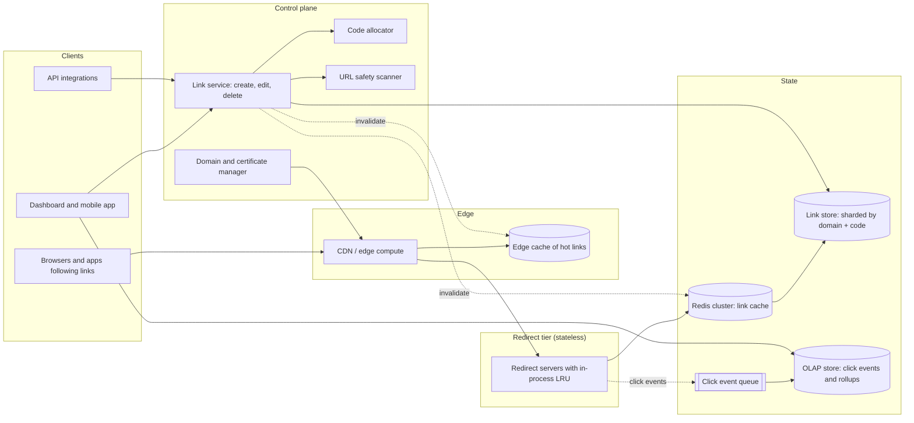
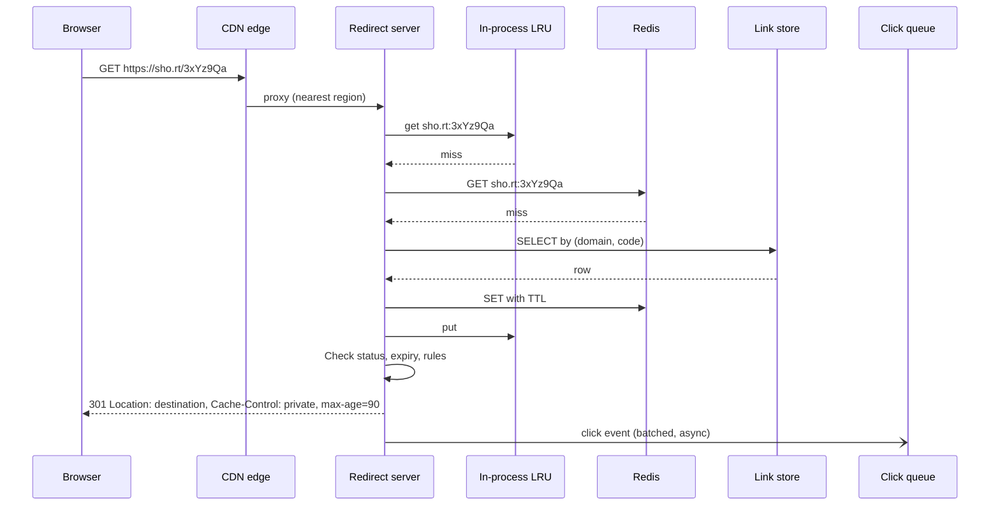

# URL shortener

Design a URL shortener in the style of Bitly: turn a long URL into a short link such as
`https://sho.rt/3xYz9Qa`, redirect anyone who opens it, and report who clicked. Around that core sit
custom aliases, branded domains, QR codes, link editing and expiry, click analytics, and abuse
defenses against the phishing campaigns that shorteners attract.

The core fits in one sentence and one table, so the interesting questions are all at the edges:

- Code allocation. The short code is the product. Its length, alphabet, and allocation strategy
  decide how many links fit, whether codes can be guessed, whether writes need coordination, and
  how the system behaves across regions. Section 6 treats every tractable strategy.
- Read amplification. A link is written once and may be read millions of times, often in a burst
  when it goes viral. Redirects must be fast from anywhere, and each one must still be counted.
- Permanence and trust. Short links are printed on posters and embedded in papers. The service must
  never reassign a code, must outlive its own infrastructure changes, and must keep its domain off
  blocklists while strangers use it to disguise malicious URLs.

## Contents

1. [Requirements](#1-requirements)
2. [Capacity estimates](#2-capacity-estimates)
3. [Glossary](#3-glossary)
4. [High-level architecture](#4-high-level-architecture)
5. [Code space: alphabet and length](#5-code-space-alphabet-and-length)
6. [Code allocation strategies](#6-code-allocation-strategies)
7. [Custom aliases and namespaces](#7-custom-aliases-and-namespaces)
8. [Deduplication and URL normalization](#8-deduplication-and-url-normalization)
9. [Redirect semantics](#9-redirect-semantics)
10. [Read path and caching](#10-read-path-and-caching)
11. [Link storage](#11-link-storage)
12. [Click analytics](#12-click-analytics)
13. [Link lifecycle](#13-link-lifecycle)
14. [Custom domains](#14-custom-domains)
15. [Abuse and safety](#15-abuse-and-safety)
16. [Enumeration and private links](#16-enumeration-and-private-links)
17. [Multi-region](#17-multi-region)
18. [Permanence](#18-permanence)
19. [Data model](#19-data-model)
20. [API sketch](#20-api-sketch)
21. [End-to-end flows](#21-end-to-end-flows)
22. [Scaling and reliability](#22-scaling-and-reliability)
23. [Summary of choices](#23-summary-of-choices)
24. [References](#24-references)

---

## 1. Requirements

### Functional

- Shorten a long URL into a short link on a default domain, with a system-generated code.
- Optionally choose a custom alias (`sho.rt/spring-sale`) and a branded domain (`go.example.com`).
- Redirect anyone who opens a short link to its destination.
- Record every click with time, country, referrer, device, and browser, and show aggregates per link.
- List, search, tag, edit, expire, and delete a user's links.
- Generate a QR code for any link.
- Preview a link's destination without following it.
- Bulk creation through an API for integrations (email platforms, SMS campaigns, CMSs).
- Detect and disable links to phishing, malware, and spam.

### Non-functional

| Property | Target |
| --- | --- |
| Redirect latency | p99 under 20 ms server-side; under 50 ms end-to-end for most users worldwide |
| Redirect availability | 99.99% or better; a redirect outage breaks links on every page, email, and poster that carries them |
| Creation latency | p99 under 200 ms; creation may be less available than redirects |
| Durability | A created link is never lost and a code is never reassigned to a different destination |
| Code length | 7 characters or fewer for generated codes on the default domain |
| Analytics freshness | Clicks visible in dashboards within a minute; totals eventually exact within a small tolerance |
| Guessability | A random code guess must rarely hit a live link (section 16) |

### Out of scope

- Link-in-bio pages, landing page builders, and campaign management UIs (conventional CRUD).
- Billing and plan enforcement, except where a plan limit touches the redirect path.
- Mobile deep-linking SDKs beyond per-platform redirect rules (section 13).

---

## 2. Capacity estimates

Assumptions, sized to a Bitly-scale service. Bitly states that its infrastructure handles more than
10 billion clicks per month; public estimates of links created per month range from a few hundred
million to over half a billion.

| Parameter | Value |
| --- | --- |
| Links created per month | 500 M |
| Clicks per month | 10 B |
| Peak-to-average ratio for clicks | 10× across the service; a single viral link can exceed 10 k clicks/s |
| Average long URL length | ~150 bytes, with a long tail of tracking-parameter URLs past 1 KB |
| Retention | Forever, for links; raw click events for 2 years, aggregates forever |

### Write throughput

- Creations: 500 M / 30 days ≈ 16.7 M/day ≈ 190/s average.
- Bulk API imports and campaign sends make creation bursty: plan for ~2 k/s peak.
- Any single relational primary handles this, so the allocation design is driven by guessability,
  multi-region behavior, and code length.

### Read throughput

- Clicks: 10 B / 30 days ≈ 330 M/day ≈ 3.9 k/s average, ~40 k/s peak.
- Read-to-write ratio ≈ 20:1 on average. The ratio per link is wildly skewed: most links receive a
  handful of clicks, a few receive millions, and most of a link's clicks arrive in its first days.
- Link preview crawlers (Slack, iMessage, social networks, email security scanners) fetch many links
  once or several times before any human does. Budget 10% to 30% of redirect traffic as non-human.

### Link storage

- Per link: code and domain (~20 B), long URL (~150 B), owner, timestamps, flags, title, and tags
  (~200 B), plus secondary index entries (by owner, by URL hash): ~600 B to 1 KB all-in.
- 6 B links/year × 1 KB ≈ 6 TB/year. Ten years ≈ 60 TB before replication. The primary-key lookup
  pattern shards trivially.

### Click storage

- 120 B clicks/year × ~300 B per enriched raw event ≈ 36 TB/year raw.
- Columnar compression of low-cardinality fields (country, device, browser) typically reaches 10×:
  ~4 TB/year in an OLAP store.
- Pre-aggregated rollups (per link, per day, per dimension) are orders of magnitude smaller and serve
  most dashboard queries.

### Cache working set

- If 100 M distinct links are clicked on a given day at ~500 B per cached entry, the daily hot set is
  ~50 GB: a small Redis cluster.
- The top 1 M links carry a large share of clicks and fit in ~500 MB, which is small enough for an
  in-process cache on every redirect server.

---

## 3. Glossary

| Term | Meaning |
| --- | --- |
| Long URL | The destination a short link points to. |
| Short link | The full short URL: domain plus code, e.g. `https://sho.rt/3xYz9Qa`. |
| Code | The path component that identifies a link within a domain (`3xYz9Qa`). Also called a key, slug, or back-half. |
| Alias | A code chosen by the user rather than generated. |
| Namespace | The set of codes that must be unique together. By default, one namespace per domain. |
| Keyspace | All possible codes of a given length and alphabet. |
| Occupancy | Fraction of the keyspace already assigned. Drives collision rate and guessability. |
| Allocator | The component that produces a new unused code. |
| PRP | Pseudorandom permutation: a keyed bijection that looks random without the key (a block cipher). |
| FPE | Format-preserving encryption: a PRP over an arbitrary domain, such as 7-character base62 strings. |
| Click | One resolved redirect request, before bot filtering. |
| Unfurl | A crawler fetch that builds a link preview in a chat or social app. |
| Interstitial | An HTML page shown between the short link and the destination (warning, ad, or password). |
| Tombstone | A record that a code once existed and must never be reassigned. |

---

## 4. High-level architecture



Principles:

- The redirect path and the control plane are separate deployments with separate availability
  targets. Creating links can fail over or degrade; resolving existing links cannot.
- The redirect path does one key lookup and never waits on anything else. Analytics, safety
  re-checks, and billing counters happen asynchronously.
- Links are immutable in the common case, which makes them cache-friendly at every layer. Mutations
  (edit, delete, takedown) are rare and pay for explicit invalidation.
- Everything user-controlled (the destination, the alias, the domain) is untrusted input that the
  service will present to strangers under its own name.

### Reference implementations

| Service | Code scheme | Notes |
| --- | --- | --- |
| Bitly | Generated base62, 7 characters on current links; custom back-halves; branded domains | Issues a 301 and states that it never reuses or modifies shortened links; built NSQ for its event pipeline |
| TinyURL | Generated codes plus custom aliases | One of the oldest shorteners (2002) |
| Google URL Shortener (goo.gl) | Generated codes | Stopped creating links in 2019; inactive links deactivated after August 25, 2025 (section 18) |
| X/Twitter t.co | Generated codes; every link in a post is wrapped | Serves an HTML/JavaScript redirect to browsers and a 301 to bots (section 9) |
| YOURLS | Sequential counter rendered in base36 or base62 | Self-hosted PHP; the base cannot change after links exist |
| Shlink | Random codes, 5 characters by default, via nanoid | Self-hosted; per-link length override |
| Dub | Random codes; edge middleware redirects from a Redis cache in front of MySQL; clicks in Tinybird (ClickHouse) | Open source; moved click storage from Redis sorted sets to ClickHouse as queries slowed |

---

## 5. Code space: alphabet and length

### Alphabet options

| Alphabet | Bits per char | Case-sensitive | Pros | Cons |
| --- | --- | --- | --- | --- |
| base62 `[0-9A-Za-z]` | 5.95 | Yes | Densest URL-safe alphabet without punctuation; the de facto standard | Hard to read aloud or type from print; `0/O`, `1/l/I` confusable |
| base64url `[0-9A-Za-z-_]` | 6.00 | Yes | Aligns with bytes | `-` and `_` get lost at line ends, in underlines, and by some auto-linkers |
| base58 (Bitcoin alphabet) | 5.86 | Yes | Drops `0 O I l`, easier to transcribe | Still case-sensitive |
| base36 `[0-9a-z]` | 5.17 | No | Survives case folding; readable | ~15% longer codes than base62 |
| Crockford base32 | 5.00 | No | Drops `I L O U`; decoder maps `I/L→1`, `O→0`; forgiving when typed | ~20% longer codes than base62 |
| Consonant-only or no-vowel sets | ~4.3 to 5.0 | Either | Cannot spell most words | Longer codes |
| Word lists (`brave-otter-lamp`) | ~11 per word | No | Memorable, speakable | Long URLs; still needs a profanity list |

Two considerations favor a case-insensitive alphabet despite the extra length:

- Humans. Codes read from a poster, a slide, or a phone call get retyped with the wrong case. A
  case-insensitive code has one fewer failure mode.
- QR codes. QR alphanumeric mode encodes only digits, uppercase letters, space, and `$%*+-./:` at
  5.5 bits per character; any other character forces byte mode at 8 bits per character. The scheme
  and host of a URL are case-insensitive, so with an uppercase-safe code the whole link
  (`HTTPS://SHO.RT/3XYZ9QA`) fits alphanumeric mode, and the QR symbol can drop a version (fewer,
  larger modules that scan from farther away).

A service can mix alphabets: base62 for generated codes on the default domain (shortest), a
case-insensitive alphabet for print-oriented branded links and QR campaigns.

### Keyspace per length

| Length | base62 | base58 | base36 | base32 |
| --- | --- | --- | --- | --- |
| 5 | 916 M | 656 M | 60 M | 34 M |
| 6 | 56.8 B | 38.1 B | 2.18 B | 1.07 B |
| 7 | 3.52 T | 2.21 T | 78.4 B | 34.4 B |
| 8 | 218 T | 128 T | 2.82 T | 1.10 T |
| 9 | 13.5 P | 7.43 P | 102 T | 35.2 T |

At 6 B links/year:

- base62, 6 characters: full in under 10 years under a counter; a random allocator suffers long
  before that (section 6).
- base62, 7 characters: 60 B links in ten years is 1.7% occupancy. Lasts centuries.
- base36 or base32 need 8 characters for comparable headroom.

### Length policy options

| Policy | How it works | Trade-off |
| --- | --- | --- |
| Fixed length | Every generated code has exactly L characters | Simple validation; generated codes and aliases are easy to separate by length |
| Grow on demand | Start at L; move to L+1 when occupancy crosses a threshold | Shortest possible codes; generated code length leaks creation era |
| Length by tier | Paid or print links get shorter codes; API bulk links get longer ones | Allocates the scarce short space deliberately |
| Length by sensitivity | Links to private content get 16 to 22 characters | Guessability becomes negligible (section 16) |

### Filtering unwanted codes

Random or scrambled codes will spell words. Options:

- Remove vowels (and digits that read as vowels, `0 1 3 4`) from the alphabet so few words form.
- Check each generated code against a blocklist of substrings and regenerate on a match (the Sqids
  approach). The cost is a small, negligible loss of keyspace.
- Reserve words that collide with application routes: `api`, `login`, `admin`, `static`, `health`,
  `favicon.ico`, `robots.txt`, `.well-known`. Keep application routes off the short domain entirely
  where possible, so the reserved set stays small and stable.

---

## 6. Code allocation strategies

The allocator must return a code that has never been assigned in the namespace. Every strategy
below is used somewhere in production. They differ in five properties:

- Enumerability: can an observer predict other codes from one they hold?
- Coordination: does each allocation need a round trip to a shared component?
- Collision handling: can two allocations produce the same code, and what happens then?
- Fill behavior: how does the cost per allocation change as the keyspace fills?
- Determinism: does the same long URL always produce the same code?

### Overview

| Strategy | Enumerable | Coordination per code | Collisions | Fill behavior | Deterministic |
| --- | --- | --- | --- | --- | --- |
| 6.1 Database auto-increment + encode | Yes, fully | One DB write (the insert itself) | None | Uses every code | No |
| 6.2 Counter + reversible scramble (Sqids, multiplicative) | Partly: reversible by anyone with the algorithm | One DB write | None | Uses every code | No |
| 6.3 Counter + keyed PRP (Feistel, FF1) | No, without the key | Counter source | None | Uses every code | No |
| 6.4 Range leasing (hi/lo) + any of the above | Depends on the encoding | One lease per block | None | Loses unused tails of crashed leases | No |
| 6.5 Multi-master sequences (Flickr ticket servers) | Like 6.1 per server | One ticket server write | None | Uses every code | No |
| 6.6 Time-based IDs (Snowflake) | Partly: time-ordered | None | None | Codes too long (11 base62 chars) | No |
| 6.7 Random code + conditional insert | No | The insert is the check | Possible; retry | Retries grow as 1 / (1 − occupancy) | No |
| 6.8 Pre-generated key pool (key generation service) | No | One pool fetch per batch | None at allocation time | Pool generation pays the retries offline | No |
| 6.9 Hash of long URL, truncated | No, but anyone can compute the code for a known URL | The insert is the check | Possible; rehash | Same as random | Yes |
| 6.10 Random UUID or 128-bit token | No | None | Negligible | Irrelevant | No |
| 6.11 User-chosen alias | Chosen by the user | Conditional insert | Common; user retries | Human-driven | No |

### 6.1 Database auto-increment + base conversion

Insert the link into a table with an auto-increment primary key, then render the ID in base62. ID
125 becomes `21`, ID 3,521,614,606,207 becomes `zzzzzzz`.

- Pros: trivial; no collisions; the densest possible use of the keyspace (codes grow one character
  at a time); YOURLS does exactly this.
- Cons: fully enumerable. Anyone can walk `…/abc1`, `…/abc2`, and so on, and read everyone's links in
  creation order. Code values reveal the service's volume (the "German tank problem"). A single
  sequence is a write bottleneck and a single point of failure, and it resists multi-region writes.
- Where it fits: internal shorteners and self-hosted instances whose links are all public anyway.

Two sub-variants: insert first and derive the code from the returned ID (two writes: insert, then
update the code column), or fetch the next value from a sequence first and insert once. Postgres
sequences and MySQL auto-increment both hand out values that a rolled-back transaction discards,
so gaps are normal and harmless.

### 6.2 Counter + reversible scramble

Keep the counter but disguise it:

- Multiplicative scramble: `code = (id × P) mod 62^7` with `P` coprime to `62^7`. Bijective and one
  multiplication, but linear: two known (id, code) pairs reveal `P`, and consecutive IDs produce
  codes that differ by a constant.
- Shuffled-alphabet encoders (Hashids, now Sqids): encode the integer with an alphabet permuted by a
  seed. The Sqids documentation states that it is not encryption; the output looks random to a
  casual observer but gives no security.
- XOR with a constant, bit reversal, or rotations: cosmetic.

Pros: removes visible sequentiality at zero cost. Cons: anyone who learns the method enumerates the
space as easily as with 6.1. Treat 6.2 as obfuscation for aesthetics, and never as protection for
private content.

### 6.3 Counter + keyed pseudorandom permutation

Encrypt the counter with a block cipher whose block is exactly the code space. A PRP is a bijection,
so distinct counters give distinct codes with no uniqueness check, and without the key the output
sequence is indistinguishable from random.

Option A, a small Feistel network over 40 bits:

```
domain       = 2^40 ≈ 1.10 T codes (fits in 7 base62 chars, since 62^7 ≈ 3.52 T)
split x      = (L, R), 20 bits each
round i      = L, R ← R, L ⊕ F(k_i, R)       # 4 rounds
F(k, R)      = low 20 bits of SipHash(k, R)  # or AES, HMAC-SHA-256
code         = base62(output), left-padded to 7 characters
```

Four rounds of a Feistel network with pseudorandom round functions give a strong pseudorandom
permutation (Luby and Rackoff). Decryption runs the rounds backwards, so the service can recover the
counter from a code, which is useful for debugging and for sharding by allocation order.

Option B, format-preserving encryption over the exact domain: NIST SP 800-38G FF1 with radix 62 and
length 7 encrypts `base62(counter)` into another 7-character base62 string, covering all 3.52 T
codes rather than 1.10 T. FF1 is standardized and available in common libraries.

Option C, cycle-walking: use a 42-bit Feistel network (the smallest balanced one that covers `62^7`)
and re-encrypt any output ≥ `62^7`. About 80% of outputs land in range on the first try, so the
expected cost is 1.25 encryptions.

Properties:

- No collision checks: the insert still uses a unique key, and a violation indicates a bug.
- The keyspace can fill to 100% with constant cost per allocation, which is the strongest argument
  for this strategy when codes must stay short (6 characters, say).
- The key is permanent. Changing it breaks injectivity against codes already issued. Leaking it
  exposes allocation order, which is the same exposure as 6.1; existing links keep working because
  codes are stored, never recomputed.
- Guessability equals that of random codes at the same occupancy (section 16).

### 6.4 Range leasing (hi/lo)

Any counter-based strategy needs a counter source. Instead of one DB round trip per code, each
allocator process leases a block:

1. Atomically advance a shared counter by the block size (a `UPDATE … SET next = next + 10000
   RETURNING next` on one row, an etcd or ZooKeeper compare-and-swap, or a DynamoDB atomic counter).
2. Serve codes from the block in memory.
3. Lease the next block before the current one runs out.

| Block size | Coordinator load at 2 k codes/s | Codes lost per crash | Notes |
| --- | --- | --- | --- |
| 100 | 20 leases/s | ≤ 100 | Frequent coordinator trips |
| 10,000 | 1 lease per 5 s | ≤ 10,000 | Typical |
| 1,000,000 | 1 lease per 8 min | ≤ 1 M | Negligible coordinator load; still < 0.0001% of a 7-char space per crash |

Pros: allocation is a memory operation; the coordinator can be down for as long as the current
block lasts. Cons: codes from different processes interleave, so creation order is only
approximate; crashed leases waste their tails. Combined with 6.1, each server's codes are visibly
clustered; combined with 6.3, nothing leaks.

Variant: static partitioning. Assign each region or allocator a fixed slice of the counter space
(region 0 gets `[0, 2^38)`, region 1 gets `[2^38, 2^39)`, and so on). No coordinator at all after
setup; the risk is a slice filling unevenly.

### 6.5 Multi-master sequences

Flickr's ticket servers (2010): two MySQL servers, each with a single-row table, one configured with
`auto-increment-increment = 2, auto-increment-offset = 1` and the other with offset 2. Clients
round-robin between them. Odd and even IDs drift apart in count, which Flickr found harmless. The
same idea generalizes to N servers with increment N. It adds availability to 6.1 without a
consensus system; adding a server means changing the increment, which needs care.

### 6.6 Time-based IDs

Twitter's Snowflake packs a 41-bit millisecond timestamp, a 10-bit worker ID, and a 12-bit
sequence into 64 bits. IDs are unique without coordination and sort by time. Rendered in base62, a
63-bit ID needs 11 characters, far over the 7-character budget. Variants with coarser time
(seconds, a custom epoch) and fewer worker bits shrink to ~8 or 9 characters but still leak
creation time. Useful as internal row IDs; poor as short codes.

### 6.7 Random code + conditional insert

Draw L characters from a cryptographically secure RNG and insert with a uniqueness constraint
(`INSERT … ON CONFLICT DO NOTHING`, a DynamoDB `PutItem` with `attribute_not_exists(code)`, a
Cassandra lightweight transaction). On conflict, draw again.

The chance that an attempt collides equals the current occupancy `p`, so the expected number of
attempts is `1 / (1 − p)`:

| Keyspace | Links stored | Occupancy | Expected attempts |
| --- | --- | --- | --- |
| base62, 7 chars | 6 B (1 year) | 0.17% | 1.002 |
| base62, 7 chars | 60 B (10 years) | 1.7% | 1.02 |
| base62, 6 chars | 6 B | 10.6% | 1.12 |
| base62, 6 chars | 30 B | 52.8% | 2.12 |
| base62, 6 chars | 50 B | 88% | 8.3 |

- Pros: no counter, no coordinator, no key to protect; codes carry no information; any node in any
  region can allocate, provided the uniqueness check is authoritative (section 17). Shlink and Dub
  use this approach.
- Cons: the uniqueness check must hit the authoritative store (a cache cannot answer "free"); a
  sparse space is required to keep retries rare, which costs roughly one character compared with a
  counter; a bug in the RNG seeding (identical seeds after a fork or a VM snapshot restore) produces
  bursts of collisions.
- The conditional insert is a single write, so the steady-state cost equals 6.1's insert.

Variant: random with length escalation. Try length L a few times; after K conflicts, draw at length
L+1. Keeps codes short while the space is sparse and degrades gracefully when it fills.

### 6.8 Pre-generated key pool

A key generation service (KGS) produces random unused codes ahead of time and stores them in a
`free_codes` table. Link servers fetch batches (say, 1,000 codes), mark them taken in the same
transaction, and assign from memory.

- Pros: allocation latency is a memory pop; collision retries happen offline in the generator.
- Cons: a stateful service and a large table of unused codes (a year of supply at 6 B codes is ~50 GB);
  batches held by crashed servers are lost (harmless in a large space); double-assignment is
  possible if a batch is handed out twice after a partial failure, so the link insert still needs a
  unique constraint. The pool adds operational weight to solve a problem (6.7's retries) that is
  negligible in a sparse space.
- Where it fits: very short codes (5 to 6 characters) at high occupancy, where 6.7's retries get
  expensive and 6.3's permanent key is unwelcome.

### 6.9 Hash of the long URL

`code = base62(first 42 bits of SHA-256(normalized URL))`, truncated to 7 characters.

- Deterministic: the same URL maps to the same code everywhere, which gives global deduplication for
  free and lets the client compute the code before the server answers.
- Truncated hashes collide by the birthday bound. In a 42-bit space the chance of at least one
  collision passes 10% at ~1 M links, so collisions are routine at any real scale. Resolution:
  rehash with a counter suffix (`SHA-256(url || 1)`) until the insert succeeds, which makes the code
  depend on insertion order and discards the determinism that motivated the approach.
- Global dedup merges unrelated users' links: one owner, one set of analytics, one expiry, one
  destination edit policy. Real products need per-owner links (section 8).
- Confirmation attack: anyone can compute the code for a candidate URL and check whether it exists,
  revealing that someone shortened, for example, a specific unlisted document URL.
- Salting with a per-owner secret restores privacy and per-owner dedup, at which point the scheme is
  a keyed PRF of `(owner, url)`, with the same collision handling as 6.7.

MD5, CRC32, and MurmurHash variants behave the same way; the hash's cryptographic strength matters
only against the confirmation attack.

### 6.10 UUIDs and long random tokens

A UUIDv4 in base62 takes 21 characters; a 128-bit token takes 22. Collisions are negligible and the
space is unguessable. Far too long for a general-purpose shortener, and exactly right for links that
grant access to private content (section 16).

### 6.11 User-chosen aliases

Covered in section 7. The allocator must cooperate with aliases: a generated code must never land on
an alias, and vice versa.

### Choosing

| Priority | Strategy |
| --- | --- |
| Simplest thing that is safe to expose | 6.7 random + conditional insert, 7 base62 characters |
| Shortest codes, filling the space densely, non-enumerable | 6.3 keyed PRP over a counter, fed by 6.4 range leases |
| Many regions writing independently | 6.7 with a region-partitioned keyspace, or 6.3 with statically partitioned counter ranges |
| Self-hosted, all links public | 6.1 auto-increment |
| Client computes the code offline | 6.9 salted hash with a server-side collision fallback |
| Access-granting links | 6.10 long random tokens |

This design uses 6.7 for the default domain: 7 base62 characters, CSPRNG, conditional insert into
the authoritative link store, with a blocklist filter. It has no key to guard and no coordinator,
and the space stays below 2% occupancy for a decade. If product requirements push generated codes
to 6 characters, switch to 6.3 over 6.4, because 6.7's retry cost climbs quickly past 50% occupancy.

---

## 7. Custom aliases and namespaces

Users want readable codes (`sho.rt/spring-sale`). Aliases share the namespace of generated codes,
which creates three problems: conflicts between users, conflicts with generated codes, and
squatting.

### Namespace options

| Option | How it works | Pros | Cons |
| --- | --- | --- | --- |
| One global namespace per domain | Aliases and generated codes compete for the same strings | Simple URLs | First come, first served; valuable words get squatted |
| Disjoint syntax | Generated codes are exactly 7 characters of base62; aliases must be of another length or include `-` | Generated allocation never needs to consider aliases | Constrains alias choice slightly |
| Per-user prefix | `sho.rt/u/alice/spring-sale` | No conflicts between users | Longer, less clean |
| Branded domains | Each customer's domain is its own namespace | Unlimited clean aliases per customer | Requires a domain (section 14) |
| Case-insensitive alias uniqueness | `Spring-Sale` and `spring-sale` are the same alias | Prevents look-alike squatting | Lookup must normalize case for aliases only |

Uniqueness always comes from a conditional insert on `(domain, code)`. A pre-check ("is this alias
available?") improves the UI but races with other users, so the insert remains the authority.

### Alias policy

- Length and charset: 3 to 64 characters from `[A-Za-z0-9-_]`, no leading or trailing punctuation.
- Reserved words (routes, brand names, `admin`, `support`), profanity and slurs, and trademarked
  terms on shared domains.
- Rate limits and plan limits on alias creation, because aliases are the resource worth squatting.
- Deleted aliases stay tombstoned (section 13). Releasing a popular alias lets a new owner capture
  every old link to it.

---

## 8. Deduplication and URL normalization

When the same long URL is shortened twice, the service can return the existing link or create a new
one.

### Options

| Policy | Behavior | Pros | Cons |
| --- | --- | --- | --- |
| Always new | Every request creates a new code | Separate analytics per campaign; no secondary index | Keyspace grows with repeated shortening; bulk integrations may create millions of duplicates |
| Per-owner dedup | Same owner + same URL returns the existing link | Idempotent for integrations; analytics stay separate per owner | Needs an index on `(owner, url_hash)` |
| Per-owner dedup unless told otherwise | Default dedup; a flag or distinct campaign tag forces a new link | Covers both needs | Slightly more API surface |
| Global dedup | Any owner shortening the URL gets the same code | Maximum reuse | Shared analytics and ownership; one owner's edit or deletion affects everyone |
| Deterministic code (6.9) | Global dedup by construction | No index | See 6.9 |

This design uses per-owner dedup with an opt-out: an index maps `(owner, SHA-256(normalized URL))`
to the code. The index answers idempotent retries from integrations as a side effect.

### Normalization

Dedup only works if equivalent URLs compare equal. Safe normalizations (RFC 3986, section 6):

- Lowercase the scheme and host; convert internationalized hosts to punycode.
- Remove the default port (`:80` for http, `:443` for https).
- Uppercase percent-encoding hex digits; decode percent-encoded unreserved characters.
- Resolve `.` and `..` path segments; an empty path becomes `/`.

Unsafe normalizations that change meaning for some servers, and are therefore left alone: sorting
or removing query parameters, stripping `utm_*` tags (the owner wants them), removing a trailing
slash, lowercasing the path, and dropping the fragment (single-page apps route on it).

Store the URL exactly as submitted and use the normalized form only for the dedup hash and the
safety scanner.

### Validation

- Schemes: allow `http` and `https`; reject `javascript:`, `data:`, `file:`, and `vbscript:`. Allow
  app schemes (`myapp://`) only on branded domains whose owner registered them.
- Hosts: reject private and loopback addresses and hostnames that resolve to them, to keep the
  preview crawler and safety scanner from becoming an SSRF path into the internal network.
- Length: cap at 8 KB. Browsers accept longer URLs, but the use cases for 64 KB destinations are
  mostly abuse (data smuggling, filter evasion).
- Loops: reject destinations on the shortener's own domains, or resolve them to their final
  destination first.

---

## 9. Redirect semantics

The redirect response decides whether later clicks reach the service at all, what the destination
sees as the referrer, and whether edits take effect.

### Response options

| Response | Browser caching | Every click reaches the service | Destination edits take effect | Referrer seen by destination | Notes |
| --- | --- | --- | --- | --- | --- |
| 301 Moved Permanently, no cache headers | Heuristically cacheable; browsers may reuse it for a long time | No | No, for browsers that cached it | Page containing the link | Classic "permanent" choice; Bitly states it issues a 301 |
| 301 with `Cache-Control: private, max-age=N` | Up to N seconds, browser only | After N seconds | After N seconds | Page containing the link | Bounds the damage of 301 caching while keeping permanent semantics |
| 302 Found | Not cached without explicit freshness headers | Yes | Yes | Page containing the link | Most analytics-friendly |
| 307 / 308 | Like 302 / 301 | Like 302 / 301 | Like 302 / 301 | Same | Preserve the request method; irrelevant for GET links |
| 200 + HTML/JavaScript redirect | Page caching rules | Yes | Yes | The shortener's URL | t.co serves this to browsers and a plain 301 to bots |
| 200 interstitial page | Page caching rules | Yes | Yes | The shortener's URL | Warnings, passwords, ads; Bitly's free plan reportedly shows an ad interstitial since 2025 |

Details that matter:

- Search engines follow both 301 and 302 and consolidate ranking signals onto the destination; SEO no
  longer forces the 301.
- A 3xx redirect keeps the original page as the referrer (subject to that page's referrer policy),
  and a native app click carries no referrer at all. t.co's HTML-and-JavaScript page makes every
  browser click arrive at the destination with `t.co` as the referrer, which credits the platform
  for the traffic even from apps. The cost is one extra render and a dependency on JavaScript (with a
  `<noscript>` meta-refresh fallback).
- Serving different responses by User-Agent (t.co's approach) lets crawlers and unfurlers get a
  clean 301 with the destination in the `Location` header, which is what they expect.
- `HEAD` requests should get the same status and `Location` as `GET`, and should not count as clicks.

This design sends `301` with `Cache-Control: private, max-age=90`. Shared caches do not store it,
browsers reuse it only briefly, edits and takedowns take effect within 90 seconds, and repeat clicks
from the same browser within 90 seconds go uncounted (acceptable, since they are usually
double-clicks and back-button reloads). Links flagged for warnings get an interstitial instead.

### Preview

Appending a marker to the code (Bitly uses `+`, as in `bit.ly/abc+`) returns an info page showing
the destination, creation date, and safety status instead of redirecting. The marker must be a
character outside the code alphabet.

---

## 10. Read path and caching

The redirect path is a single lookup `(domain, code) → (destination, flags)`, answered from the
fastest layer that has it.

### Layers

| Layer | Hit latency | Consistency on edit | Cost | Notes |
| --- | --- | --- | --- | --- |
| Browser cache (301 max-age) | 0 | Up to max-age stale | Free | Clicks invisible to analytics |
| CDN cache of the redirect response | ~1 to 10 ms at the edge | Purge API or short TTL | Per request | Clicks must come from CDN logs |
| Edge compute + edge KV (Cloudflare Workers KV, Vercel Edge + Upstash) | Few ms | KV propagation delay (seconds to a minute) | Per request + storage | Can emit click events from the edge |
| In-process LRU on redirect servers | Microseconds | TTL or pub/sub invalidation | RAM | Absorbs single hot keys |
| Distributed cache (Redis, Memcached) | ~0.5 ms in-region | Explicit delete on write | RAM cluster | Main cache |
| Link store | 1 to 10 ms | Authoritative | Disk | Source of truth |

### Where to cache at the edge

| Option | Analytics source | Pros | Cons |
| --- | --- | --- | --- |
| No edge caching; CDN only terminates TLS and proxies | Redirect servers | Simplest; exact counting | Every click travels to a region |
| Cache redirects at the CDN with a short TTL | CDN log streaming | Offloads viral links almost entirely | Log pipelines lag by minutes; purge needed for takedowns |
| Edge function reads edge KV and redirects | Edge function emits events | Low latency worldwide; logic (targeting, bot detection) at the edge | Vendor lock-in; KV consistency window on edits |
| Regional redirect servers in several regions | Redirect servers | Full control | More infrastructure |

This design runs redirect servers in several regions behind an anycast CDN that terminates TLS and
proxies without caching. With 7 base62 characters and a 20:1 read ratio, origin capacity is cheap
and exact counting is simpler. The edge-KV design is the natural next step if latency targets
tighten.

### Hot keys

A viral link concentrates traffic on one cache key and therefore one Redis shard.

- The in-process LRU on every redirect server absorbs it: after the first request per server, the
  hot link never leaves the process.
- Request coalescing (singleflight): concurrent misses for the same key wait on one fetch instead of
  stampeding the cache or the database.
- Read replicas of the hot shard, or client-side key replication (`code#1`…`code#8`), are fallbacks
  that are rarely needed once the in-process layer exists.

### Misses and nonexistent codes

- A cache miss reads the link store and populates the cache with a TTL (a day, refreshed on hit).
- Unknown codes come from typos, truncated links, and scanners. Cache the negative answer briefly
  (a few seconds to a minute) so repeated misses do not reach the database, but keep the TTL short
  because a just-created link can be requested before its creation replicates (section 17).
- A Bloom filter of existing codes would reject most unknown codes without a lookup. At 60 B codes
  and a 1% false-positive rate it needs ~9.6 bits per code, ~72 GB in total, which works split across
  store shards and does not fit in each redirect server. Rate-limiting 404s per client (section 16)
  handles scanners more cheaply.
- A check character (section 16) rejects most mistyped and forged codes before any lookup.

### Invalidation

On edit, delete, or takedown: write the store, then delete the cache key and publish an invalidation
on a pub/sub channel that every redirect server subscribes to for its in-process LRU. The 90-second
browser max-age bounds how long a changed link can keep redirecting to the old destination. A
takedown that cannot wait uses a short in-process TTL (such as 60 seconds) as a backstop in case the
pub/sub message is lost.

---

## 11. Link storage

Access patterns, in order of volume:

1. Get by `(domain, code)`: every redirect cache miss. Must be fast and highly available.
2. Conditional insert by `(domain, code)`: every creation.
3. Get by `(owner, url_hash)`: dedup on creation.
4. List by owner, newest first, with filters (tags, domain, date): dashboards.
5. Scan by destination host: abuse takedowns ("disable every link to `evil.example`").

### Options

| Option | Fit | Issues |
| --- | --- | --- |
| Relational (MySQL, Postgres), sharded by hash of `(domain, code)` | Strong constraints; conditional insert is a unique key; mature tooling | Secondary indexes (by owner, by host) live on other shards, so they become separate tables keyed by those fields |
| Wide-column (Cassandra, Scylla) | Horizontal writes; key lookups | Conditional insert needs lightweight transactions (Paxos, ~4 round trips); secondary access patterns need denormalized tables |
| Key-value (DynamoDB, Bigtable) | Key lookups at any scale; conditional put | Secondary indexes eventually consistent; cross-region caveats (section 17) |
| NewSQL (Spanner, CockroachDB, TiDB) | Global unique constraints and secondary indexes with transactions | Higher write latency; cost |
| Redis as the primary store | Very fast | Durability depends on AOF/replication settings; RAM cost at 60 TB is prohibitive; Dub moved analytics out of Redis as it grew |
| Object storage (S3 static website redirects) | S3 website hosting can redirect per object via `x-amz-website-redirect-location` | Fine for a personal shortener; no analytics, slow writes, no conditional create in older setups |
| Static site `_redirects` file | Build-time redirect table on a static host | Personal scale only |

This design uses a sharded relational store:

- `links`, sharded by `hash(domain, code)`. Random codes spread uniformly, so shards stay balanced
  without resharding hot ranges. (Sequential codes from 6.1 would need hash partitioning, since range
  partitioning would put every new link on the last shard.)
- `links_by_owner` and `links_by_url_hash`, sharded by owner. They are written after the main row in
  the same request, with a background reconciler for the rare failure between the two writes. The
  dashboard tolerates a second of lag; the redirect path never reads them.
- `links_by_host` for takedowns, maintained asynchronously from the change stream.

Shard count: 60 TB over ten years at ~2 TB per shard is ~30 primary shards, each with replicas. Read
traffic mostly stops at the cache, so shards are sized for storage and cache-miss traffic.

---

## 12. Click analytics

Each redirect produces one event: link ID, timestamp, client IP (for geolocation), User-Agent,
referrer, and edge location. Owners see totals, time series, and breakdowns by country, city,
referrer, device, OS, and browser.

### Recording options

| Option | Redirect path cost | Query flexibility | Scale limit |
| --- | --- | --- | --- |
| Increment a counter column in the link row | One synchronous write per click | Totals only | Hot rows on viral links; write amplification |
| Increment counters in Redis (per link, per day, per dimension) | One async `INCR` batch | Fixed dimensions chosen in advance | Memory grows with dimension cross-products |
| Redis sorted sets of raw clicks (early Dub) | One async write | Filters in application code | Queries slow down as data grows |
| Append to a log / queue, aggregate downstream (Kafka, NSQ, Kinesis) | One async append to a local buffer | Anything the OLAP store supports | Horizontal |
| CDN or load balancer access logs as the event source | None | Same as above after parsing | Minutes of delay; limited fields |
| Sampling (record 1 in N clicks of hot links) | Lower | Approximate | Unlimited; exactness lost |

This design:

1. The redirect server writes the event to an in-memory ring buffer and returns the redirect
   immediately. A background thread batches events to the queue every 100 ms or 1,000 events.
2. If the queue is unreachable, batches spill to local disk and replay later. If the disk fills,
   events are dropped and a counter of dropped events is recorded, so reported totals can carry an
   error bound. The redirect never blocks.
3. Enrichment consumers: GeoIP lookup (then truncate or discard the IP), User-Agent parsing, bot
   classification (see Bots and unfurls below), and deduplication by event ID.
4. Sink: a columnar OLAP store (ClickHouse, Druid, Pinot, or a hosted equivalent such as Tinybird)
   holding raw events partitioned by day and ordered by `(link_id, timestamp)`.
5. Materialized rollups per `(link, hour)` and per `(link, day, dimension)` answer dashboard queries
   without scanning raw events.

### Exactness

The queue gives at-least-once delivery, so duplicates happen during retries and consumer restarts.
Each event carries a random 64-bit ID; the OLAP table deduplicates on it (for example a ClickHouse
`ReplacingMergeTree`) or the rollup job does. Owners get counts that are exact within the rare
dropped-event window, which is enough for marketing analytics. Billing on click volume (as Dub
does) uses the same pipeline with a reconciliation job.

### Unique visitors

"Unique clicks" needs per-link distinct counting:

| Option | Memory per link | Error |
| --- | --- | --- |
| Exact set of visitor hashes | Grows with visitors | 0 |
| HyperLogLog (Redis `PFADD`, ClickHouse `uniq`) | ~12 KB in Redis at full size, smaller for sparse sets | ~0.8% standard error |
| Daily-salted visitor hash (IP + User-Agent + salt rotated and deleted daily) | Rows in the OLAP store | Exact per day; no cross-day linkage by design |

The daily-salted hash counts unique visitors per day without keeping a stable identifier, which suits
privacy regulation. The salt is deleted at the end of the day, so nobody (including the operator)
can link a visitor across days.

### Bots and unfurls

- Classify by User-Agent (Slackbot, facebookexternalhit, Twitterbot, WhatsApp, iMessage's preview
  fetcher, link scanners in email gateways), by known crawler IP ranges, and by behavior (a click
  within milliseconds of an email delivery, from a security vendor's network, is a scanner).
- Record bot clicks but report them separately. Owners care about humans; abuse analysis cares about
  everything.
- Email security gateways follow every link in every message. For email campaigns this can double
  apparent clicks.

### Privacy

- Store country and city, then drop or truncate the IP (zero the last octet of IPv4 and the last 80
  bits of IPv6).
- Respect `DNT` and Global Privacy Control where the product promises to.
- Raw events expire after a retention window; rollups carry no personal data.

---

## 13. Link lifecycle

### Editing the destination

| Policy | Pros | Cons |
| --- | --- | --- |
| Immutable destinations | Links are trustworthy; caching is trivial; Bitly's stated policy for its redirects | Owners who make a typo must create a new link and reprint |
| Editable by the owner | Fix printed QR codes after the fact | A link can be created benign, pass safety review, get widely shared, then switch to phishing |
| Editable with re-scan and history | Keeps the flexibility; each edit re-enters the safety pipeline; audit log of destinations | More machinery |

Printed QR codes make editing a real requirement for paid customers. This design allows edits on
branded domains and paid plans, re-runs the safety scanner on every edit, keeps every past
destination in a history table, and invalidates caches (section 10). The 90-second browser max-age
bounds staleness.

### Expiration

- Time-based: `expires_at` on the link. The redirect path checks it on every hit (it is in the cached
  record) and returns a "link expired" page or an owner-chosen fallback URL. A background sweep
  tombstones expired links. Store TTL features (DynamoDB TTL, Cassandra TTL) are unsuitable for
  deletion because deletion must leave a tombstone, and TTL deletions happen late (DynamoDB deletes
  within days of expiry).
- Click-limited: expire after N clicks. An exact limit needs an atomic counter on the redirect path
  (a Redis `INCR` in the link's region); an approximate limit reads the analytics count, which lags.
  Offer exact limits only for small N (one-time links).

### Deletion and tombstones

Deleting a link keeps a tombstone row with the code, domain, deletion time, and reason. The code is
never reassigned: someone may have printed it, and reassigning it hands the old audience to a new
owner. Tombstones cost a few dozen bytes each.

The redirect for a deleted link returns `410 Gone` with a page explaining that the link was removed
(or disabled for abuse), which is distinguishable from a mistyped code's `404`.

### Conditional redirects

A link can hold rules evaluated at redirect time, in order:

- Device and OS targeting: iOS to the App Store, Android to Play, others to the web.
- Geo targeting by country.
- A/B splits by weight, with the assignment hashed from a visitor cookie or salted IP so a visitor
  sees one variant.
- Scheduling: different destinations before and after a launch date.
- Password protection: an interstitial form; the destination is revealed only after the password
  check, so it cannot live in a cacheable response.

Rules live in the cached link record. They add CPU to the redirect path but no extra lookups.

---

## 14. Custom domains

Customers point their own domain (`go.example.com`) at the service for branded links.

### Routing

- The customer adds a CNAME (subdomains) or A/AAAA records (apex domains, where CNAME is forbidden)
  to the service's edge.
- The redirect path keys lookups on `(Host header, code)`, so each domain is its own namespace.
- Domain ownership is verified by a TXT record before the domain goes live, so nobody can claim a
  domain they do not control.

### TLS certificates

| Option | How | Trade-off |
| --- | --- | --- |
| Customer uploads a certificate | Manual | Expiry is the customer's problem, and it will expire |
| Issue on verification via ACME (Let's Encrypt, others) | HTTP-01 or DNS-01 challenge after DNS is pointed | Automated renewals; CA rate limits need per-account budgeting at scale |
| On-demand issuance at first TLS handshake (Caddy's on-demand TLS) | Issue when an unknown SNI arrives, after asking the app whether the domain is registered | Zero setup; the "ask" check is essential, or anyone can make the service request certificates for arbitrary names |
| CDN-managed custom hostnames (Cloudflare for SaaS and equivalents) | The CDN issues and renews | Easiest; per-hostname fees |

### Lifecycle risks

- The customer lets the domain lapse or moves DNS elsewhere. Periodically re-verify DNS; stop
  serving and alert when it no longer points at the service.
- The customer's domain is re-registered by someone else, who points it back at the service. Tie the
  domain's links to the verified owner and require re-verification after a DNS change.
- The service's own TLD is a dependency. In 2010 the `.ly` registry deleted `vb.ly`, a shortener, for
  content it objected to, and changed its rules for short `.ly` names. Default short domains should
  sit on TLDs whose registries have stable, predictable policies, and the service should hold a
  second domain ready to serve the same codes.

---

## 15. Abuse and safety

A shortener hides a destination behind a trusted-looking domain, which is exactly what phishing and
malware campaigns want. Bitly reports blocking about one million malicious URLs in 2025. If abuse
goes unchecked, email providers and browsers blocklist the shortener's domain, and every legitimate
link on it breaks.

### Threats

| Threat | Description |
| --- | --- |
| Phishing and malware | Destination hosts credential phishing or drive-by downloads |
| Cloaking | Destination serves benign content to scanners and malicious content to victims |
| Bait and switch | Destination is benign at creation, then changes (by edit or by the destination site changing) |
| Redirect chains | Short link to another shortener to an open redirect to the payload, each hop evading a filter |
| Spam volume | Millions of links created to rotate through blocklists |
| Alias squatting | Registering brand names as aliases on the shared domain |
| Enumeration | Scanning the keyspace to find private links (section 16) |

### Defenses

| Layer | Mechanism |
| --- | --- |
| Account | Require an account to create links (Bitly stopped guest link creation in 2023); verify email; rate limits by account age and plan |
| Creation-time scan | Look up the destination and every hop of its redirect chain in threat lists (Google Safe Browsing Update API with a local hash-prefix list, Web Risk, commercial feeds); check domain age and reputation; score URL features |
| Asynchronous deep scan | Fetch the destination in a sandboxed browser from residential-looking egress to defeat cloaking; classify page content and screenshots |
| Click-time checks | Re-check hot links periodically and on threat-list updates; the redirect path consults a small in-memory set of disabled link IDs and blocked hosts |
| Interstitials | For suspicious but unconfirmed links, show a warning page with the destination instead of redirecting |
| Bulk takedown | Disable every link to a host via `links_by_host`; publish the flag through the invalidation channel |
| Reporting | Abuse report form and an email address that trusted reporters (CERTs, brand-protection firms) can automate against |
| Feedback loop | Signals from email providers and browser vendors that flag the shortener's domain |

The creation-time scan must finish within the creation latency budget, so it uses local lists and a
fast classifier. The expensive sandbox fetch runs asynchronously; a link that fails it is disabled
seconds later, usually before it is distributed at scale.

### Preview and transparency

The `+` preview page (section 9), a visible destination on hover in the product's own apps, and
browser extensions all let recipients see where a link goes before trusting it.

---

## 16. Enumeration and private links

Georgiev and Shmatikov ("Gone in Six Characters", 2016) scanned short links from bit.ly, goo.gl, and
the shorteners built into Microsoft OneDrive and Google Maps. Because 5- and 6-character spaces are
small, their scan found large numbers of OneDrive links to private documents and Google Maps
directions between private addresses. The lesson applies to every allocation strategy: a random
code protects against guessing only in proportion to the unoccupied fraction of the space.

### Density is the guessability

A random guess hits a live link with probability equal to occupancy. At 60 B links in a 7-character
base62 space, that is 1.7%: a scanner making 1 M requests finds ~17,000 live links. Strategies 6.3,
6.7, 6.8, and salted 6.9 all produce codes that are unpredictable individually but still dense.
Unpredictability stops an attacker from targeting a specific link; only sparsity stops sweeping.

### Options

| Option | Effect on scanners | Cost |
| --- | --- | --- |
| Longer codes for sensitive links (16 to 22 characters, ~95 to 131 bits) | Sweeping becomes hopeless | Longer URLs for those links |
| Per-client rate limits on 404s and 410s | Slows a scanner to the rate of its IP pool | Legitimate typos rarely hit the limit |
| Check characters | Append 1 to 2 characters of a keyed MAC of the code; the edge rejects forged codes without a lookup, cutting a scanner's hit rate by 62× per character | One or two more characters per code |
| CAPTCHA or proof-of-work after repeated misses | Raises the cost per guess | Friction for the rare human who mistypes repeatedly |
| Interstitial for private links ("this link was shared with you by …") | Blocks automated harvesting of destinations if paired with a challenge | Friction |
| Don't shorten capability URLs | Links that grant access keep their own long tokens | Product decision for embedding services |

This design keeps 7-character codes for ordinary links and exposes a `private` option in the API
that allocates 22-character codes (6.10). Integrations that shorten access-granting URLs (document
shares, password reset links, map directions between home addresses) are expected to use it; the
creation path warns when a destination URL contains long random tokens. Redirect servers rate-limit
misses per client IP and per /24 or /48 prefix.

---

## 17. Multi-region

Redirects must be fast worldwide and must survive a region outage. Creation can tolerate more.

### Reads

- Redirect servers and caches in every region; the link store replicated asynchronously to each
  region's read replicas.
- Read-after-create is the classic failure: a user creates a link in `us-east`, pastes it in a chat,
  and a friend in `eu-west` clicks it 300 ms later, before replication arrives. Options:

| Option | How | Trade-off |
| --- | --- | --- |
| On a miss, ask the home region | Redirect servers forward local misses to the write region before returning 404 | A cross-region round trip on every unknown code, which scanners can abuse; rate-limit forwarded misses |
| Encode the home region in the code | The first character or a counter range identifies where the link was created; only recent codes from that region trigger a forward | Leaks the creation region; needs a partitioned keyspace |
| Write-through to a global cache | Creation writes to a globally replicated cache (for example Redis with active replication, or an edge KV) before returning | Another replicated system; its propagation delay still exists, only shorter |
| Delay the response to the creator | Return after replication to all regions | Adds hundreds of milliseconds to creation; still races if replication stalls |

This design forwards local misses to the home region for codes whose creation region matches and
applies negative caching only to forwarded misses.

### Writes

| Option | Uniqueness guarantee | Creation latency | Region outage |
| --- | --- | --- | --- |
| Single write region | Local conditional insert | Cross-region for distant users (~100 to 200 ms) | Creation unavailable until failover; redirects unaffected |
| Multi-region writes, eventually consistent store, shared keyspace | Unsafe: two regions can accept the same code | Local | Available |
| Multi-region writes, partitioned keyspace (region prefix or disjoint counter ranges) | Safe for generated codes: regions never produce the same code | Local | Available |
| Globally consistent store (Spanner, CockroachDB, DynamoDB multi-region strong consistency) | Safe for everything, including aliases | Cross-region consensus on every insert | Available with a majority of regions |

The shared-keyspace trap is real: with DynamoDB global tables in the default multi-region eventual
consistency mode, a conditional write is evaluated only against the receiving region's replica, and
concurrent writes to the same item in two regions resolve by last writer wins. Two regions could
each create `sho.rt/spring-sale` for different users, and one link would silently vanish. The
multi-region strong consistency mode (introduced in 2025) rejects the conflicting write instead, at
the cost of cross-region latency.

This design uses partitioned keyspaces for generated codes (each region draws random codes from its
own slice of the space, marked by the first character's range) and routes alias creation to a
single home region, since aliases are a small fraction of writes and must be globally unique.

---

## 18. Permanence

A short link's value lies in never breaking. Services that shut down turn every link they issued into
a dead reference in papers, books, and archived pages.

### The goo.gl case

Google launched goo.gl in 2009, stopped creating links in March 2019, and in July 2024 announced that
every goo.gl link would return 404 after August 25, 2025. It reported that more than 99% of links had
no activity in the month before the announcement. After public feedback, Google changed course on
August 1, 2025: only links that showed no activity in late 2024 (and had been displaying a warning
page) were deactivated; actively used links and links generated by Google apps kept working. Archive
Team's URLTeam project, which has scraped shortener mappings since the 2009 tr.im shutdown scare,
archived goo.gl mappings ahead of the cutoff.

### Designing for permanence

- Never reassign codes (section 13).
- Keep the redirect path independent of everything else: if the company stops selling links, the
  redirect tier and a read-only copy of the link table must keep running cheaply.
- Freeze to a static artifact: immutable mappings compress well. 60 B links × ~100 bytes compressed
  ≈ 6 TB, servable from object storage behind a tiny lookup service or sharded static files.
- Offer export: owners can download their links and, for branded domains, move them to another
  provider without breaking a single URL, since the domain is theirs.
- Publish a permanence policy, and consider escrowing the mapping with an archive.

---

## 19. Data model

| Table / store | Key | Fields | Notes |
| --- | --- | --- | --- |
| `links` | `(domain_id, code)` | link ID, long URL, owner ID, created at, updated at, expires at, status (active, disabled, deleted), flags (private, interstitial), title, rules (JSON), safety verdict | Sharded by hash of key; status `deleted` is the tombstone |
| `links_by_owner` | `(owner_id, created_at, link_id)` | domain, code, long URL, tags | Dashboard listing; sharded by owner |
| `links_by_url_hash` | `(owner_id, url_hash)` | link ID | Per-owner dedup |
| `links_by_host` | `(destination_host, link_id)` | | Takedowns; built from the change stream |
| `link_history` | `(link_id, changed_at)` | previous destination, actor, reason | Audit trail for edits and takedowns |
| `domains` | `domain_id` | hostname, owner, verification status, TXT token, certificate state, default fallback URL | Custom domains |
| `aliases_reserved` | `(domain_id, alias)` | reason | Reserved words and brands |
| `users`, `orgs`, `api_keys` | ID | plan, limits, roles, key hashes | Conventional |
| `allocator_ranges` | `(namespace, region)` | next counter value, block size | Only for counter strategies (6.3, 6.4) |
| `abuse_reports` | report ID | link ID, reporter, category, status | Moderation queue |
| Click events (OLAP) | `(link_id, timestamp, event_id)` | country, city, referrer host, device, OS, browser, bot class, visitor hash | Partitioned by day; TTL on raw rows |
| Click rollups (OLAP) | `(link_id, bucket, dimension, value)` | clicks, human clicks, unique visitors (HLL state) | Serves dashboards |
| Link cache (Redis) | `domain:code` | destination, status, expires at, rules, safety flags | TTL refreshed on hit |

---

## 20. API sketch

Illustrative, loosely modeled on Bitly's v4 API.

### Link management

| Method and path | Purpose |
| --- | --- |
| `POST /v1/links` | Create: `{long_url, domain?, alias?, private?, expires_at?, tags?, rules?, dedup?}`; returns the link, or the existing one under per-owner dedup |
| `POST /v1/links/bulk` | Create up to 1,000 links; returns per-item results |
| `GET /v1/links/{id}` | Read a link |
| `PATCH /v1/links/{id}` | Edit destination, tags, expiry, or rules (plan permitting); triggers a safety re-scan |
| `DELETE /v1/links/{id}` | Tombstone the link |
| `GET /v1/links?owner=me&tag=…&cursor=…` | List links, newest first |
| `GET /v1/links/{id}/clicks?unit=day&units=30` | Time series |
| `GET /v1/links/{id}/clicks/countries` (also `referrers`, `devices`) | Breakdowns |
| `GET /v1/links/{id}/qr?format=svg&size=…` | QR code |
| `GET /v1/aliases/{domain}/{alias}/available` | Availability hint (the create call remains authoritative) |
| `POST /v1/domains`, `GET /v1/domains/{id}/verification` | Add and verify a custom domain |

Create requests accept an `Idempotency-Key` header so that retried integration calls never create
duplicates, independent of URL dedup.

### Redirect surface

| Request | Response |
| --- | --- |
| `GET /{code}` | `301` + `Location`, `Cache-Control: private, max-age=90`; or `200` interstitial; `404` unknown; `410` deleted or disabled |
| `HEAD /{code}` | Same status and headers, not counted |
| `GET /{code}+` | Preview page: destination, created date, safety status |
| `GET /robots.txt` | Allows crawling (crawlers follow redirects to index destinations) |

---

## 21. End-to-end flows

### Create a link

```mermaid
sequenceDiagram
  participant C as Client
  participant L as Link service
  participant S as Safety scanner
  participant D as Link store
  participant O as Owner index

  C->>L: POST /v1/links {long_url}
  L->>L: Validate scheme and host; normalize; hash
  L->>O: Lookup (owner, url_hash)
  O-->>L: miss
  L->>S: Fast check (local threat lists, reputation)
  S-->>L: allow
  L->>L: Draw 7 random base62 chars (region slice), blocklist filter
  L->>D: INSERT (domain, code) if absent
  D-->>L: ok (on conflict: draw again)
  L->>O: Insert owner and url_hash index rows
  L-->>C: 201 {short_url, id}
  L-)S: Enqueue deep scan (sandbox fetch)
```

### Follow a link



### A link goes viral

1. A celebrity posts a link; clicks climb to 20 k/s within a minute.
2. Every redirect server serves it from its in-process LRU after the first request. Redis sees one
   request per server per TTL period; the store sees one.
3. Click events grow proportionally. Batching keeps queue appends at a few per second per server.
4. The OLAP store ingests at the higher rate; per-minute rollups keep the owner's live dashboard fast.

### Takedown

1. The deep scan or an abuse report marks the link malicious.
2. The link service sets `status = disabled`, records the reason in `link_history`, and adds the
   destination host to the blocked-host set if the whole host is malicious.
3. It deletes the Redis key and publishes an invalidation; each redirect server evicts its LRU entry.
4. New clicks receive a `410` warning page. Browsers holding the 301 for up to 90 seconds still
   redirect; nothing else does.
5. A bulk job disables other links to the same host through `links_by_host`.

---

## 22. Scaling and reliability

### Failure modes

| Failure | Effect | Mitigation |
| --- | --- | --- |
| Redis cluster down | Redirects fall through to the store; hot links still served from in-process LRUs | Size the store's read replicas for full miss traffic of the long tail; request coalescing; shed load on unknown codes first |
| Link store primary shard down | Creation fails for codes hashing to that shard; redirects continue from cache and replicas | Replica promotion; creation retries a new random code, which almost always lands on a healthy shard |
| Whole region down | Its users' redirects shift to other regions via anycast or DNS | Every region can serve every link; creation for that region's keyspace slice pauses while other regions continue |
| Click queue down | No new analytics | Redirect servers spill to local disk; replay later; dropped-event counters |
| OLAP store down | Dashboards stale | Queue retains events; consumers catch up |
| Safety scanner down | Creation either fails closed (no new links) or opens with a deferred scan | Fail open for established accounts, closed for new ones; deep scan catches up |
| Allocator coordinator down (counter strategies only) | New ranges unavailable | Servers keep allocating from leased blocks; large block sizes buy hours |
| PRP key leaked (6.3 only) | Allocation order becomes computable | Existing links unaffected; rotate to a new key over a fresh counter range and a new code length or prefix to preserve injectivity |
| Default domain seized, blocklisted, or unresolvable | Every link on it fails | Secondary domain serving the same codes; relationships with registries and blocklist operators; strong abuse controls prevent the blocklisting |
| CDN outage | Edge unreachable | Multi-CDN or DNS failover to direct regional endpoints |

### Deploys

Redirect servers are stateless apart from their LRU; rolling deploys warm new instances from Redis in
seconds. Schema changes to `links` must remain readable by the previous redirect-server version,
because the redirect tier deploys independently of the control plane.

### Cost

- The redirect path is a hash lookup and a 301; a few dozen modest servers per region handle the
  peak. The CDN in front mainly buys TLS termination and DDoS absorption.
- Storage grows linearly at ~6 TB/year for links and ~4 TB/year for compressed click events.
- The largest variable costs are the analytics store and abuse scanning.

---

## 23. Summary of choices

| Problem | Choice in this design | Main alternative | Why the choice |
| --- | --- | --- | --- |
| Code alphabet | base62 for generated codes; case-insensitive alphabets offered for print and QR | base58, Crockford base32 | Shortest codes for the common case |
| Code length | 7 characters; 22 for private links | 6 characters with a PRP | Sparse space keeps random allocation cheap and scanning unproductive |
| Allocation | CSPRNG code + conditional insert, region-partitioned keyspace | Counter + FF1/Feistel over leased ranges | No key, no coordinator, safe across regions |
| Aliases | Same namespace, conditional insert, routed to one home region | Disjoint alias syntax, per-user prefixes | Clean URLs with global uniqueness |
| Deduplication | Per owner, with opt-out | Global, deterministic hashing | Separate analytics and ownership; idempotent integrations |
| Redirect response | 301 with `private, max-age=90`; interstitial for flagged links | 302, t.co-style JavaScript redirect | Permanent semantics with bounded staleness and near-complete counting |
| Caching | In-process LRU + Redis + store; CDN proxies without caching | Edge KV redirects | Exact counting; hot keys absorbed in process |
| Link storage | Sharded relational store keyed by hash of `(domain, code)` | DynamoDB, Cassandra, Spanner | Unique constraints and mature tooling; uniform shards |
| Analytics | Async batched events to a queue, OLAP store with rollups | Synchronous counters | Redirect path never blocks; flexible queries |
| Unique visitors | Daily-salted visitor hash; HLL for long ranges | Stable visitor IDs | Privacy by construction |
| Destination edits | Allowed on paid and branded links, with re-scan and history | Immutable | Printed QR codes need fixes; abuse bounded by re-scan |
| Deletion | Tombstone, `410`, never reuse | Free the code | Printed links must never change owners |
| Custom domains | TXT verification, ACME certificates, periodic re-verification | Customer-managed certificates | Automation removes expiry outages |
| Abuse | Accounts, fast creation-time lists, async sandbox scan, click-time block set, host-level takedown | Creation-time checks only | Catches bait-and-switch and cloaking |
| Multi-region writes | Partitioned keyspace for generated codes; single home region for aliases | Globally consistent store | Local creation latency without cross-region conflicts |
| Read-after-create | Forward local misses to the home region | Global write-through cache | Correct without another replicated system |
| Permanence | Never reassign; redirect tier runs standalone; export and static freeze path | None | Links outlive the product around them |

---

## 24. References

Services and documentation:

- Bitly. [How does a shortened link work?](https://support.bitly.com/hc/en-us/articles/230897368-How-does-a-shortened-link-work)
- Bitly. [Bitly API for developers](https://bitly.com/pages/solutions/for-developers) (10 B+ clicks per month)
- Bitly. [Google URL Shortener update: active goo.gl links will keep working](https://bitly.com/blog/google-url-shortener-shutdown/)
- Google Developers Blog. [Google URL Shortener links will no longer be available](https://developers.googleblog.com/en/google-url-shortener-links-will-no-longer-be-available/) (with the August 2025 update)
- Google. [We're updating our plans for goo.gl links](https://blog.google/innovation-and-ai/technology/developers-tools/googl-link-shortening-update/)
- Mozilla Bugzilla. [838332: t.co links use JS redirection instead of a HTTP 301](https://bugzilla.mozilla.org/show_bug.cgi?id=838332)
- Erwin Hofman. [The redirect technique behind Twitter's t.co links](https://www.erwinhofman.com/blog/the-redirect-technique-behind-twitter-tco-links/)
- YOURLS. [Character set](https://yourls.org/docs/guide/essentials/charset)
- Shlink. [Environment variables](https://shlink.io/documentation/environment-variables/)
- Dub. [Self-hosting guide](https://dub.co/docs/self-hosting) and Tinybird's [Dub customer story](https://www.tinybird.co/customer-stories/dub)
- AWS. [DynamoDB global tables: how they work](https://docs.aws.amazon.com/amazondynamodb/latest/developerguide/V2globaltables_HowItWorks.html)
- [Sqids](https://sqids.org/)

Engineering posts:

- Flickr. [Ticket Servers: Distributed Unique Primary Keys on the Cheap](https://code.flickr.net/2010/02/08/ticket-servers-distributed-unique-primary-keys-on-the-cheap/) (2010)
- Bitly. [NSQ: realtime distributed message processing at scale](https://word.bitly.com/post/33232969144/nsq) (2012)
- Twitter. Announcing Snowflake (2010), and the [twitter-archive/snowflake](https://github.com/twitter-archive/snowflake) repository

Papers and standards:

- Martin Georgiev and Vitaly Shmatikov. [Gone in Six Characters: Short URLs Considered Harmful for
  Cloud Services](https://arxiv.org/abs/1604.02734). 2016.
- Michael Luby and Charles Rackoff. How to construct pseudorandom permutations from pseudorandom
  functions. SIAM Journal on Computing, 1988.
- NIST SP 800-38G. [Recommendation for Block Cipher Modes of Operation: Methods for Format-Preserving
  Encryption](https://csrc.nist.gov/pubs/sp/800/38/g/final) (FF1).
- [RFC 3986: Uniform Resource Identifier (URI): Generic Syntax](https://www.rfc-editor.org/rfc/rfc3986), section 6 (normalization)
- [RFC 9110: HTTP Semantics](https://www.rfc-editor.org/rfc/rfc9110) (redirect status codes) and
  [RFC 9111: HTTP Caching](https://www.rfc-editor.org/rfc/rfc9111) (heuristic freshness)
- ISO/IEC 18004 (QR code), alphanumeric mode.

Incidents:

- CircleID. [Libyan Government Seizes vb.ly Domain](https://circleid.com/posts/libyan_government_has_seized_vbly_domain/) (2010)
- TechCrunch. [Trouble in clever domain land: bit.ly and others risk losing theirs](https://techcrunch.com/2010/10/06/trouble-in-clever-domain-land-bit-ly-and-others-risk-losing-theirs-swift-ly) (2010)
